# AI-CONSTITUTION-SPEC.md — Personal AI Constitution System

**Audience:** Implementers (Thomas Polliard, future AI assistants tasked with carrying this work forward, contributors to `convergent-systems-co/ai`).
**Status:** Draft v0.8. Four corrections from the v0.7 review. (1) Atom kind terminology reverts: `kind: "reviewer"` replaces v0.7's `kind: "panel"` — reviewer is the right shape (the concept *is* the classification; panel was a wrapper-of-a-wrapper). (2) `domain` field becomes `domains[]` array — a reviewer atom can span multiple subject areas (e.g., a `secure-coding-reviewer` covering both `engineering` and `security`). (3) GitHub YAML Issue Forms conversion is **deferred** — `.github/ISSUE_TEMPLATE/*.md` stays through v0.8, conversion happens later as its own filed-issue work. (4) The Convergent Systems brand is now explicitly pinned: all five sites consume `[email protected]` from `brand-atoms.com/brands/convergent-systems`, dark-first canvas with Frost Cyan (#5CD6FF) primary and Solar Gold (#F4C75E) mark — see §14. The plans/specs-in-`~/.ai/` placement (§16.1) is reaffirmed despite the mutability tension: sync-worthy work products are a documented carve-out from the "mutable lives in `~/.config/`" rule.
**Inherits from:** `~/.ai/Constitution.md` (governance meta-rules), `~/.ai/Common.md §5` (Governance Storage), `~/.ai/GOALS.md` (G1 deterministic core, G2 cross-tool, G3 audit, G4 hook-driven enforcement).
**Authoritative source for the implementation:** this document, until merged into the four-file canon.

---

## 0. TL;DR

The four-file constitution is good for one expert author who already knows what rules they want. It is impassable for anyone else: there is no on-ramp, no maintenance loop, no portable identity, no way to recover the system on a new machine without an act of memory. This spec turns the existing prose stack into a **product**:

1. **`ai setup`** (and `ai --tui`) launches a guided interview that produces a personalized `Constitution.md` and a derived `Common.md`. Every question offers presets, a free-text answer, or a "chat with the assistant" handoff.
2. **`ai review`** periodically inspects `~/.ai/memory/` for patterns that have crystallized into rules, proposes amendments against the four canonical files, and retires the memory once the rule is codified. Uncodified memories remain. A 30-day idle prompt nags until run.
3. **`ai doctor`** detects and repairs structural damage (broken symlinks, missing hooks, stale binary, dirty working tree, divergent HEAD) and resets the repo to a known-good state.
4. **`ai sync <url>`** pushes the canonical tree (memories, audit overrides, audit violations — never raw interaction JSONL, never secrets) to a private remote.
5. **`ai restore`** is `ai setup` re-bound to a sync URL: it pulls the previously-synced tree and re-asserts the symlink/hook topology on a fresh machine.
**Mutable-state rule (v0.6).** All per-machine mutable state lives under `~/.config/aiConstitution/`. `~/.ai/` holds canonical governance content, audit records, memory, hooks, and atom *references* — no transient or session state, no caches, no checkpoints. This is the architectural principle that simplifies sync / restore / doctor / backup; v0.6 closes the last leaks (notably `checkpoints/`).

**Atoms ecosystem (v0.9, five registries).**

| Registry | Hosts | Schema |
|---|---|---|
| `brand-atoms.com` | Palettes, fonts, brand compositions | W3C design tokens |
| `persona-atoms.com` | **Two kinds**: `kind: "agentic"` (Markdown personas, loaded by `ai mode`) and `kind: "reviewer"` (YAML reviewer personas, invoked by review panels in `/spawn` workflows). Reviewer personas additionally carry a `domains: [...]` array naming subject areas the reviewer covers (engineering, security, architecture, documentation, finops, data). A single reviewer atom can span multiple domains. | Kind-tagged in atom metadata |
| `profile-atoms.com` | Profile compositions (recipes pinning atom@version refs) | TOML |
| `skill-atoms.com` | Skill bundles (SKILL.md + templates + assets), versioned, content-hashed | Tarballs with manifest |
| `workflow-atoms.com` | **Reusable GitHub Actions workflows.** `kind: "reusable"` atoms (callable via `uses: convergent-systems-co/workflow-atoms/<name>@<version>` from any repo's `.github/workflows/<file>.yml`); `kind: "composite"` atoms (callable as composite action steps). Examples: `cloudflare-pages-deploy`, `release-goreleaser`, `secret-scan-patterns`, `astro-build`. | YAML workflows + action.yml |

All five follow the same pattern: versioned, immutable, content-addressable, cached locally, mutation-impossible at the published version. Per `§14.1` each registry is also a sibling Astro site (`brand-atoms.com`, `persona-atoms.com`, `profile-atoms.com`, `skill-atoms.com`, `workflow-atoms.com`) under the Convergent Systems visual identity.

6. **`ai mode <name>`** resolves a profile or persona reference from `profile-atoms.com` / `persona-atoms.com` (agentic namespace), cache-first. Profile TOML recipes pin `<atom>@<version>` references. The active mode lives in `~/.config/aiConstitution/mode.json` (JSON, machine state only). See §7.9 for atoms architecture; §7.10 for skill atoms.
7. **`ai update --migrate`** runs automatically on first invocation after `brew update`, `scoop update`, or `ai update`. It compares the shipped hook / skill / persona / question set against the user's current install and prompts to wire anything new — never silently — and to re-evaluate existing hooks.
8. **`ai hooks propose <name>`** scaffolds a new hook from a finding; on completion, offers to file the hook upstream as an issue on the public repo, gated by `shareNewHooks` in `~/.config/aiConstitution/settings.toml`.
9. **Pre-commit secret scanning** ships as `hooks/secret-precommit.py`, driven by the same `hooks/patterns.json` that powers the existing `hooks/secret-block.py`. No trufflehog in CI. **And** — per §10.5 — the same `~/.ai/bin/` wrapper pattern that strips `--no-verify` generalizes into a **cross-tool command wrapper facade**: `bin/git`, `bin/gh`, `bin/terraform`, etc. wrap their underlying tools and inject `preHooks` / `postHooks` / `commandHooks` uniformly across AI tools. Claude has clean native hooks; Copilot does not. Wrapping the commands papers over Copilot's gap so the same enforcement fires regardless of which AI tool invoked it.
9a. **GitHub Actions workflows are consumed from `workflow-atoms.com`** (the 5th atom registry, new in v0.9). Each repo's `.github/workflows/*.yml` files prefer a one-line `uses: convergent-systems-co/workflow-atoms/<name>@<version>` reference over inline YAML, the same way profiles consume persona atoms. `ai setup` asks which workflow atoms to install during Phase 8 (see Q36d in `questions.yaml` v0.9). The aiConstitution repo itself ships an inline `deploy-ai-constitution.yml` for v0.8 as a transitional measure; migration to a `cloudflare-pages-deploy` atom is tracked as a feature issue.
10. **`~/.config/aiConstitution/settings.toml`** holds user preferences (`shareNewHooks`, `review.cadenceDays`, `update.autoMigratePrompt`, `telemetry.installPing`, secret-scanning scope, default persona). The wizard offers to accept defaults on setup; accepting sets `shareNewHooks = true` so the user is never re-asked.
11. **`aiConstitution.convergent-systems.co`** publishes the methodology, the installer, and a `hook` issue type for community-contributed hooks. Lives inside the Convergent Systems visual identity sourced from `brand-atoms.com` (W3C design tokens, real CSS variables, no recolored screenshots).

Everything in this spec is a strict superset of what `~/.ai/bin/ai` already does. No existing surface is broken; new surfaces are additive.

---

## 1. Goals and Non-Goals

### 1.1 Goals

- **G1. Onboardable.** A literate adult who has never seen this system can install it, answer a guided interview, and be running with a personalized constitution inside thirty minutes — without writing prose, without reading the existing 1500-line canon, and without the assistant fabricating rules on their behalf.
- **G2. Maintainable in the loop.** The system observes its own memory layer and proposes amendments back into the constitution on a regular cadence, with the user as approver, never as scribe.
- **G3. Portable.** A new laptop, a borrowed dev container, a recovered backup — `ai restore <url>` brings the full constitution and memory back, including the symlink and hook topology, with one command.
- **G4. Self-repairing.** `ai doctor` detects and fixes the predictable failure modes (broken symlinks, missing hooks, dirty repo, hook misregistered, stale binary) without conversation.
- **G5. Brand-coherent.** The website, the TUI chrome, and the installer all read from `brand-atoms.com` rather than re-inventing visual identity.
- **G6. Strengthen, never weaken.** This spec extends `~/.ai/Constitution.md §2.2` (strengthening only). No new surface relaxes an existing rule. No new surface bypasses an existing hook.
- **G7. Hygienic across updates.** When the binary, hooks, skills, personas, or wizard taxonomy change upstream, the user is prompted to reconcile on next `ai` invocation — never silently mutated, never silently skipped. Existing user-authored hooks are re-evaluated alongside.

### 1.2 Non-Goals

- **Not a multi-tenant SaaS.** Each user's `.ai/` is theirs. There is no shared identity service, no central registry of constitutions, no cross-user features. Sync targets are user-owned (private GitHub, GitLab, S3-compatible bucket, etc.).
- **Not a replacement for the prose files.** `Constitution.md` and the rest remain authoritative. The TUI generates them and the review loop amends them — neither replaces them.
- **Not a model wrapper.** This is the configuration plane around whatever agent the user already runs.
- **Not a secrets store.** Per `Common.md §4`, secrets live in OS keychains, vaults, or env files. The system MUST NOT add a new place where they could land.
- **No mode-switching as exclusive state.** The user's `ai mode --switch author|coder` shape is honored as the CLI surface — but the underlying architecture activates personas additively rather than swapping domain files. See §7 for the full rationale.

### 1.3 Anti-goals (explicit)

- A wizard that fabricates rules.
- A sync that ships raw interaction logs (`audit/interactions/*.jsonl` is local-only per `Common.md §5.2`).
- A "doctor" that silently rewrites the user's prose.
- An auto-update that silently re-wires hooks. Every migration step is shown and approved per item, except where the user has explicitly enabled `update.autoMigrateApprove` in settings.toml.

---

## 2. System Architecture

### 2.1 Where this slots in

```mermaid
flowchart TB
  subgraph User[" "]
    direction LR
    UI_CLI["ai &lt;cmd&gt; (CLI surface)"]
    UI_TUI["ai --tui / ai setup<br/>(Bubble Tea)"]
    UI_WEB["aiConstitution.convergent-systems.co<br/>(Astro + brand-atoms)"]
  end

  subgraph Atoms["Convergent Systems atoms ecosystem (versioned, immutable)"]
    BA["brand-atoms.com<br/>(W3C design tokens)"]
    PA["persona-atoms.com<br/>(Agentic Persona atoms;<br/>coder@1.2.0, prose-writer@1.0.0, …)"]
    PRA["profile-atoms.com<br/>(Profile atoms;<br/>senior-engineer@1.0.0, fiction-author@0.3.0, …)"]
  end

  subgraph UserConfig["~/.config/aiConstitution/  (machine-local; NOT synced)"]
    SETTINGS["settings.toml<br/>(human-edited preferences)"]
    MODE["mode.json<br/>(active mode; machine state)"]
    STATE["state.json<br/>(last-seen-version,<br/>last-review-timestamp, ...)"]
    DRAFTS_P["persona-drafts/<br/>(pre-publication personas)"]
    DRAFTS_F["profile-drafts/<br/>(pre-publication profiles)"]
    CACHE_P[".persona-cache/<br/>(fetched atoms,<br/>content-addressed by version)"]
    CACHE_F[".profile-cache/<br/>(fetched profile atoms)"]
    CACHE_B[".brand-cache/<br/>(brand atoms)"]
  end

  subgraph Core["~/.ai/  (canonical; references atoms, holds compositions)"]
    direction TB
    BIN["bin/ai (Go, stdlib + Bubble Tea)"]
    FOUR["Constitution.md<br/>Common.md<br/>Code.md<br/>Writing.md"]
    MEM["memory/"]
    AUDIT["audit/<br/>overrides|violations|<br/>interactions|snapshots"]
    HOOKS["hooks/<br/>audit, secret-block,<br/>secret-precommit,<br/>branch-guard, worktree-guard,<br/>command-wrappers.toml,<br/>patterns.json"]
    PROFREF["governance/profiles/<br/>(TOML recipes:<br/>name + composes=[atom@version])"]
    GOV["governance/plans,<br/>schemas, policy, seed"]
    META["metadata/projects.json"]
  end

  subgraph Tools["Per-tool consumers"]
    CLAUDE["~/.claude/"]
    COPILOT["~/.copilot/"]
    CURSOR[".cursor/, .cursorrules"]
    AGENTS["AGENTS.md (Codex)"]
  end

  subgraph Remote["User-owned sync remote"]
    SYNC["ai sync target"]
  end

  subgraph Upstream["Public repos"]
    REPO["github.com/convergent-systems-co/ai<br/>(hook + finding issues)"]
    PAREPO["github.com/convergent-systems-co/persona-atoms<br/>(submit-persona issues / PRs)"]
    PRAREPO["github.com/convergent-systems-co/profile-atoms<br/>(submit-profile issues / PRs)"]
  end

  UI_CLI --> BIN
  UI_TUI --> BIN
  UI_WEB --> BIN
  BIN --> SETTINGS
  BIN --> MODE
  BIN --> STATE
  BIN --> FOUR
  BIN --> MEM
  BIN --> AUDIT
  BIN --> HOOKS
  BIN --> PROFREF
  BIN --> GOV
  BIN --> META
  BIN --> DRAFTS_P
  BIN --> DRAFTS_F
  BIN -.fetch.-> PA
  BIN -.fetch.-> PRA
  BIN -.fetch.-> BA
  PA -.cache.-> CACHE_P
  PRA -.cache.-> CACHE_F
  BA -.cache.-> CACHE_B
  FOUR -.symlink.-> CLAUDE
  FOUR -.symlink.-> COPILOT
  FOUR -.symlink.-> CURSOR
  FOUR -.symlink.-> AGENTS
  MEM -.symlink.-> CLAUDE
  MEM -.symlink.-> COPILOT
  HOOKS -.registered.-> CLAUDE
  HOOKS -.registered.-> COPILOT
  BIN <==> SYNC
  BIN -.issue.-> REPO
  BIN -.submit.-> PAREPO
  BIN -.submit.-> PRAREPO
```



### 2.2 Deterministic vs model-judgment seam

Per `GOALS.md §G1`, every behavior below is deterministic and therefore belongs in `bin/ai`, a hook, or a config table. The TUI is allowed to call into a model for the **chat-with-assistant** branch of any question, and for the *proposal* step of `ai review` and `ai hooks propose` — but the **decision** is always the user's, recorded as a typed answer, and the **artifact** is always deterministic markdown / Python / TOML the user can read, diff, and approve.

| Behavior | Surface |
|---|---|
| Render TUI, capture answers, validate, persist | `bin/ai` |
| Template-fill the four canonical files from answers | `bin/ai` (Go templates against shipped golden) |
| Diff memory directory against canonical files, classify candidates | `bin/ai` |
| Propose amendment prose | model (chat handoff; user approves verbatim) |
| Apply approved amendment (bump version, append Changelog, write file) | `bin/ai` |
| Sync push/pull | `bin/ai` |
| Restore (clone, re-symlink, re-register hooks) | `bin/ai` |
| Doctor (detect+repair) | `bin/ai` |
| **Mode activation (load persona)** | `bin/ai` |
| **Update migration prompt + execution** | `bin/ai` |
| **Hook proposal scaffolding** | model (chat handoff); user approves prose; `bin/ai` writes the file |
| **Hook upstream issue filing** | `bin/ai` (via `gh issue create`) |
| **Pre-commit secret scan** | `hooks/secret-precommit.py` (deterministic regex over staged diff) |

---

## 3. CLI Surface

The existing surface (`setup`, `hook install`, `skills`, `update`, `status`, `commit`, `audit`, `plan`, `backup`, `worktree`, `version`, `help`) remains intact. **New verbs:**

```
ai setup [--tui] [--non-interactive] [--profile=<starter|developer|writer|both>]
ai --tui
ai review [--check] [--since=<duration>] [--apply] [--dry-run]
ai doctor [--fix] [--reset-head=<ref>]
ai sync push [--remote=<url>] [--force]
ai sync pull [--remote=<url>]
ai sync status
ai restore <url> [--dest=<path>] [--no-hooks]
ai amend <file>/<section> [--message=<text>] [--breaking]
ai memory list [--type=feedback|reference|project|user]
ai memory codify <slug>
ai memory retire <slug>
ai brand fetch [--brand=<id>]
ai brand list

# New in v0.2 / extended in v0.3:
ai mode <name>                       # Activate (profile-or-persona resolution; see §7)
ai mode current                      # Print active mode
ai mode list                         # List profiles + personas side-by-side
ai mode clear                        # Return to no-mode (four-file only)
ai focus <name>                      # Alias of `ai mode`

ai profile list                      # List profiles in governance/profiles/
ai profile show <name>               # Show profile YAML + merged persona content
ai profile new <name>                # Interactive composer
ai profile edit <name>               # Open in $EDITOR with schema validation
ai profile remove <name>             # Remove (refuses if active or default)
ai profile share <name>              # File upstream

# New in v0.6:
ai persona list                      # List both agentic + domain types, grouped
ai persona show <name>               # Show resolved atom; print persona content + metadata
ai persona share <name>              # File a persona draft upstream (agentic by default;
                                     # --domain for YAML reviewer atoms)

ai skills install <name>[@<version>] # Resolve from skill-atoms.com; cache; symlink
ai skills upgrade <name> [<version>] # Bump manifest, refetch, re-symlink
ai skills upgrade --all              # Upgrade every installed skill to latest stable
ai skills share <name>               # File a skill draft upstream

# New in v0.9 — workflow atoms (5th registry):
ai workflow list                     # Browse workflow-atoms.com catalog
ai workflow show <name>[@<version>]  # Render an atom's body inline
ai workflow install <name>[@<version>] # Write .github/workflows/<name>.yml using: the atom
ai workflow upgrade <name> [<version>] # Bump the pinned uses: ref
ai workflow upgrade --all            # Bump every installed workflow atom
ai workflow share <name>             # File a workflow draft upstream

ai plugins list                      # Show available Claude plugins (superpowers, ...)
ai plugins enable <name>             # Enable a Claude plugin per its plugin-specific install path
ai plugins disable <name>            # Disable
ai plugins status                    # Per-plugin: installed? enabled? version?

ai update --migrate                  # Run reconciliation explicitly
ai update --skip-migrate             # One-shot bypass of the migration prompt

ai hooks list                        # All installed hooks + status
ai hooks evaluate                    # Run a health check across installed hooks; emit findings
ai hooks propose <name>              # Scaffold a new hook from the most recent finding,
                                     # or from --from-violation=<path>; chat handoff for prose
ai hooks share <name>                # File a hook as an upstream issue (gated by settings.toml)
ai hooks install <name>              # Install a hook into the wiring (existing surface,
                                     # generalized from `ai hook install audit|secret-block`)

ai settings get <key>                # Read a setting
ai settings set <key>=<value>        # Write a setting (validated)
ai settings edit                     # Open settings.toml in $EDITOR
ai settings reset [--accept-defaults] # Restore defaults

ai issue file --type=finding         # File a finding upstream (gated by settings.toml)
ai issue file --type=hook            # File a hook upstream
```

### 3.1 `ai setup` (extended)

(Unchanged from v0.1 except:)

- On first run, **after** the wizard's Phase 9 (Sync) and **before** Phase 10 (Brand), insert a new prompt: **"Accept default settings.toml?"** Accepting writes `~/.config/aiConstitution/settings.toml` with `shareNewHooks=true`, `update.autoMigratePrompt=true`, the canonical defaults from §13.

### 3.2 `ai review` (extended)

Adds `--check`:

- **`ai review --check`** — cheap dry-run that compares "now" to `governance/last-review-timestamp`. If more than `settings.review.cadenceDays` (default 30) have passed, prints a one-line nag with the count of pending review candidates. Returns exit 0 always; the nag is informational. `ai status` calls this internally and surfaces the result.
- **`ai review`** (interactive, unchanged from v0.1) — also updates `governance/last-review-timestamp` on completion.

### 3.3 `ai doctor`

Unchanged from v0.1, with two added checks:

9. **Settings file.** `~/.config/aiConstitution/settings.toml` exists, parses as valid TOML, all required keys present, all values within validation ranges (cadenceDays 1–365, etc.). Missing or invalid → propose `ai settings reset --accept-defaults`.
10. **Last-seen version marker.** `governance/last-seen-version` exists and matches `bin/ai --version`. Mismatch surfaces the migration prompt (see §8).

### 3.4 `ai sync push|pull`

Unchanged from v0.1.

### 3.5 `ai restore <url>`

Unchanged from v0.1, plus:

- Step 8b: Restore `~/.config/aiConstitution/settings.toml` if it exists in the synced tree (it MAY exist; it MAY have been deliberately excluded if the user wants per-machine settings). If absent, run the "accept defaults?" prompt before continuing.

### 3.6 `ai amend`

Unchanged from v0.1.

### 3.7 `ai mode` (and `ai focus`)

See §7 for the full architecture and rationale. Summary:

- **`ai mode <name>`** — resolves in order: (1) profile at `governance/profiles/<name>.yaml`, (2) persona at `governance/personas/agentic/<name>.md`. If both exist, profile wins; the binary prints a warning suggesting the user pick distinct names. The resolved persona(s) load into the assistant's working context on top of the always-loaded four-file constitution. Records a `focus-change` event to the audit log per §6.6.
- **`ai mode current`** — prints the active mode name, whether it's a profile or a persona, the composing personas (if a profile), the always-loaded domain files, and the source paths.
- **`ai mode list`** — enumerates both profiles and personas, side-by-side.
- **`ai mode clear`** — deactivates; logs the change.
- **`ai focus`** — alias of `ai mode`.

### 3.8 `ai profile ...`

Profile management (new in v0.3 — see §7.8):

- **`ai profile list`** — list profiles in `governance/profiles/` with their composing personas inline.
- **`ai profile show <name>`** — print the profile YAML and the merged persona content.
- **`ai profile new <name>`** — interactive composer; pick personas from a checklist, set merge order, optionally add prose overrides; writes `governance/profiles/<name>.yaml`.
- **`ai profile edit <name>`** — open in `$EDITOR`; validates on save against `governance/schemas/profile.schema.json`.
- **`ai profile remove <name>`** — refuses if the profile is the current `[focus]` default in `settings.toml`; refuses if the profile is active in `~/.config/aiConstitution/mode.json`.
- **`ai profile share <name>`** — file the profile upstream as an issue (gated by `settings.upstream.shareNewSkills`; profiles are skill-class artifacts).

### 3.9 `ai update --migrate`

See §8 for the full architecture. Summary: on any `ai` invocation where `governance/last-seen-version` differs from the binary version, enter the migration prompt unless `settings.update.autoMigratePrompt = false`.

### 3.10 `ai hooks ...`

See §9 for the authorship loop. Summary:

- **`ai hooks list`** — every hook in `~/.ai/hooks/` plus wiring status (registered? where?).
- **`ai hooks evaluate`** — runs each hook's `--self-check` mode (a convention this spec establishes; each hook MUST implement it). Emits a findings report. Findings that warrant new hooks become input to `ai hooks propose`.
- **`ai hooks propose <name>`** — scaffolds a new Python (or, if explicitly requested, shell / Go / Node) hook into `~/.ai/hooks/<name>.py` from a chat handoff. The chat is seeded with the source finding (a violation MD, a `--from-violation=<path>` argument, or the most recent `audit/violations/*.md`).
- **`ai hooks share <name>`** — files an upstream issue against `convergent-systems-co/ai` with the hook source, motivation prose, and the audit record that inspired it. Gated by `settings.upstream.shareNewHooks` and a final per-call confirmation.
- **`ai hooks install <name>`** — generalization of the existing `ai hook install audit|secret-block` surface. Idempotent. Wires the hook into Claude and Copilot settings.

### 3.11 `ai settings ...`

See §13 for the full schema. Standard get/set/edit/reset shape.

### 3.12 `ai issue file ...`

Direct surface for `ai hooks share` and major-finding upstreaming. Generates a markdown body, opens an issue via `gh issue create` against `convergent-systems-co/ai`, attaches the relevant audit records (after running them through `Common.md §4.5` redaction).

---

## 4. TUI Wizard

(Unchanged from v0.1 except:)

- After Phase 9 (Sync) and before Phase 10 (Brand), the wizard MUST surface the "Accept default settings.toml?" question (now Q42a in the taxonomy). Accepting commits the canonical settings.toml with `shareNewHooks=true`. Declining opens an inline editor with the defaults pre-populated and validates on save.
- The persistent right-rail's "Deferred" list now also surfaces "Hooks: N proposed, awaiting review" and "Migration: pending from v<n.n.n>" when applicable.

---

## 5. Question Taxonomy (additions)

§5 of v0.1 enumerated Q01–Q48 plus per-section templates. v0.2 adds the questions below; numbering is preserved so existing `qid`s never break. The full taxonomy now lives in `governance/wizard/questions.yaml` v0.2.

### 5.x Phase 9 addendum — settings & cadence (Q42a, Q42b)

| qid | Question | Presets | Notes |
|---|---|---|---|
| Q42a | Accept default settings.toml? Defaults set `shareNewHooks=true`, `update.autoMigratePrompt=true`, `review.cadenceDays=30`, `telemetry.installPing=false`, and the canonical secret-scanning scope. | "Accept defaults (recommended)" / "Customize" (inline editor) / "Skip — no settings.toml" / chat | Accepting is the only path that flips `shareNewHooks` to `true` without future prompts. Skipping means every share-the-hook prompt is per-event. |
| Q42b | Review cadence — how often does `ai` prompt for an audit/amendment review? | "30 days (canonical)" / "7 days" / "90 days" / "Never" (warning) / custom | Persisted as `settings.review.cadenceDays`. |

### 5.y Phase 8 addendum — modes / personas (Q41a)

| qid | Question | Presets | Notes |
|---|---|---|---|
| Q41a | Default mode on session start — profile, persona, or none? | "None — four-file only (recommended)" / "Profile" / "Persona" | Persisted as `settings.focus.defaultPersona`. Three-question expansion (Q41a/b/c) introduced in v0.3; see `questions.yaml` v0.4. |

### 5.v Phase 8 addendum — Claude plugins (Q36b, new in v0.6)

| qid | Question | Presets | Notes |
|---|---|---|---|
| Q36b | Enable Claude-designed plugins to extend the agent's capabilities? | "Yes — pick from list" / "Skip — I'll enable manually later with `ai plugins enable`" / chat | Persisted as `settings.plugins.enabled = [...]`. Plugins are Claude-specific extensions installed via `claude` CLI; `ai` knows the conventional ones and offers to enable them. |
| Q36c | (if Q36b = yes) Which plugins? | checklist: `superpowers` (subagent-driven-development + executing-plans; Claude-designed) / `<others as they become available>` / "Pick later" | `superpowers` integrates with the existing `docs/superpowers/plans/` + `docs/superpowers/specs/` conventions; enabling it makes `ai plan new` produce superpowers-style task lists with `- [ ]` checkboxes. |

### 5.z Phase 6 addendum — secret scanning (Q28a)

| qid | Question | Presets | Notes |
|---|---|---|---|
| Q28a | Install pre-commit secret scanner — and at what scope? | "~/.ai/ only" / "Current repo only" / "All repos (recommended; wires into `clone`)" / "Skip" (warning) | Persisted as `settings.secret_scanning.installScope`. "All repos" means `bin/clone` installs the pre-commit hook into every fresh clone. |
| Q28b | Allow `git commit --no-verify` to bypass the pre-commit scanner? | "No (recommended)" / "Yes" (warning) | Persisted as `settings.secret_scanning.allowNoVerifyBypass`. "No" wires a wrapper around `git commit` that strips `--no-verify` per `Common.md §3.6` (override format is non-negotiable; same principle). |

### 5.w Phase 7 addendum — upstream sharing (Q35a)

| qid | Question | Presets | Notes |
|---|---|---|---|
| Q35a | Share AI-authored hooks with the public aiConstitution repo by default? | "Yes (recommended; set during accept-defaults Q42a)" / "Ask each time" / "No" | Persisted as `settings.upstream.shareNewHooks`. If Q42a chose "Accept defaults," this is pre-answered "Yes." |
| Q35b | Auto-file major findings as issues upstream? | "Ask each time (recommended)" / "Yes — auto-file" / "No — never" | Persisted as `settings.upstream.shareMajorFindings`. Default deliberately conservative because findings can contain context the user may not want public. |

The full updated taxonomy is in the companion `questions.yaml` v0.2.

---

## 6. Memory → Amendment Lifecycle (extended)

(v0.1 §6 unchanged, with the following additions:)

### 6.5 30-day idle prompt

`ai review --check` writes / reads `governance/last-review-timestamp`. On every `ai <anything>` invocation, the binary cheaply checks the timestamp delta against `settings.review.cadenceDays`. If exceeded:

```
[ai] You haven't run `ai review` in 47 days (cadence: 30).
     12 memories pending review · 3 likely amendable.
     Run now? [y/N/snooze 7d/disable]
```

Snoozing writes a future timestamp into `governance/last-review-snooze` so the prompt is suppressed until then. Disabling sets `settings.review.cadenceDays = 0` and asks the user to confirm.

### 6.6 New event kind: `focus-change`

The interaction audit JSONL (`Common.md §5.2`) gains a new `kind` value: `focus-change`. Emitted by `ai mode` whenever a persona is activated or cleared. Fields:

| Field | Value |
|---|---|
| `kind` | `focus-change` |
| `chronon` | UTC ISO-8601 ms |
| `trace` | session id |
| `cwd` | working directory |
| `actor` | `human` |
| `focus_from` | previous persona name or `none` |
| `focus_to` | new persona name or `none` |
| `focus_source` | `cli` \| `settings-default` \| `restore` |

Enables `Common.md U14` independent verification of "what rules were active when X happened" by `grep`ping the audit log.

---

## 7. Modes, Personas, and Focus — The Architecture Decision

The user's request was: `ai mode --switch author|coder|...`, with the verb `--switch` implying mutually exclusive state. This section pushes back on the **semantics** while honoring the **surface**.

### 7.1 Why exclusive mode-switching is the wrong default

1. **Cross-domain work breaks.** Per `Common.md §2.4`, when a task spans Code and Writing — a technical blog post, an ADR, a README with embedded examples — both domain files apply, and the stricter rule wins. An exclusive `coder` mode would suppress Writing.md while you're drafting a blog post; an exclusive `author` mode would suppress Code.md while the post has code blocks. The cross-domain doctrine vanishes silently.
2. **Hidden state.** The user might forget which mode is active. The assistant says "I'll draft your novel," but the active mode is `coder`, so creative latitude is gone and the assistant over-applies code discipline to prose. The most reliable signal — the prose in front of the user — is the wrong signal.
3. **Symlink churn.** If "mode" means "swap which domain file the symlink points to," every `ai mode` invocation is a destructive file operation that races with whatever the assistant is currently doing. Hard to undo mid-task. Easy to break per-tool wiring.
4. **Audit clarity loss.** "Which rules were in force when this commit landed?" — needs full mode-history reconstruction. Today's audit log already records every override; a swap-in/swap-out model would multiply the bookkeeping.
5. **Defeats `GOALS.md §G2`.** Cross-tool portability assumes the symlinks are stable. If Claude's symlink to Writing.md disappears while Copilot in another terminal still has its symlink to Writing.md, the two assistants disagree on what's in force. The user's `~/.ai/` is no longer a single source of truth.

### 7.2 The counter-proposal: focus, not swap

The four-file constitution stays **always loaded**. Domain inheritance per `Constitution.md §2` is preserved without exception. What `ai mode` does instead:

- Load a persona file from `governance/personas/agentic/<persona>.md` into the assistant's working context **on top of** the constitution.
- Personas are **additive emphasis**. A `coder` persona might foreground Code.md §1 (Clean Code) and §3 (Testing) while leaving Common.md and Writing.md fully active. A `prose-writer` persona foregrounds Writing.md §1 (Voice) and §5 (Process) while leaving Code.md fully active.
- A persona MAY declare `exclusive: true` in its frontmatter for the rare case where exclusivity is genuinely required (e.g., a hypothetical `red-team` persona that suppresses §5.5 hook-driven enforcement for a constrained drill window). Exclusivity always logs a `focus-change` event with `exclusive: true` so the audit trail is unambiguous.
- The user's existing persona library (`coder.md`, `devops-engineer.md`, `iac-engineer.md`, `tech-lead.md`, `executor.md`, `observer.md`, `project-manager.md`, `issue-refiner.md`, `test-writer.md`, `test-evaluator.md`, `documentation-reviewer.md`) plus the v0.4 additions (`prose-writer.md`, `tech-writer.md`, and opt-in `theologian` / `philosopher` / `essayist` / `science-writer` / `worldbuilder`) **already have the right shape**. This spec does not invent personas; it adds the CLI surface that loads them and the profile layer that composes them.

### 7.3 The CLI surface

```
$ ai mode list
Available modes (resolution order: user-private profiles → shipped profiles → user-private personas → shipped personas):

Shipped profiles (~/.ai/governance/profiles/):
  senior-engineer    — coder + tech-lead + documentation-reviewer
  solo-developer     — coder + tech-lead + devops + test-writer + docs
  infra-focused      — devops-engineer + iac-engineer + observer
  qa-focused         — test-writer + test-evaluator + observer
  pm-focused         — project-manager + issue-refiner + tech-lead
  essayist           — prose-writer + essayist
  fiction-author     — prose-writer + worldbuilder
  theology-writer    — prose-writer + theologian + philosopher

Shipped personas (~/.ai/governance/personas/agentic/):
  coder                  — disciplined, test-first, clean-code default
  prose-writer           — ProseWriter; voice-matching, narrative-driven creative prose
  tech-writer            — TechWriter; citation-strict, inverted-pyramid factual prose
  devops-engineer        — infra-as-code, observability, blast-radius-aware
  iac-engineer           — Terraform / Bicep / Pulumi focus
  tech-lead              — review-oriented, design-first
  executor               — minimal narration, command-first
  observer               — read-only, no mutations
  project-manager        — task decomposition, hierarchy, EPIC→Feature→Story→Task
  issue-refiner          — issue grooming, acceptance criteria
  test-writer            — test-first; specs become tests
  test-evaluator         — coverage analysis, flake detection
  documentation-reviewer — readme/runbook/adr lint

Specialized (opt-in):
  theologian             — Writing.md §6; tradition-aware, primary-source-strict
  philosopher            — Writing.md §7; attribution-strict, schools-of-thought aware
  essayist               — Writing.md §8; articles, opinion, journalism
  science-writer         — Writing.md §9; mechanism-over-magic-words
  worldbuilder           — Writing.md §10; internal-consistency-first

$ ai mode current
none (four-file constitution only)
Domain files in force: Common.md, Code.md, Writing.md
$ ai mode coder
[mode] activated: coder
[audit] focus-change recorded → ~/.ai/audit/interactions/2026-05.jsonl
Domain files in force: Common.md, Code.md, Writing.md (unchanged)
Persona in force: coder
$ ai mode clear
[mode] cleared (was: coder)
```

### 7.4 What gets persisted

- `settings.focus.defaultPersona` (in `~/.config/aiConstitution/settings.toml`) — the persona/profile loaded on session start (default: `none`).
- A transient `~/.config/aiConstitution/mode.json` holds the active mode during a session; cleared on `ai mode clear`. Per §7.6 this lives outside `~/.ai/` and is never synced.
- The audit log records every focus change.

### 7.5 If the user still wants exclusive modes

Two paths:

1. **Per-persona `exclusive: true` frontmatter.** Authoring the persona declares its exclusivity. Audit log makes it visible. No silent state.
2. **A custom `Common.local.md` that disables a domain.** Per `Constitution.md §6`, local files MAY add or strengthen. A local file CAN disable a domain — but it must be explicit, committed (or `.gitignored` explicitly), and logged as an override. This is the escape hatch, not the default.

The spec recommends neither as default. The user accepts the recommendation by accepting the design; the surface `ai mode --switch` resolves to `ai mode` (additive), and exclusivity requires opt-in per persona.

### 7.6 Why git is the wrong vehicle for mode state

Three patterns initially seemed plausible for "switching modes" and all of them break:

- **Mode = git branch.** A branch per mode (`branch:coder`, `branch:author`) would let `git checkout` flip the working tree. But it also forces every cross-branch change (a memory written in `coder` mode that should apply globally) into a merge operation. Multiple machines on different branches diverge silently. The four-file canon would itself become branch-dependent — a `Common.md` on the `coder` branch could drift from the one on `author`, violating `GOALS.md §G2`. Rejected.
- **Mode = symlink swap.** `Code.md` and `Writing.md` swap symlink targets to `Code.coder.md` / `Writing.prose-writer.md` variants. But this re-introduces the cross-domain failure (§7.1, point 1), persists destructive file ops to the working tree, and makes `git status` lie about which file the assistant is reading. Rejected.
- **Mode = conditional `git include`.** `.git/config` `[includeIf "onbranch:..."]` directives could conditionally include rule fragments. But these resolve at config-read time, not at "AI tool startup," so the assistant has no signal of mode change without re-reading config every turn. Rejected.

The underlying problem: **mode is per-session, per-machine, per-human-intent runtime state**. Git tracks one version of each file across all collaborators on all machines. The two have nothing in common. Forcing one onto the other produces either a worse git tree or a worse mode system.

**The design therefore separates the layers explicitly:**

| State class | Where it lives | Synced? | Format | Notes |
|---|---|---|---|---|
| **Persona atoms** (canonical, versioned, immutable) | `persona-atoms.com/<name>/<version>/persona.md` | — (remote) | markdown | Published; once published, never mutated. New versions are new entries. |
| **Profile atoms** (canonical, versioned, immutable) | `profile-atoms.com/<name>/<version>/profile.toml` | — (remote) | TOML | Same model. Compose lists are pinned to persona-atom versions. |
| Atom cache | `~/.config/aiConstitution/.persona-cache/<name>/<version>/`, `.profile-cache/<name>/<version>/` | **no** | varies | Content-addressed by version; offline operation works after first fetch. |
| Profile references (the user's "recipes") | `~/.ai/governance/profiles/*.toml` | yes (git) | TOML | The file holds `composes = [{ atom = "coder", version = "1.2.0" }, ...]` — pointers to atoms, not prose. |
| **User-private persona drafts** | `~/.config/aiConstitution/persona-drafts/*.md` | **no** (machine-local) | markdown | Pre-publication staging surface. Promotable to atoms via `ai persona share`. |
| **User-private profile drafts** | `~/.config/aiConstitution/profile-drafts/*.toml` | **no** (machine-local) | TOML | Same pattern as persona drafts. |
| Active mode (per-session, per-machine) | `~/.config/aiConstitution/mode.json` | **no** | **JSON** | Machine state only. Never hand-edited. Stricter parse, smaller, faster than TOML for this purpose. |
| Persistent machine state (last-seen-version, last-review-timestamp, last-drill-timestamp, snooze targets) | `~/.config/aiConstitution/state.json` | **no** | **JSON** | Single consolidated machine-state file. Replaces the loose collection of marker files inside `~/.ai/governance/`. |
| Default mode (per-machine) | `~/.config/aiConstitution/settings.toml` `[focus]` | depends | TOML | Human-edited; carries version pin for atom resolution (`defaultProfileAtom = "polliard-coder@0.5.0"`). |
| Mode-change history | `audit/interactions/*.jsonl` | **no** (local-only per `Common.md §5.2`) | JSONL | Auditable forensically; doesn't propagate. |

Two consequences worth naming explicitly:

1. **The atoms layer makes drift structurally impossible.** A profile pinning `coder@1.2.0` produces identical output across every machine, every session, forever — because `coder@1.2.0` cannot change. Earlier drafts of this spec treated personas as files in `~/.ai/`, which left the mutation surface open; v0.5 closes it.
2. **`~/.ai/` itself holds zero per-machine mutable state AND zero canonical persona/profile content.** It contains: governance prose (the four files + GOALS + README), audit records, memory, hooks, profile *references*, and tooling. Mutation events are confined either to `~/.config/aiConstitution/` (per-machine) or to the atom registries (publication only). This makes `ai backup`, `ai sync push`, `ai restore`, and `ai doctor --reset-head` dramatically simpler — none of them needs to special-case "the user's current mode" or "the user's local persona overrides" because that content lives outside the synced tree.

### 7.7 Persona library refactor — Prose vs. Tech is not one role

The existing `governance/personas/agentic/document-writer.md` conflates two roles that disagree on simple craft questions. The roles want different rule sets, different evidence standards, different voice constraints, different review passes:

| Role | Domain | Defining rules | Examples |
|---|---|---|---|
| **ProseWriter** | Creative prose — fiction, non-fiction long-form, narrative. Writing.md §10 (worldbuilding), §11 (fiction), §12 (non-fiction books). | Voice-matching (Writing.md §1.2). Character / plot / subtext discipline. Continuity bible (§5.5). No padding (§5.4). The Multi-Hat review pass (§5.7) for delivered drafts. Less rigid sourcing — invented worlds need real-world detail at primary-source level when committed (§3.3 fiction-research rule), but otherwise creative latitude. | A novel chapter; a 4000-word essay; a worldbuilding bible entry; a literary non-fiction memoir scene. |
| **TechWriter** | Factual prose accompanying or describing systems — runbooks, ADRs, API references, READMEs, design docs, RFC-shaped specs. Code.md §1 (clean code applies to docs that accompany code); Writing.md §8 (article structure); Writing.md §9 (science writing accuracy when the doc commits to mechanism). | Inverted pyramid. Attribution to sources by name. No invented APIs / signatures / flags (Common.md P2 hardened). Cross-domain rule applies — Code.md and Writing.md both in force. Citation discipline against the actual code surface, not against memory of the code surface. | A runbook for production deploys; an ADR for a database choice; an API reference for a new endpoint; a README for a CLI; a postmortem. |

A ProseWriter can use the active voice for rhythmic effect even when the strict subject is unclear; a TechWriter can't. A TechWriter must cite the exact CLI flag; a ProseWriter writing a near-future thriller can invent a CLI flag for verisimilitude (but per Writing.md §9 must label it as speculation if the surrounding technology is otherwise real). One persona covering both is a category error.

**The refactor (v0.4):**

| Today | v0.4 disposition |
|---|---|
| `document-writer.md` | **Removed outright.** Not deprecated, not shimmed — gone. The conflation was a defect, not a feature worth preserving for backward compatibility. Users with `defaultPersona = "document-writer"` in their `settings.toml` get a one-time `ai update --migrate` prompt that requires them to pick a successor before the next session starts. No silent rename. |
| (new) | **`prose-writer.md`** — creative-prose persona. Frontmatter: `displayName: ProseWriter`, `description: "Voice-matching, character-driven, narrative-discipline prose for fiction and creative non-fiction."` Foregrounds Writing.md §1 (Voice), §5 (Process), §10–§12. |
| (new) | **`tech-writer.md`** — factual-prose persona. Frontmatter: `displayName: TechWriter`, `description: "Citation-strict, inverted-pyramid, mechanism-accurate prose for runbooks, ADRs, API references."` Foregrounds Common.md P2 (no fabrication), Writing.md §8, §9; cites Code.md when the doc accompanies code. |
| (new, opt-in) | `theologian.md` — Writing.md §6. Tradition-aware, primary-source-strict. |
| (new, opt-in) | `philosopher.md` — Writing.md §7. Attribution-strict, schools-of-thought aware. |
| (new, opt-in) | `essayist.md` — Writing.md §8 (articles, journalism, opinion). |
| (new, opt-in) | `science-writer.md` — Writing.md §9. Mechanism-over-magic-words; statistical literacy from §4. |
| (new, opt-in) | `worldbuilder.md` — Writing.md §10. Internal-consistency-first; constraints over options. |

The opt-in personas ship in the repo but `ai mode list` groups them under "specialized" so the default output isn't overwhelming. Users compose them into profiles per their actual work.

**File-naming note.** Filenames follow the existing kebab-case convention (`prose-writer.md`, `tech-writer.md`) to stay consistent with `coder.md`, `tech-lead.md`, `devops-engineer.md`. The CamelCase form (`ProseWriter`, `TechWriter`) lives in the persona's `displayName` frontmatter and is what shows up in `ai mode list`, the wizard, and the migration prompt. If you'd rather the files themselves be CamelCase, that's a one-line convention change — flag it and the rename is mechanical.

**Migration path** (handled by `ai update --migrate` per §8):

1. On v0.4 update, the migration prompt detects either:
   - `defaultPersona = "document-writer"` in any `settings.toml`, or
   - `document-writer` listed in the `composes:` of any profile (shipped or user-private).
2. Migration is **mandatory** for the affected users — `ai` refuses to enter normal operation until the user picks a successor. Four resolutions offered:
   - **Map to `prose-writer`** — the user's work was creative prose.
   - **Map to `tech-writer`** — the user's work was factual / technical docs.
   - **Compose a profile** — create a one-line profile that bundles both (the migration writes `~/.config/aiConstitution/profiles/legacy-document-writer.toml` for the user and points `defaultPersona` at it).
   - **Pick later** — defers but `ai` will re-prompt on every invocation until resolved (mandatory exit from the deprecated name).
3. The chosen resolution is logged as an `amendment` event in the audit log.

No compatibility shim ships, because shims are the place persona drift hides. The forced decision is the feature.

### 7.8 Profiles — composing personas

Your point that "my Coder is more like 4-5 of those personas" is the design driver here. Two paths to address it:

- **Path A: grow `coder.md`.** Make `coder.md` cover everything a senior engineer does — clean code, tech leadership, testing, IaC, observability, documentation. The persona becomes monolithic. Cost: every user who wants a slimmer "coder" (a junior contributor, a researcher who codes occasionally) gets the kitchen sink. Cost: the persona file becomes hard to amend without breaking distant consumers.
- **Path B: keep personas atomic, compose them.** `coder.md` stays narrow ("disciplined, test-first, clean code"). `tech-lead.md` stays narrow ("review-oriented, design-first"). A **profile** is a named recipe that composes N personas. Your personal "Coder" becomes a profile that loads `coder` + `tech-lead` + `test-writer` + `devops-engineer` (or whatever combination fits).

The spec adopts Path B. The reasons:

1. **Reusable units.** Personas can be remixed across users without each user shipping a private monolith.
2. **Inheritance-free.** v0.2 raised persona inheritance (Q-O10) as an open question. Profiles obsolete it — composition replaces inheritance, and is simpler to reason about because there's no `super()` chain to trace.
3. **Diffable.** A profile is a 20-line YAML. Adding `test-evaluator` to your "Coder" is one line and a commit.
4. **Composable across the boundary.** A profile can compose `author` + `theologian` + `philosopher` for users who write Reformed theology. Another user composes `author` + `worldbuilder` + `science-writer` for hard SF. The atomic units don't need to know what they'll be combined with.

#### 7.8.1 Profile TOML schema (atoms-aware)

Profiles use TOML (consistent with `settings.toml` and `command-wrappers.toml`). Schema validated at load time against `governance/schemas/profile.schema.json`. The composition list pins **atoms** at specific **versions**.

`~/.ai/governance/profiles/<name>.toml` (canonical) or `~/.config/aiConstitution/profile-drafts/<name>.toml` (draft):

```toml
# governance/profiles/polliard-coder.toml
name = "polliard-coder"
version = "0.5.0"
description = """
Thomas's working coder profile: disciplined coding plus tech-lead review
posture, with test-first discipline and IaC/devops awareness for the
cross-cutting infra work that comes up weekly.
"""

# Atoms loaded in order. Later atoms override earlier on conflicts.
# Atomic personas only — profile-in-profile composition is forbidden (Q-O14).
# Each entry is { atom = "<name>", version = "<semver>" }.
# Resolution: persona-atoms.com/<atom>/<version>/persona.md, cached locally.
composes = [
  { atom = "coder", version = "1.2.0" },
  { atom = "tech-lead", version = "1.0.3" },
  { atom = "test-writer", version = "1.0.0" },
  { atom = "devops-engineer", version = "1.1.0" },
  { atom = "documentation-reviewer", version = "0.9.0" },
]

# Optional: pin to a local draft instead of a published atom.
# Useful for in-flight personas you haven't published yet.
# composes = [
#   { atom = "coder", version = "1.2.0" },
#   { draft = "my-custom-coder", path = "~/.config/aiConstitution/persona-drafts/my-custom-coder.md" },
# ]

# Optional inline prose. Appended after the composed atoms; highest precedence.
# Use sparingly — most user customization belongs in a persona draft that you
# eventually publish as its own atom.
[overrides]
text = """
## Profile-specific notes
- Prefer Go for new CLI tools (per metadata/projects.json convention).
- Prefer Bicep over Terraform for Azure work (per JM Family standards).
"""

# true would suppress non-composed atoms, like an exclusive persona.
# Default false. Audit log marks every load as exclusive=true|false.
exclusive = false
```

**Composition order matters** because later atoms override earlier ones on conflicts — the same precedence model as `Constitution.md §2.3` ("stricter rule wins" within a tier, here flipped to "later wins" because composition is intentional). Per-atom conflict resolution emits a warning to the audit log:

```
[ai mode] profile=polliard-coder: tech-lead@1.0.3 overrode coder@1.2.0 §3.2 (testing pyramid)
[audit] focus-merge-override recorded (atom=tech-lead@1.0.3, overrode=coder@1.2.0)
```

**Version pinning is mandatory.** A profile without explicit versions is rejected at load. This is a deliberate choice — `coder` could mean five different things over a year of atom releases; `coder@1.2.0` always means exactly one thing. Without pinning, the immutability guarantee is lost.

**Range syntax** (planned, not v0.5): `version = "^1.2.0"` for caret ranges, `version = "1.x"` for major-pin. v0.5 supports only exact versions to keep the resolver trivial. Range syntax lands in Phase J along with the persona-atoms.com registry's resolution API.

#### 7.8.2 Shipped sample profiles

The repo ships a small set so users have starting points. All shipped profiles live at `~/.ai/governance/profiles/<name>.toml`:

| Profile | Composes | Intended audience |
|---|---|---|
| `senior-engineer.toml` | coder, tech-lead, documentation-reviewer | Default for users who selected `profile=developer` in the wizard. |
| `solo-developer.toml` | coder, tech-lead, devops-engineer, test-writer, documentation-reviewer | Small-team / single-maintainer projects where one person wears many hats. |
| `infra-focused.toml` | devops-engineer, iac-engineer, observer | Platform / SRE work. |
| `qa-focused.toml` | test-writer, test-evaluator, observer | Test engineering. |
| `pm-focused.toml` | project-manager, issue-refiner, tech-lead | Coordination-heavy roles. |
| `essayist.toml` | prose-writer, essayist | Opinion / longform prose. |
| `fiction-author.toml` | prose-writer, worldbuilder | Novelists, narrative writers. |
| `theology-writer.toml` | prose-writer, theologian, philosopher | Reformed / Catholic / etc. theology writing. |

Users override or ignore these by writing their own profile under `~/.config/aiConstitution/profiles/`. The wizard's Q41a (which today asks for a single persona) becomes Q41a + Q41b + Q41c in v0.4: first pick "profile vs persona vs none," then pick from the appropriate list, then optionally compose a custom profile inline.

#### 7.8.3 What gets stored in `mode.json`

The transient runtime file at `~/.config/aiConstitution/mode.json` carries the active mode for this machine's current session. **JSON, not TOML**, because this is pure machine state — written by `ai mode`, read by `ai mode current`, deleted by `ai mode clear`, never hand-edited:

```json
{
  "type": "profile",
  "name": "polliard-coder",
  "version": "0.5.0",
  "source": "user-draft",
  "activatedAt": "2026-06-14T13:42:18Z",
  "activatedVia": "cli",
  "composedAtoms": [
    { "atom": "coder", "version": "1.2.0", "source": "atom" },
    { "atom": "tech-lead", "version": "1.0.3", "source": "atom" },
    { "atom": "test-writer", "version": "1.0.0", "source": "atom" },
    { "atom": "devops-engineer", "version": "1.1.0", "source": "atom" },
    { "atom": "documentation-reviewer", "version": "0.9.0", "source": "atom" }
  ],
  "sourcePath": "~/.config/aiConstitution/profile-drafts/polliard-coder.toml"
}
```

`ai mode current` reads this; `ai mode clear` deletes it. The same file holds the equivalent shape for a single-persona activation (`type: "persona"`, `composedAtoms` length one). Never inside `~/.ai/`. Never synced. Format is JSON precisely because no human ever edits it — JSON's stricter syntax and lack of formatting affordances (comments, multiline strings, inline tables) are virtues for machine-only state.

A second machine-state file lives alongside: `~/.config/aiConstitution/state.json`, consolidating last-seen-version, last-review-timestamp, last-drill-timestamp, snooze targets, and other slow-moving system state that earlier drafts kept as loose marker files in `~/.ai/governance/`.

#### 7.8.4 Persona drafts — the pre-publication staging surface

Per Q-O14 (closed), profile-in-profile composition is forbidden. Persona inheritance is forbidden (Q-O10, closed). The intentional extension surface is now **persona drafts** at `~/.config/aiConstitution/persona-drafts/<name>.md`.

A draft is exactly what it sounds like — a persona-in-progress on this machine, not yet published as an atom. The workflow:

```
1. cp ~/.config/aiConstitution/.persona-cache/coder/1.2.0/persona.md \
      ~/.config/aiConstitution/persona-drafts/my-coder-v2.md
2. Edit the draft.
3. Reference it from a profile (either by replacing an atom entry or as an additional compose).
4. Activate the profile, work with it, iterate.
5. When stable, `ai persona share my-coder-v2` → submits to persona-atoms.com as a candidate atom.
6. On acceptance, the atom is published at persona-atoms.com/my-coder-v2/<version>/
7. Update the profile to reference the published atom; delete the draft.
```

Why drafts instead of permanent local overrides:

1. **The atom registry is the source of truth.** A profile that references only published atoms is fully reproducible across machines. A profile that references local drafts is not — drafts are by definition not in the registry. Drafts are intended to be transient.
2. **Publication is the durability path.** A persona worth keeping is worth publishing. The friction of `ai persona share` is small; the reproducibility benefit is large.
3. **Drafts surface in `ai status`.** Drafts older than a configurable threshold (default 30 days) generate a "publish or retire?" nudge so they don't accumulate silently.

The same pattern applies to **profile drafts** at `~/.config/aiConstitution/profile-drafts/<name>.toml`. Personal/private profiles can stay as drafts forever (not every user wants to publish their personal composition); the nudge is configurable away.

#### 7.8.5 Resolution order (atoms-aware)

When `ai mode <name>` runs, the resolver walks these locations in priority order:

```
1. ~/.config/aiConstitution/profile-drafts/<name>.toml    (local draft profile; highest)
2. ~/.ai/governance/profiles/<name>.toml                   (user's git-tracked profile reference)
3. profile-atoms.com/<name>/latest                         (published profile atom)
4. ~/.config/aiConstitution/persona-drafts/<name>.md       (local draft persona)
5. persona-atoms.com/<name>/latest                         (published persona atom)
```

First match wins. Profile-class hits (1, 2, 3) take priority over persona-class hits (4, 5) when names collide. The `--persona` and `--profile` flags are the unambiguous selectors:

- `ai mode --persona coder` — load atomic persona only.
- `ai mode --profile coder` — load profile only.
- `ai mode coder@1.2.0` — pin a specific version of the resolved atom (overrides whatever the profile would have pinned).

**Resolution of a profile triggers atom resolution recursively** for each `composes[]` entry. Each entry resolves in this order:

```
For { atom = "coder", version = "1.2.0" }:
  1. ~/.config/aiConstitution/.persona-cache/coder/1.2.0/persona.md  (cache hit; offline-safe)
  2. persona-atoms.com/coder/1.2.0/persona.md                         (network fetch; caches on success)
  3. ERROR: atom not found, cache empty, network unreachable          (fail loudly; see Q-O15)

For { draft = "my-custom-coder", path = "..." }:
  1. The literal path                                                  (no fallback; missing = error)
```

When a draft shadows a published atom of the same name, `ai mode current` reports `source = "user-draft"` so the shadow is visible. `ai mode show <name>` prints both the resolved file and the shadowed-by-priority alternates as comments.

### 7.9 Persona Atoms and Profile Atoms — the mutation barrier

The atoms architecture is the v0.5 mutation-prevention story. It extends the established `brand-atoms.com` pattern to personas and profiles via two companion services: `persona-atoms.com` (canonical agentic personas) and `profile-atoms.com` (canonical profile compositions).

#### 7.9.1 What an atom is (and what types of personas exist)

An atom is a versioned, immutable, content-addressable unit of authority. The Convergent Systems atoms family has **five registries** (as of v0.9; was four through v0.8); the persona registry hosts **two kinds** under one domain, and the workflow registry hosts **two kinds** (reusable workflows and composite actions):

```
https://persona-atoms.com/agentic/<name>/<semver>/persona.md
https://persona-atoms.com/agentic/<name>/<semver>/persona.meta.json
https://persona-atoms.com/reviewer/<name>/<semver>/reviewer.yaml
https://persona-atoms.com/reviewer/<name>/<semver>/reviewer.meta.json

https://profile-atoms.com/<name>/<semver>/profile.toml
https://profile-atoms.com/<name>/<semver>/profile.meta.json

https://skill-atoms.com/<name>/<semver>/skill.tar.gz
https://skill-atoms.com/<name>/<semver>/skill.meta.json

# new in v0.9
https://workflow-atoms.com/reusable/<name>/<semver>/workflow.yml
https://workflow-atoms.com/reusable/<name>/<semver>/workflow.meta.json
https://workflow-atoms.com/composite/<name>/<semver>/action.yml
https://workflow-atoms.com/composite/<name>/<semver>/action.meta.json
```

Workflow atoms are consumed directly by GitHub Actions via the
standard `uses:` syntax — there is no client-side resolver step
because GitHub Actions itself does the fetch + cache. The repo
behind `workflow-atoms.com` (`convergent-systems-co/workflow-atoms`)
hosts both the YAML sources (which `uses:` references at SHA or
tag) and the Astro catalog site.

The agentic/reviewer split honors the reality discovered during v0.5 self-review: the existing `~/.ai/governance/personas/` directory holds **two distinct kinds** with different schemas and different lifecycles. After two rounds of terminology iteration (v0.6 used `kind: "domain"`, v0.7 used `kind: "panel"`), v0.8 settles on `kind: "reviewer"` — the concept of "reviewer" *is* the classification, and the file already encodes that name (the existing repo has `code-reviewer.yaml`, `security-reviewer.yaml`, `refactor-specialist.yaml`, etc., all carrying the reviewer shape).

| | **Agentic personas** (`kind: "agentic"`) | **Reviewer personas** (`kind: "reviewer"`) |
|---|---|---|
| URL path | `/agentic/<name>/<version>/persona.md` | `/reviewer/<name>/<version>/reviewer.yaml` |
| Schema | Markdown with frontmatter (`displayName`, `description`, free-form prose body) | YAML with structured fields (`capabilities`, `evaluate_for`, `principles`, `outputs`) |
| Loaded by | `ai mode <name>` — additive context that persists through a session | Review panels invoked by `/spawn` workflows; per-pass load / evaluate / unload |
| Lifecycle | Session-long, conversational | Per-review-pass, deterministic |
| Mental model | "What role am I playing right now?" | "What lens am I reviewing through?" |
| Examples | `coder`, `tech-lead`, `prose-writer`, `executor`, `observer` | `code-reviewer`, `security-reviewer`, `refactor-specialist`, `systems-architect`, `cost-analyst`, `data-governance-reviewer`, `docs-reviewer` |
| Additional metadata | — | `domains: [...]` array (subject areas: engineering, security, architecture, documentation, finops, data — can span multiple) |
| Composed by | `profile-atoms.com` profiles (recipes pinning agentic personas) | Review panels declared in `project.yaml` (`panels: [code-review, security-review, ...]`) |

Both kinds share the atom contract: `<file>` is the content, `<file>.meta.json` is the provenance/license/dependency/hash metadata. Both are immutable once published. New versions are new entries.

The metadata file declares the kind so consumers know what to expect:

```json
{
  "name": "coder",
  "version": "1.2.0",
  "kind": "agentic",
  "displayName": "Coder",
  "description": "Disciplined, test-first, clean-code implementer",
  "contentSha256": "...",
  "authored": "2026-05-17T...",
  "publishedAt": "2026-05-17T...",
  "compatibleWith": [
    { "atom": "tech-lead", "kind": "agentic", "versions": "^1.0.0" }
  ]
}
```

For reviewer personas, `kind: "reviewer"` and a `domains[]` array (note: plural, array — a reviewer can span multiple subject areas):

```json
{
  "name": "secure-coding-reviewer",
  "version": "1.0.0",
  "kind": "reviewer",
  "domains": ["engineering", "security"],
  "displayName": "Secure Coding Reviewer",
  "description": "Review pass covering both correctness/safety and security risk",
  "contentSha256": "...",
  "compatibleWith": [
    { "atom": "code-reviewer", "kind": "reviewer", "versions": "^1.0.0" },
    { "atom": "security-reviewer", "kind": "reviewer", "versions": "^1.0.0" }
  ]
}
```

A single-domain reviewer is just an array of length one (`"domains": ["engineering"]`), not a singleton scalar — the schema is uniform.

The CLI knows which kind to resolve based on context:

- `ai mode <name>` → resolves only `kind: "agentic"` atoms. Trying `ai mode code-reviewer` errors with "code-reviewer is a reviewer persona, not an agentic persona. Use `ai review-panel` or invoke via `/spawn`."
- `/spawn` review panels → resolve only `kind: "reviewer"` atoms.
- `ai persona list` → lists both, grouped by kind. Reviewers are sub-grouped by their first listed domain for discoverability.
- `ai persona show <name>` → finds and prints either, with the kind identified.
- `ai persona list --domain security` → filters reviewer atoms whose `domains[]` contains `"security"`.

A JSON Schema for atom metadata (`governance/schemas/atom-metadata.schema.json`) validates both kinds at load time and at publication time. Schema enforces that `kind: "reviewer"` atoms include a `domains: string[]` (minimum length 1) with values from the documented domain vocabulary.

#### 7.9.2 The registry surface

The **five** Convergent Systems atom registries are sibling Astro sites following the `brand-atoms.com` pattern: public catalog, JSON API, GitHub repo for PR-driven submissions.

| Registry | Repo | Catalog routes |
|---|---|---|
| `brand-atoms.com` | `convergent-systems-co/branding-library` (existing) | `/palettes`, `/fonts`, `/brands` |
| `persona-atoms.com` | `convergent-systems-co/persona-atoms` (new) | `/agentic`, `/agentic/<name>`, `/agentic/<name>/<version>`, `/reviewer`, `/reviewer/<name>`, `/reviewer/<name>/<version>`, plus `/builder` (Astro builder mirroring brand-atoms.com/builder) |
| `profile-atoms.com` | `convergent-systems-co/profile-atoms` (new) | `/profiles`, `/profiles/<name>`, `/profiles/<name>/<version>` |
| `skill-atoms.com` | `convergent-systems-co/skill-atoms` (new) | `/skills`, `/skills/<name>`, `/skills/<name>/<version>` |
| `workflow-atoms.com` (v0.9) | `convergent-systems-co/workflow-atoms` (new) | `/reusable`, `/reusable/<name>`, `/reusable/<name>/<version>`, `/composite`, `/composite/<name>`, `/composite/<name>/<version>`, plus `/builder` (composes a reusable workflow from snippets) |

Each catalog page renders the atom's current content and links to all versions plus the composition graph (for profiles and review panels). Each provides:

| Route | Content |
|---|---|
| `/api/v1/agentic/<name>/<version>/persona.md` | Raw content (persona atoms) |
| `/api/v1/reviewer/<name>/<version>/reviewer.yaml` | Raw content (reviewer atoms) |
| `/api/v1/profiles/<name>/<version>/profile.toml` | Raw content (profile atoms) |
| `/api/v1/skills/<name>/<version>/skill.tar.gz` | Tarball content (skill atoms; signed content hash in meta) |
| `/api/v1/<any-of-above>/meta.json` | Atom metadata + content SHA-256 |
| `/submit` | PR submission documentation |
| `/index.json` | Full catalog (for offline-bootstrap during `ai restore`) |

The shape match means a single resolver implementation in `bin/ai` handles **four** of the five registries (brand / persona / profile / skill) — only the URL template and the content type differ. The fifth (`workflow-atoms.com`) is consumed directly by GitHub Actions via `uses:`; `bin/ai` resolves it only for the catalog-browsing / `ai workflow install <name>` flow (which writes `.github/workflows/<name>.yml` referencing the chosen atom). See §7.11.

#### 7.9.3 Publication flow

```
local persona-drafts/<name>.md      (draft, iterating)
  → ai persona share <name>          (validates draft, opens PR against persona-atoms)
  → review on github.com/convergent-systems-co/persona-atoms
  → merge → atom published at persona-atoms.com/<name>/<version>/
  → user updates their profile to reference the published atom
  → ai removes the local draft after a 30-day grace window
```

The `ai persona share` flow:

1. **Validate the draft.** Frontmatter present (`displayName`, `description`, `version` suggested). Prose meets `Common.md P1` (Stranger/Decade/Load/Honesty tests).
2. **Run a pre-submission secret scan** against `hooks/patterns.json` — the same defense-in-depth as `ai issue file`.
3. **Compute SHA-256 content hash.**
4. **Open a PR** against `convergent-systems-co/persona-atoms` with a structured body: the persona.md, the proposed metadata, the originating audit context (if the draft grew from a finding per §9), and the content hash.
5. **Notify the user** of the PR URL. On merge, the atom is published and the user's next `ai update --migrate` offers to swap the draft reference for the published atom reference.

#### 7.9.4 Authentication and trust model

Atoms are public by default — same model as `brand-atoms.com`. Anyone can browse, fetch, and use any atom. Publication requires a GitHub PR (so attribution is unambiguous) and review by repo maintainers.

For users who want to keep an atom **private** to themselves (or to a small team), the v0.5 model is:

- Keep it as a `persona-drafts/<name>.md` file forever — drafts never get the publish-or-retire nudge if `settings.drafts.suppressNudge = true` is set.
- Or run a private mirror — the resolver supports a `[atoms]` section in `settings.toml` that overrides the default registry URL:

```toml
[atoms]
personaRegistry = "https://my-private-atoms.example.com"
profileRegistry = "https://my-private-atoms.example.com"
```

A private mirror MUST serve the same API shape. The spec does not provide a turnkey "private atoms server" in v0.5; that's deferred to v2 (Phase K stretch).

#### 7.9.5 Cache discipline (per-type TTLs, v0.7)

Atoms cache to `~/.config/aiConstitution/.persona-cache/<kind>/<name>/<version>/`, `.profile-cache/<name>/<version>/`, `.skill-cache/<name>/<version>/`, and `.brand-cache/<brand-id>/`. The cache is **content-addressed by version**, never by name alone — `coder` is not a cache key; `coder/1.2.0` is. This means:

- Multiple versions of the same atom coexist locally without conflict.
- `ai brand fetch` generalizes to `ai atoms fetch` (covers persona / profile / skill / brand), idempotent, no-op when cache is fresh.
- Tamper detection runs on every cache load: SHA-256 of the cached file is compared to the metadata's content hash. Mismatch quarantines the cache entry and refetches.

**Two TTLs per atom kind** (added in v0.7). The cached *content* of a pinned version is never invalidated — atoms at `<name>/<version>/` are immutable forever. But two operational questions need cadence:

1. **Freshness check** — how often should the binary ask the registry "is there a newer version of this atom available?" Drives "newer version available" prompts during `ai status`, `ai update --migrate`, and idle moments.
2. **GC of unused versions** — how long should a cached version stay on disk after it stops being referenced by any profile / skill manifest / `mode.json` entry?

Defaults proposed for v0.7 (`settings.toml [atoms.cache.*]`):

| Kind | `freshnessCheckDays` | `gcUnusedDays` | Rationale |
|---|---|---|---|
| agentic persona | 7 | 90 | Personas evolve moderately; week-scale freshness; keep 90 days of versions in case a profile pins an old one |
| reviewer persona | 7 | 90 | Same evolution pace as agentic |
| profile | 14 | 90 | Profiles are user compositions; less upstream churn than personas |
| skill | 7 | 90 | Skills can evolve quickly as new patterns emerge |
| brand | 30 | 180 | Brand identity changes slowly; keep cached longer for offline-safe terminal styling |

A safety override: `gcRespectReferences = true` (default) prevents GC of any version currently referenced by a profile, skill manifest, panel composition, or `mode.json` entry, regardless of age. The GC pass only deletes versions whose **last reference was removed** ≥ `gcUnusedDays` ago.

These defaults are tunable per atom kind in `settings.toml`:

```toml
[atoms.cache.agentic]
freshnessCheckDays = 7
gcUnusedDays = 90

[atoms.cache.reviewer]
freshnessCheckDays = 7
gcUnusedDays = 90

[atoms.cache.profile]
freshnessCheckDays = 14
gcUnusedDays = 90

[atoms.cache.skill]
freshnessCheckDays = 7
gcUnusedDays = 90

[atoms.cache.brand]
freshnessCheckDays = 30
gcUnusedDays = 180

[atoms.cache]
gcRespectReferences = true
```

Users who work offline often can raise `freshnessCheckDays` (less polling) and `gcUnusedDays` (longer retention). Users on lean disks can drop `gcUnusedDays`. The binary runs both freshness checks and GC on `ai doctor` and after `ai update --migrate`; never silently in the background.

#### 7.9.6 Why this beats local files

| Concern | Local files (v0.4) | Atoms (v0.5) |
|---|---|---|
| Mutation surface | Every shipped persona file can be edited (intentionally or by mistake) | Published atoms are immutable; mutation requires publishing a new version |
| Reproducibility across machines | "polliard-coder" depends on which version of `coder.md` each machine has | "polliard-coder" pins `coder@1.2.0`; result is deterministic everywhere |
| Discovery | `cat ~/.ai/governance/personas/agentic/*.md` | Browse `persona-atoms.com/personas` like a catalog |
| Trust path | "Did someone edit my coder.md?" requires inspecting git history | Content hash on every cache load; mutation requires a PR against a public repo |
| Sharing a new persona | Open a PR against `convergent-systems-co/ai`, persona ships with the next binary release | Open a PR against `persona-atoms`; atom is available within minutes, no binary release tie-in |
| Versioning | Single file = single version per machine; users on different versions diverge silently | Explicit version pin in profile; cross-version coexistence is normal |
| Offline operation | Works (files are local) | Works after first fetch (cache is local; content-addressed by version) |

#### 7.9.7 Migration from v0.4

For users on v0.4 (with personas as local files), `ai update --migrate` to v0.5 does the following:

1. Detects any `governance/personas/agentic/*.md` files in the user's `~/.ai/` repo.
2. For each, finds the matching atom at `persona-atoms.com/<name>/latest`.
3. **Diffs the local content against the latest atom.** Three outcomes:
   - **Identical** → the local file is removed; profile references update to pin the atom version.
   - **User has customizations** → offers to (a) publish the customizations as a new atom version, (b) keep as a `persona-drafts/<name>.md`, or (c) discard and use the atom.
   - **Name doesn't exist as an atom yet** → migration prompts the user to publish (becomes the seed for the persona-atoms.com catalog) or keep as a draft.
4. The `~/.ai/governance/personas/agentic/` directory is removed once empty. Profile TOML files are rewritten to use the atom-reference schema.

The migration is transactional — `ai backup` runs first, and the operation can be rolled back if the user aborts.

### 7.10 Skill Atoms — companion registry for `~/.ai/skills/`

Skills follow the same atom model as personas and profiles. Today the existing `~/.ai/skills/<name>/SKILL.md` (with optional `templates/` subdirectories) carries skill content and the `ai skills install <name>` flow symlinks them into `~/.claude/skills/`. v0.6 atomizes this surface so skills are versioned, immutable, and content-hashed like everything else.

#### 7.10.1 Atom shape — why skills are tarballs

Personas are single `.md` files. Profiles are single `.toml` files. Skills are **directories** — a SKILL.md plus optional templates, sample inputs, schema files. Tarball is the natural container:

```
https://skill-atoms.com/<name>/<semver>/skill.tar.gz
https://skill-atoms.com/<name>/<semver>/skill.meta.json
```

The tarball contains:

```
skill.tar.gz
├── SKILL.md                     (required; the skill content)
├── templates/                   (optional; consumed by the skill)
│   └── *.md
├── schema/                      (optional; JSON Schema for skill outputs)
│   └── *.schema.json
└── README.md                    (optional; for atoms.com catalog rendering)
```

The metadata JSON declares `contentSha256` of the tarball for tamper detection on cache load, plus the file manifest (paths + per-file hashes), license, and `compatibleWith` hints.

#### 7.10.2 Local manifest, not content

v0.6 changes the local skills layout. Today `~/.ai/skills/<name>/SKILL.md` *is* the content. In v0.6 the directory holds **manifests** — one TOML per skill — that pin atom versions:

```toml
# ~/.ai/skills/project.toml
name = "project"
atom = "project"
version = "1.0.0"
# Optional: pin a draft instead of a published atom
# draft = { path = "~/.config/aiConstitution/skill-drafts/project/" }
```

The actual skill content lives in `~/.config/aiConstitution/.skill-cache/<name>/<version>/`. `~/.claude/skills/<name>` symlinks to the cache, not to `~/.ai/`. This means:

- The synced `~/.ai/` repo records *which skill versions the user wants installed*, not the skill content itself.
- Skill updates flow through the atom registry, not through `git pull` of `~/.ai/`.
- Multiple machines tracking different skill versions produce no merge conflict in `~/.ai/skills/`.

The existing `ai skills install <name>` surface generalizes to atom-aware resolution:

```
ai skills install <name>             # latest stable version
ai skills install <name>@<version>   # pin specific version
ai skills install <name>@^1.2.0      # caret range (Phase J)
ai skills uninstall <name>           # removes manifest + symlink (content stays cached)
ai skills upgrade <name> [<version>] # bump manifest, re-symlink
ai skills upgrade --all              # bump every installed skill to its latest stable
```

#### 7.10.3 Draft and publication

Same pattern as personas:

- `~/.config/aiConstitution/skill-drafts/<name>/` holds pre-publication skill directories.
- `ai skills share <name>` validates, packs the tarball, computes hash, opens a PR against `convergent-systems-co/skill-atoms`.
- On merge, the skill is available at `skill-atoms.com/<name>/<version>/` and the user updates their manifest.

#### 7.10.4 Migration from v0.5

Existing skills under `~/.ai/skills/<name>/` get transactional migration in `ai update --migrate`:

1. For each existing skill directory, search `skill-atoms.com` for a matching `<name>@latest`.
2. **Hash-equivalent** → silently rewrite to a `<name>.toml` manifest pinning that version, remove the local directory.
3. **Hash differs** → offer (a) publish the local version as a new draft+PR, (b) keep as `skill-drafts/<name>/`, (c) discard and use the upstream atom.
4. **No upstream match** → migrate to `skill-drafts/<name>/` and prompt the user to consider publishing.

`ai backup` runs first; the migration is rollback-safe.

### 7.11 Workflow Atoms — the fifth registry (v0.9)

GitHub Actions workflows are the last remaining inline-YAML surface in
each Convergent Systems repo. Per the user directive 2026-05-23,
workflows now come from `workflow-atoms.com` the same way personas
come from `persona-atoms.com`. Two atom kinds:

| | **Reusable workflow** (`kind: "reusable"`) | **Composite action** (`kind: "composite"`) |
|---|---|---|
| URL path | `/reusable/<name>/<version>/workflow.yml` | `/composite/<name>/<version>/action.yml` |
| Consumed by | Top-level `jobs.<id>.uses:` in a caller workflow | A `step.uses:` inside any job |
| Versioning surface | `uses: convergent-systems-co/workflow-atoms/.github/workflows/<name>.yml@<tag-or-sha>` | `uses: convergent-systems-co/workflow-atoms/composite/<name>@<tag-or-sha>` |
| Examples | `astro-build`, `cloudflare-pages-deploy`, `goreleaser-tag`, `gh-issue-from-finding` | `secret-scan-patterns`, `setup-cs-tofu`, `redact-and-redact` |

#### 7.11.1 Why a fifth registry and not skills/plugins/something else

Skills are slash-commands the assistant invokes. Plugins are Claude
multi-step workflows. Profiles are persona compositions. None of
those fit GitHub Actions reusable workflows — those are explicitly
consumed by `uses:` in `.github/workflows/*.yml`, are versioned via
git tag/SHA on the upstream repo, and have their own well-defined
GitHub-native composition model. Rather than mash them into one of
the existing four registries, v0.9 adds a fifth that maps cleanly to
GitHub's existing surface.

#### 7.11.2 CLI surface

```
ai workflow list                       # browse workflow-atoms.com catalog
ai workflow show <name>[@<version>]    # render an atom's body inline
ai workflow install <name>[@<version>] # write .github/workflows/<name>.yml
                                       # that uses: the atom; pinned to version
ai workflow share <name>               # file an atom draft against
                                       # convergent-systems-co/workflow-atoms
ai workflow upgrade <name> [<version>] # bump the pinned `uses:` ref
ai workflow upgrade --all              # bump every installed workflow atom
```

`ai workflow install` writes a minimal stub at
`.github/workflows/<name>.yml`:

```yaml
name: <human-friendly title>
on:
  push:
    branches: [main]
jobs:
  <name>:
    uses: convergent-systems-co/workflow-atoms/.github/workflows/<name>.yml@<version>
    with:
      # filled per the atom's expected inputs
      ...
    secrets: inherit
```

Pinning is **mandatory** — `uses: ...@main` would defeat the
immutability invariant. The CLI refuses to write an unpinned
reference and the `ai doctor` check surfaces any that drifted.

#### 7.11.3 Wizard question (Q36d)

A new question fires during Phase 8 (AI Tool Wiring) per
`questions.yaml` v0.9:

| qid | Question | Presets |
|---|---|---|
| Q36d | Install workflow atoms from `workflow-atoms.com` now? | "Yes — pick from the recommended set" / "Yes — multi-select all available" / "Skip — install later with `ai workflow install <name>`" / chat |
| Q36e | (if Q36d != skip) Which workflow atoms? | Multi-select checklist of recommended atoms; falls back to "none" / chat |

Recommended starter set (proposed; final list lives at
`workflow-atoms.com/recommended-starter.json`):
`astro-build`, `cloudflare-pages-deploy`, `goreleaser-tag`,
`secret-scan-patterns`, `ci-go-workspace`.

#### 7.11.4 Migration from inline workflows

For users with pre-v0.9 inline `.github/workflows/*.yml` content,
`ai update --migrate` to v0.9 walks the workflow directory and offers
to swap each file for an atom reference where a matching atom exists.
Hash-equivalent inline workflows migrate silently; differences are
surfaced for review per the same protocol §7.9.7 uses for personas.

The aiConstitution repo itself ships `.github/workflows/deploy-ai-constitution.yml`
inline for v0.8 as a transitional measure — the atom won't exist
until `workflow-atoms.com/reusable/cloudflare-pages-deploy/` is
published. The migration to that atom is tracked as an upstream
issue against this repo.

---

## 8. Update Reconciliation

When the binary, hooks, skills, personas, schemas, or `questions.yaml` change upstream, the user is prompted to reconcile on the first `ai` invocation after the update. The mechanism is deterministic.

### 8.1 Trigger

A file at `~/.ai/governance/last-seen-version` carries the binary version this user last saw. On every `ai` invocation (cheap stat + read; under 5ms), the binary compares its embedded version string to the file. Three states:

- **Match** — no prompt, normal execution proceeds.
- **Missing file** — first run after install; populate with current version, no prompt.
- **Mismatch** — enter the migration prompt unless `settings.update.autoMigratePrompt = false` (in which case write a status line and proceed).

The marker is updated **only** on successful migration completion or explicit `--skip-migrate`. A migration that was interrupted leaves the file untouched so the next `ai` invocation re-prompts.

### 8.2 The migration prompt

```
[ai] Binary updated: v0.4.2 → v0.5.0 (since 2026-06-14)

Changes in this release:
  · 2 new hooks shipped (secret-precommit, prompt-injection-detector)
  · 1 hook updated (audit.py: new event kind `focus-change`)
  · 3 new personas (red-team, code-reviewer, story-editor)
  · 5 new wizard questions (Q49, Q50, Q51a-c)
  · 1 schema bump (interaction.schema.json: new fields)

What would you like to do?
  [a] Walk each change individually (recommended)
  [b] Apply all changes (skip per-item prompts)
  [c] Skip this release (re-prompt next invocation)
  [d] Disable auto-prompts (settings.update.autoMigratePrompt = false)
```

Choosing `[a]` walks each item with these options per item:
- **Install / Update / Skip** for hooks, skills, personas.
- **Answer / Defer** for new wizard questions (loops into the TUI screen for just that qid).
- **Apply / Defer / Skip** for schema bumps (auto-migration of stored data when feasible, manual review when not).

### 8.3 Existing hooks re-evaluation

In parallel with the "what's new" list, the migration step runs `ai hooks evaluate` and reports:

- Any installed hook whose self-check returns warnings (e.g., a regex pattern that has matched suspiciously often; a hook whose registration path is stale; a Python hook whose dependencies are missing).
- Any **gap** the upstream version covers but the user's install doesn't.

The user is offered to fix each gap individually.

### 8.4 Skill, persona, and question reconciliation

- **Skills.** New skills under `~/.ai/skills/` are listed but not auto-installed. The user picks which to opt into per the existing `ai skills install` surface.
- **Personas.** New personas under `governance/personas/agentic/` are auto-available (they're just files); the prompt simply informs the user they exist.
- **Wizard questions.** New questions are added to `governance/wizard/questions.yaml`. The user's `governance/seed/answers.yaml` carries a `wizard_version` field. If the user's version is older than the shipped version, the migration prompt offers to answer the new questions inline (one TUI screen per new qid). Deferred questions remain deferred per the existing wizard semantics.

### 8.5 What `ai update` does

`ai update` itself remains: `git pull --ff-only` on `~/.ai/` plus `go build` of the binary. New behavior at the end:

```
$ ai update
[update] git pull: 6 files changed
[update] rebuilding bin/ai
[update] new version: v0.5.0 (was v0.4.2)
[update] note: migration prompt will fire on next `ai` invocation.
         To run it now: ai update --migrate
```

### 8.6 brew / scoop

The Homebrew formula and the Scoop manifest each run a post-install hook that writes a flag file at `~/.config/aiConstitution/.update-pending`. On next `ai` invocation, the binary sees the flag (in addition to the version mismatch) and prepends a `Source: brew | scoop` line to the migration prompt for traceability.

---

## 9. Hook Authorship & Upstream Contribution

When the AI notices a recurring pattern that would benefit from enforcement (per `GOALS.md §G1` and `§G4`), the loop is:

```
finding → propose hook → user reviews prose → write hook → install → optional: share upstream
```

### 9.1 What is a "finding"

A finding is a moment where one of the following is true:

- A `Common.md U11` self-noticed violation has been logged at `audit/violations/<UTC>.md`, and the violation's "proposed amendment" field includes "would have been caught by a hook."
- The user manually flags a moment with `ai issue file --type=finding` and notes that a hook would have helped.
- `ai review` classifies a memory as amendable AND notes "rule shape suggests mechanism enforcement is feasible."
- `ai hooks evaluate` detects a gap.

### 9.2 `ai hooks propose <name>`

The flow:

1. The binary loads context: the source finding, the existing hook inventory, the `hooks/patterns.json` (shared pattern set), and a hook template appropriate to the language (Python for the default, but `--lang=go|sh|node` supported).
2. A chat handoff (per §4 affordance) generates a candidate hook in `~/.ai/hooks/<name>.py.proposed`. The chat is seeded with the finding text and the existing hook source files for context.
3. The user reviews the file. Edit / accept / reject.
4. On accept: rename `<name>.py.proposed` → `<name>.py`, register the hook via `ai hooks install <name>`, run the hook's `--self-check` mode to verify it executes cleanly.
5. **Then the upstream prompt fires** (see §9.3).

### 9.3 Upstream prompt

```
[ai hooks] Hook `<name>.py` installed locally.

Would you like to file this hook with the aiConstitution repository?
A new issue will be opened against convergent-systems-co/ai with the hook
source, the audit record that inspired it, and a one-paragraph motivation.

  [y] Yes, file the issue now
  [n] No, keep this hook local
  [a] Always share new hooks (sets settings.upstream.shareNewHooks = true)
  [d] Never ask again (sets settings.upstream.shareNewHooks = false)
```

If `settings.upstream.shareNewHooks = true`, the prompt is skipped and the issue is filed automatically with a per-event confirmation:

```
[ai hooks] shareNewHooks=true; filing upstream issue...
[ai hooks] issue created: github.com/convergent-systems-co/ai/issues/142
```

### 9.4 Major findings (separate from hooks)

A "major finding" is one of:

- A violation marked `severity: major` in its YAML frontmatter (this is a convention this spec establishes for `audit/violations/*.md`).
- A pattern observed three or more times across distinct sessions.
- Any finding the user explicitly tags with `ai issue file --type=finding --major`.

Major findings get their own upstream prompt:

```
[ai] Major finding detected:
     <one-line summary>
     Source: audit/violations/2026-06-14T091522Z.md
     Severity: major
     Recurrence: 4 sessions across 12 days

Would you like to file an issue against the aiConstitution repository?
Issue type: `finding`.

  [y] Yes
  [n] No
  [a] Always share major findings (sets settings.upstream.shareMajorFindings = true)
  [d] Never ask (sets settings.upstream.shareMajorFindings = false)
```

### 9.5 The upstream issue templates

Two new issue types in the public repo, in `.github/ISSUE_TEMPLATE/` (Markdown templates; YAML Issue Forms conversion deferred per §13.3):

- **`hook.md`** — fields: hook name, language, motivation paragraph, hook source (code block), originating audit record (redacted), proposed registration surface (`PreToolUse`, `PostToolUse`, `pre-commit`, etc.), test cases (optional).
- **`finding.md`** — fields: finding summary, severity (major/minor), recurrence count, originating audit record (redacted), proposed remediation (rule amendment / new hook / both), no proposal (just observation).

The submitter (the binary) MUST redact per `Common.md §4.5` before the issue is opened, and the resulting issue body is shown to the user for final review before submission unless `settings.upstream.shareMajorFindings = true` AND `settings.upstream.skipReviewWindow = true` (a deliberately stricter opt-in than `shareNewHooks` because the content carries more context).

### 9.6 What does NOT auto-file

- Anything containing material that matched the secret scanner during redaction (the issue is aborted and the user is alerted).
- Anything where the user's `Q04` answer named an employer AND the finding mentions that employer's name (auto-redacted to `[REDACTED:employer]` with a notice).
- Anything tagged `local-only` in its source MD.

---

## 10. Pre-Commit Secret Scanning

The user's request: no trufflehog in the pipeline. Instead, a local pre-commit hook that prevents secrets from being committed in the first place. This section specifies the design and addresses the unavoidable bypass concern.

### 10.1 The shared pattern set

Today, `~/.ai/hooks/secret-block.py` carries its own regex set inline. v0.2 extracts the set to **`~/.ai/hooks/patterns.json`** — a single canonical source consumed by:

- `secret-block.py` (PreToolUse: deny Bash commands)
- `secret-precommit.py` (NEW; pre-commit git hook)
- `bin/ai` (pre-sync scan in `ai sync push`)
- `bin/ai` (redaction in `ai issue file`)

`patterns.json` schema:

```json
{
  "version": "1.0",
  "patterns": [
    {
      "id": "github-token",
      "regex": "(ghp|gho|ghu|ghs|ghr)_[A-Za-z0-9]{36}",
      "severity": "high",
      "redaction": "[REDACTED:github-token]"
    },
    {
      "id": "aws-access-key",
      "regex": "AKIA[0-9A-Z]{16}",
      "severity": "high",
      "redaction": "[REDACTED:aws-access-key]"
    }
  ]
}
```

The set is versioned and ships in the repo; users can add local patterns via `~/.ai/hooks/patterns.local.json` (gitignored).

### 10.2 `hooks/secret-precommit.py`

A standard Python `pre-commit` hook (not pre-commit framework; the lower-level `.git/hooks/pre-commit`). It:

1. Reads the staged diff via `git diff --cached -U0`.
2. Walks each `+` line through the patterns from `patterns.json` + `patterns.local.json`.
3. On match: prints the file, line number, pattern id, and a redacted excerpt. Exit code 1 aborts the commit.
4. On clean: exit code 0, commit proceeds.

Installation per repo via `ai hooks install secret-precommit --repo=<path>`. Installation across all clones requires `ai hooks install secret-precommit --all-future-clones` which adds the wiring to `bin/clone`.

### 10.3 The `--no-verify` problem

Pre-commit hooks can be bypassed with `git commit --no-verify`. Per `Common.md §3.6` (the override format itself is non-overridable), this is a structural concern.

Three options, in order of strength:

- **Option A — Wrap `git`.** `~/.ai/bin/git` is a thin wrapper that strips `--no-verify` from the args before exec'ing the real `git` (which is found at `/usr/bin/git` or wherever `PATH` resolves it next). The wrapper lives early on `PATH`. **Cost:** anyone who really needs the bypass (rare, but it exists — e.g., a corrupted hook) loses an escape hatch.
- **Option B — Server-side enforcement.** A CI workflow runs gitleaks (NOT trufflehog) on every pushed commit; any match fails the build. The pre-commit is best-effort; the server is the gate. **Cost:** a secret was on the user's disk at some point; the rotation surface is wider.
- **Option C — Both A and B.** Pre-commit hook + gitleaks in CI as defense-in-depth. **Cost:** slower CI, two systems to maintain.

The spec's recommendation: **Option A by default**, with Option B available as `ai hooks install gitleaks-ci` for users who want server-side enforcement. Both options surface in the wizard at Q28a / Q28b. The user accepts or declines per machine.

`settings.secret_scanning.allowNoVerifyBypass = false` (the default) installs the wrapper. Setting it to `true` removes the wrapper and logs the change to the audit log with a one-month nag to reconsider.

### 10.4 Why not trufflehog

The user prefers to avoid trufflehog. The spec honors that. Reasons documented for the record:

- Trufflehog is heavier than the diff-regex pass needed for the common case.
- Trufflehog's entropy heuristic produces false positives on non-secret high-entropy content (UUIDs, hashes, generated identifiers) that the user's prose and code routinely contain.
- The `patterns.json` approach is auditable: every pattern is a deliberate decision, versioned, and reviewable. Trufflehog's match logic is opaque by comparison.
- The user wants the same patterns enforced at three points (pre-commit, PreToolUse, pre-sync). A single `patterns.json` does that; a tool dependency triples the surface area.

If a finding later proves that the regex approach misses a class of secrets that trufflehog would catch, the path forward is: write the missing pattern into `patterns.json`, file it upstream per §9. The tool dependency stays out.

### 10.5 The Command Wrapper Facade — generalizing beyond secret scanning

The `bin/git` wrapper introduced for `--no-verify` stripping (§10.3) is the entry point for a broader pattern. Claude has clean native hooks (`PreToolUse`, `PostToolUse`, `SessionStart`, `SessionEnd`, `Stop`, `SubagentStop`, `PreCompact`, `UserPromptSubmit`). Copilot CLI's hook surface is less mature — fewer events, less reliable timing, harder to inject behavior on. Cursor's surface is different again. The result is that "enforce a rule across all AI tools" is hard.

**The wrapper facade resolves this by enforcing at the *command* layer, not the *AI tool* layer.** When the AI tool runs `git commit`, the binary it actually exec's is `~/.ai/bin/git` (because `~/.ai/bin` is early on `PATH`). That wrapper is identical regardless of which AI tool invoked it. It fires `preHooks` before the real `git` runs, `commandHooks` on the specific subcommand (`commit`, `push`, `rebase`), and `postHooks` after. Copilot now gets the same enforcement Claude does — not because Copilot grew new hook surfaces, but because the surface moved to the command layer where both tools converge.

This is the facade pattern. Not perfect. Better than nothing.

#### 10.5.1 Anatomy of a wrapper

`~/.ai/bin/git` is a small shell or Go binary (Go is recommended for portability and exit-code fidelity). Pseudocode:

```python
def main(argv):
    config = load("~/.ai/hooks/command-wrappers.toml")["command"]["git"]
    subcommand = argv[0] if argv else ""

    # 1. Strip args the user said to strip (e.g., --no-verify on commit).
    argv = strip_args(argv, config, subcommand)

    # 2. Run preHooks; any non-zero exit aborts the command.
    for hook in matching_hooks(config["preHooks"], subcommand):
        result = run(hook["script"], argv, env=hook_env)
        if result.exit != 0:
            print(f"[ai] {hook['script']} blocked `git {subcommand}`")
            return result.exit

    # 3. Exec the real git (PATH lookup that skips ~/.ai/bin/).
    real_git = which_skip_self("git")
    result = run([real_git] + argv, capture_output=True)

    # 4. Run postHooks with the captured result (subject to size limits).
    for hook in matching_hooks(config["postHooks"], subcommand):
        run(hook["script"], argv, env=hook_env_with_result(result))

    return result.exit
```

The wrapper preserves exit codes, stdin/stdout/stderr, and signal handling. Wrapping must not alter program semantics for commands that pass all hooks — only intercept those that fail them.

#### 10.5.2 Configuration schema

`~/.ai/hooks/command-wrappers.toml`:

```toml
schemaVersion = "0.1"

# ─── git ──────────────────────────────────────────────────────────────────────
[command.git]
realCommand = ""  # auto-resolve via PATH; non-empty = pinned binary path

[[command.git.preHooks]]
script = "~/.ai/hooks/branch-guard.py"
subcommands = ["commit", "merge", "rebase", "cherry-pick", "revert", "am", "pull", "push"]
description = "Deny direct mutation of protected branches (Common.md §2.2)"

[[command.git.preHooks]]
script = "~/.ai/hooks/secret-precommit.py"
subcommands = ["commit"]
description = "Pre-commit secret scan against patterns.json"

[[command.git.preHooks]]
script = "~/.ai/hooks/no-verify-strip.py"
subcommands = ["commit"]
stripArgs = ["--no-verify", "-n"]
description = "Strip --no-verify per settings.secret_scanning.allowNoVerifyBypass=false"

[[command.git.preHooks]]
script = "~/.ai/hooks/worktree-guard.py"
subcommands = ["worktree"]
description = "Enforce canonical worktree placement (Common.md §U17)"

[[command.git.postHooks]]
script = "~/.ai/hooks/audit-command.py"
description = "Append every git invocation to audit/interactions/<YYYY-MM>.jsonl"

# ─── gh (GitHub CLI) ──────────────────────────────────────────────────────────
[command.gh]
[[command.gh.preHooks]]
script = "~/.ai/hooks/destructive-gh-guard.py"
subcommands = ["repo delete", "release delete", "secret delete", "auth logout"]
description = "Gate destructive gh operations per Common.md §2.2"

[[command.gh.postHooks]]
script = "~/.ai/hooks/audit-command.py"

# ─── terraform (opt-in) ───────────────────────────────────────────────────────
[command.terraform]
enabled = false  # opt-in per Q-W1 in wizard

[[command.terraform.preHooks]]
script = "~/.ai/hooks/destructive-terraform-guard.py"
subcommands = ["destroy", "apply"]
description = "Gate terraform destroy/apply per Common.md §2.2"

# ─── kubectl (opt-in) ─────────────────────────────────────────────────────────
[command.kubectl]
enabled = false

[[command.kubectl.preHooks]]
script = "~/.ai/hooks/destructive-kubectl-guard.py"
subcommands = ["delete", "drain", "cordon"]
description = "Gate destructive cluster operations"
```

Each `[[command.X.preHooks]]` block triggers when `subcommands` matches the first argv element (or first two, for two-word subcommands like `gh repo delete`). `postHooks` always run unless `enabled = false` at the command level.

#### 10.5.3 Why this papers over Copilot's hook gap

When Claude Code runs `git commit`, two enforcement layers fire:
1. **Claude's native `PreToolUse` hook** — already wired today.
2. **The wrapper's `preHooks`** — fires on every invocation of `git`, regardless of caller.

When Copilot CLI runs `git commit`, Claude's `PreToolUse` doesn't fire (Copilot's not Claude). But the wrapper still fires, because Copilot exec'd `git` and `git` resolved to `~/.ai/bin/git`. Same enforcement, different surface.

Manual commits from a human typing in their shell? Wrapper fires. Pre-commit defense from a non-AI script? Wrapper fires. The wrapper makes the enforcement universal at the cost of one PATH manipulation.

#### 10.5.4 Bypass considerations and honesty

Wrappers can be bypassed. Three vectors:

1. **`/usr/bin/git commit`** — absolute path skips the wrapper. The wrapper's `which_skip_self` logic itself uses this to find the real binary, so there's no way to block this without breaking the wrapper.
2. **`PATH=/usr/bin git commit`** — overriding PATH inline. Same as above.
3. **`unset PATH` shenanigans** — esoteric but possible.

The wrapper facade is a **defense-in-depth measure**, not a security control. Its value is two-fold:

- It catches the common case (`git commit` typed normally, or invoked by an AI tool via its standard PATH).
- It produces an audit signal when bypassed — `postHooks` includes `audit-command.py`, which records every invocation. If a bypass leaves no audit line where one would normally appear, the gap itself is visible.

The spec is honest about this in the wrapper's first-run message:

```
[ai] ~/.ai/bin/git is now early on your PATH. Hooks will fire on
     `git` invocations regardless of which AI tool you're using.

     Note: this is defense-in-depth, not a security control. A determined
     bypass via absolute path (/usr/bin/git) or PATH override is always
     possible. The wrapper's value is catching the common case and
     producing an audit signal when it's bypassed.
```

#### 10.5.5 Wizard question and settings

A new wizard question fires during Phase 6 (Audit Policy):

| qid | Question | Presets | Notes |
|---|---|---|---|
| Q30a | Enable the cross-tool command wrapper facade? | "Enable for git + gh (recommended)" / "Enable for git + gh + terraform" / "Enable for git + gh + terraform + kubectl" / "Custom" (chat) / "Disable" (warning) | Persisted as `settings.command_wrappers.enabled`. Per-command toggles in the TOML; the question sets sensible defaults. |
| Q30b | Allow opt-out per machine? (Some CI runners may need wrappers off; flag enables that escape hatch.) | "Yes" (recommended) / "No — wrappers always on" | Persisted as `settings.command_wrappers.allowDisable`. |

Defaults table (matches Q30a "recommended"):

```toml
[command_wrappers]
enabled = true
allowDisable = true

[command_wrappers.commands]
git = "enabled"
gh = "enabled"
terraform = "disabled"  # opt-in; many environments don't have terraform
kubectl = "disabled"    # opt-in
```

The `ai update --migrate` flow re-evaluates available wrappers on each release: if `terraform` is detected on PATH but the wrapper is disabled, the migration prompt offers to enable it.

#### 10.5.6 Per-command author/share flow

`ai hooks` (§9) operates on the wrappers' hooks the same way it operates on Claude/Copilot hooks. A `[[command.git.preHooks]]` entry that the user authored via `ai hooks propose` can be filed upstream via `ai hooks share` for inclusion in the shipped `command-wrappers.toml` — gated by the same `shareNewHooks` setting.

---

## 11. Plugins — the workflow-orchestration layer

The CLI / persona / panel / plugin seam falls out naturally from **workflow shape**, not from any single dimension like "complexity" or "interactivity":

| Concern shape | Best home | Rationale |
|---|---|---|
| Deterministic file/state operations (read, write, resolve, validate) | `ai` CLI | Same input → same output; no judgment needed; testable; scriptable. |
| Behavioral shaping (voice, discipline, focus during a session) | personas (`kind: "agentic"` atoms) | Context loaded once per session; no commands; just rules and emphasis. |
| Per-pass evaluation criteria (review lenses) | panels (`kind: "panel"` atoms) | Structured, declarative, deterministic for the duration of one review. |
| Multi-step guided workflows with branching and in-conversation state | **plugins** | Benefits from conversational UX; spans multiple CLI invocations; carries context. |

### 11.1 The five plugin candidates

These are plugin-shaped (companions to your existing `superpowers`):

| Plugin | Wraps | What it guides |
|---|---|---|
| `amendment-author` | `ai memory codify` + `ai amend` | When `ai review` surfaces a pattern that warrants a constitutional amendment, this plugin walks the user through: reviewing the memory entries, drafting amendment prose, picking the target file (Constitution / Common / Code / Writing), computing the semver bump, writing the Changelog entry, and filing the local amendment or upstream PR. |
| `hook-author` | `ai hooks propose` + `ai hooks share` | When a finding warrants a new hook: diagnose what the hook should detect, pick a language (Python / Bash / Go / Node), draft the hook with test cases, wire it via `ai hooks install`, optionally share upstream. Removes the "do I have Go?" friction (F9). |
| `atom-publisher` | `ai persona share` / `ai profile share` / `ai skills share` | Guides drafts through validation → metadata generation → content hashing → PR submission against the appropriate atoms repo → manifest update on acceptance. |
| `review-panel` | `/spawn` review-panel orchestration | Identifies which panel (code-review, security-review, …), loads the relevant panel atoms (code-reviewer, refactor-specialist, …), walks the code or prose under review, aggregates findings, files issues per finding. |
| `memory-curator` | `ai review` decision tree | Surfaces candidates for codification, shows diffs against canonical files, walks the user through accept/reject/edit/defer decisions per candidate. |

These all share three properties that justify the plugin form factor:

1. **Multi-step with branches.** Not a single tool call; a conversation with decisions.
2. **In-conversation state.** Carries context across turns within the session (e.g., "we already decided this finding maps to Common.md, now we're drafting the prose").
3. **Wraps CLI verbs.** The plugin orchestrates `ai amend`, `ai hooks propose`, `ai persona share`, etc. — it doesn't replace them.

### 11.2 What stays in the CLI

`ai setup`, `ai doctor`, `ai sync push/pull`, `ai restore`, `ai update --migrate`, `ai mode {current,clear,list,show,share}`, `ai profile {list,show,new,edit,remove,share}`, `ai persona {list,show,share}`, `ai skills {install,uninstall,upgrade,share}`, `ai plugins {list,enable,disable,status}`, `ai settings {get,set,edit,reset}`, `ai hooks {list,install,evaluate}`, `ai audit override/violation`, `ai atoms fetch`, `ai brand fetch`, `ai backup`, `ai worktree`, `ai issue file`.

Pure mechanism. Same input → same output. Scriptable. The CLI is what plugins call.

### 11.3 What stays as personas

Behavioral profiles. `coder`, `prose-writer`, `tech-writer`, `tech-lead`, `devops-engineer`, `executor`, `observer`, `project-manager`, etc. These are session-long context, not workflows.

### 11.4 What stays as panels

Review lenses. `code-reviewer`, `security-reviewer`, `refactor-specialist`, `systems-architect`, `cost-analyst`, `data-governance-reviewer`, `docs-reviewer`. Per-pass evaluation atoms invoked by the `review-panel` plugin or directly via `/spawn`.

### 11.5 Plugin fallback: planner personas

Per F12 (v0.6 elaboration): if the user declines to install plugins during Q36b/c, the wizard offers **planner persona fallback**. The plugin-less path uses agentic personas to provide degraded-but-functional guidance:

- Without `amendment-author` plugin → activate `project-manager` or `tech-lead` profile; `ai amend` still works, the persona shapes the AI toward walking the user through it manually.
- Without `hook-author` plugin → `ai hooks propose` opens an editor with a multi-language template; no guided picker.
- Without `superpowers` plugin → `ai plan new` produces a minimal template in `~/.ai/plans/` without the subagent-driven-development scaffolding.

The plugins are sugar. The CLI + personas are bread.

### 11.6 The `ai plugins` family

```
ai plugins list                      # Show available + installed Claude plugins
ai plugins enable <name>             # Enable; runs the plugin's install path
ai plugins disable <name>            # Disable without uninstalling
ai plugins status                    # Per-plugin: installed? enabled? version?
ai plugins update <name>             # Update an installed plugin
```

Plugins are discovered via Claude's plugin registry (the user's existing `superpowers` is detected here). `ai` knows which conventional plugins integrate with the spec's surfaces — the five candidates above plus `superpowers` — and `ai plugins enable amendment-author` (when published) does the right thing.


---

## 12. Sync & Restore

(Unchanged from v0.1 §7, except:)

### 12.1 Restore drill verification

`ai restore --dest=/tmp/ai-restore-drill-<UTC>` (the quarterly drill from Q45) prints an explicit checklist on completion:

```
[restore drill] complete. Verification:
  ✓ git clone succeeded (HEAD: a3f2d1e)
  ✓ ai binary on PATH (version v0.7.0; resolved via brew/winget/scoop)
  ✓ symlinks resolved (8/8)
  ✓ hooks registered (4/4)
  ✓ brand cache fetched
  ✓ sample memory readable (memory/MEMORY.md, 36 entries)
  ✓ sample audit override readable (audit/overrides/<latest>.md)
  ✗ settings.toml absent — would prompt "accept defaults?" on first real restore

Drill result: 7/8 PASS · 1/8 NOTE
Time: 12.3s · Disk: 84 MB
```

Failures fire a calendar reminder for the user; passes update `~/.config/aiConstitution/state.json` `lastDrillTimestamp` so `ai status` knows the drill is current.

### 12.2 Pre-sync scan extension

`ai sync push` now also includes `~/.config/aiConstitution/settings.toml` in the bundle, optionally. The TOML carries no secrets by design (the schema in §13 explicitly excludes secret fields), but the user MAY opt out via `settings.sync.includeSettingsFile = false` if they want per-machine settings.

---

## 13. Settings.toml Schema

The single canonical source of user preferences. Path: `~/.config/aiConstitution/settings.toml` (XDG-compliant on Linux; same path on macOS for cross-platform predictability).

### 13.1 Defaults (shipped via `ai settings reset --accept-defaults`)

```toml
# ~/.config/aiConstitution/settings.toml
# Managed by `ai settings`. Hand-editing is allowed; use `ai settings edit`
# for a validated round-trip.

schemaVersion = "0.2"

[upstream]
# Share AI-authored hooks back to convergent-systems-co/ai as issues.
# True means: file automatically without per-event prompt (still shown for review
# unless skipReviewWindow=true). False means: ask each time.
shareNewHooks = true

# Share AI-authored skills back to the public repo. Default false because
# skills can carry project-specific context that users may not want public.
shareNewSkills = false

# Auto-file major findings as issues upstream. Default false; ask each time.
shareMajorFindings = false

# Skip the per-event review window before an upstream issue is filed.
# Independent of shareNewHooks/shareMajorFindings; an extra layer of opt-in.
skipReviewWindow = false

# Where issues are filed.
upstreamRepo = "convergent-systems-co/ai"

[review]
# How often `ai status` and `ai` startup nag for a memory review.
# 0 disables the nag entirely.
cadenceDays = 30

# What `ai review --check` reports on.
includeMemory = true
includeAuditOverrides = true
includeAuditViolations = true

[update]
# On first `ai` invocation after a binary version bump (detected via
# governance/last-seen-version), enter the migration prompt.
autoMigratePrompt = true

# Skip per-item prompts during migration. Strongly discouraged.
autoMigrateApprove = false

[telemetry]
# Anonymous install ping (country code, OS, install method). Opt-in only.
# No other telemetry exists. Adding any other key here is a defect.
installPing = false

[secret_scanning]
# Where to install the pre-commit secret hook.
# "~/.ai/" only: protects only the ~/.ai/ repo itself.
# "current-repo": ai sets it up in each repo on request.
# "all-repos": wires into bin/clone so every fresh clone gets it.
installScope = "all-repos"

# Allow `git commit --no-verify` to bypass the pre-commit scan.
# False (default) installs a `git` wrapper that strips --no-verify.
allowNoVerifyBypass = false

# Whether to also wire gitleaks in CI as defense-in-depth.
ciScanner = "none"  # "none" | "gitleaks"

[focus]
# Persona loaded on session start. "none" means four-file constitution only.
defaultPersona = "none"

# Where personas come from.
personaDir = "~/.ai/governance/personas/agentic/"

[wizard]
# The version of questions.yaml the user's answers.yaml was generated against.
# `ai update --migrate` reads this to detect new questions.
lastSeenWizardVersion = "0.2"

[sync]
# Include this settings file in `ai sync push`.
# Default true; opt out for per-machine settings.
includeSettingsFile = true

[paths]
# Override locations. Empty string = use default.
aiRoot = ""           # default: $HOME/.ai
configDir = ""        # default: $HOME/.config/aiConstitution
```

### 13.2 Validation

`ai settings set <key>=<value>` and the post-edit `ai settings edit` flow validate against a JSON Schema shipped at `governance/schemas/settings.schema.json`. Invalid values are rejected with the specific constraint that failed (range, enum, regex).

### 13.3 Precedence

Resolution order, highest to lowest:

1. Environment variable (e.g., `AICONST_REVIEW_CADENCE_DAYS=14`)
2. `~/.config/aiConstitution/settings.toml`
3. Shipped defaults (compiled into `bin/ai`)

Environment overrides exist so CI runs and scripted setups can pin behavior without modifying the file.

### 13.4 What's never in settings.toml

- Secrets (any kind).
- Personally identifying info other than the principal name (which the user already chose to put there or not).
- Tokens, URLs with credentials, paths to vaults.

`ai sync push` runs the pre-sync scan against the TOML body before including it. Any match aborts the push.

---

## 14. Brand Integration and Public Sites

### 14.1 One stack: Astro everywhere (v0.7, expanded in v0.9)

All six Convergent Systems web properties share one stack and one design system:

| Site | Purpose | Stack | Builder |
|---|---|---|---|
| `brand-atoms.com` | Palettes, fonts, brand compositions | Astro (existing) | `/builder` |
| `persona-atoms.com` | Agentic + reviewer persona catalogs | Astro | `/builder` |
| `profile-atoms.com` | Profile compositions | Astro | `/builder` |
| `skill-atoms.com` | Skill bundles | Astro | `/builder` |
| `workflow-atoms.com` (new in v0.9) | Reusable + composite GitHub Actions workflow atoms | Astro | `/builder` — guided workflow composition |
| `aiConstitution.convergent-systems.co` (canonical: `ai-constitution.convergent-systems.co`) | Spec, usage, methodology, installer | Astro | `/builder` — guided constitution + profile creation |

All six sites pull design tokens from `brand-atoms.com` and inherit the same Astro components, page chrome, and builder mechanism. The `aiConstitution` site is two things in one: (a) **the spec and usage docs** (machine-friendly, deep-linkable, full of the canonical text), and (b) **the public-facing landing** (what someone hits when curious about the methodology, before they install).

The v0.6 plan to "keep mkdocs for `convergent-systems-co.github.io/ai/`" is **retired in v0.7**. Two doc stacks for one project is a maintenance tax with no benefit once the Astro stack carries the brand consistently. The existing mkdocs content (governance symlinks, ai-cli docs, tools docs) ports to Astro as part of Phase F.

The `mkdocs.yml` and `docs-build` / `docs-serve` Makefile targets are removed once the port lands. The `docs-check-symlinks` discipline (verifying `docs/governance/*.md` link to the canonical four files) is preserved in the Astro build, just as a content collection check instead of a Make target.

### 14.2 The builder

Each atom site provides a `/builder` route mirroring `brand-atoms.com/builder`. The builder is an in-browser form that:

1. Walks the user through the atom's schema (persona prose, profile composition, skill manifest, brand tokens).
2. Validates against the published JSON Schema (`atom-metadata.schema.json` + per-kind schemas).
3. Computes the content hash.
4. Generates either (a) a downloadable draft (for users iterating locally) or (b) a pre-filled GitHub PR against the appropriate atoms repo.

This is the answer to F9's "have them use the builder to create it themselves" — the builder is the no-tooling-required path. A user without `go` who wants to author a hook can do it in the browser; the builder produces the file(s) and the PR.

### 14.3 Hook and finding issue types (Markdown for now; YAML Issue Forms deferred)

The upstream repos (`convergent-systems-co/ai` for hooks and findings; the five atom repos for atoms) use Markdown issue templates today — the v0.1-era convention. v0.7 proposed converting to YAML Issue Forms (`.yml`) for structured submission; v0.8 **defers** that conversion — it warrants its own filed issue against the repo and is not a blocker for shipping atoms/plugins/etc.

Templates currently shipped:

- `epic.md`, `feature.md`, `story.md`, `task.md` — the existing hierarchy
- `hook.md` (v0.6) — hook contribution
- `finding.md` (v0.6) — finding contribution

The `aiConstitution` site documents the contribution flow and links to the templates. Accepted contributions appear under `/community/hooks/`, `/community/findings/`, `/community/personas/`, etc., with anonymized attribution by default.

The YAML conversion remains a v1.x goal; the structured fields it enables (typed inputs, dropdowns, validation) will improve submission quality once tracked. The conversion is itself a candidate `feature` issue against this repo, not a v0.8 blocker.

### 14.4 Brand tokens — pinned to `[email protected]`

All five Convergent Systems web properties consume the `convergent-systems` brand atom from `brand-atoms.com`:

```
https://brand-atoms.com/brands/convergent-systems
https://brand-atoms.com/dist/brands/convergent-systems/1.0.0/json/brand.json
https://brand-atoms.com/dist/brands/convergent-systems/1.0.0/w3c/tokens.json
https://brand-atoms.com/dist/brands/convergent-systems/1.0.0/css/tokens.css
https://brand-atoms.com/dist/brands/convergent-systems/1.0.0/tailwind/tailwind.config.cjs
```

Key facts captured from the brand atom (so the spec is unambiguous without requiring a fetch):

| Aspect | Value |
|---|---|
| Brand atom | `[email protected]` (MIT-licensed; sourced from convergent-systems.co) |
| Tagline | "Civilization-Grade Software for a Converging World" |
| Founding principle | "Careful software is built for outcomes, not engagement." |
| Visual identity | Dark-first, mathematical, restrained |
| Mark | Hexagonal seal with six radial axes converging on a centered golden node |
| Palette | `convergent-deep-space@1.0.0` |
| Fonts | Inter (heading, body) — OFL-1.1 |
| **Primary action color** (light + dark) | `frost-cyan` = `#5CD6FF` |
| **Brand mark / identity accent** | `solar-gold` = `#F4C75E` |
| Secondary warmth | `ember-orange` = `#FF8A3D` |
| Dark canvas | `deep-space-0` = `#07090F` |
| Dark text | `snow-0` = `#EEF1F7` |
| Light canvas | `parchment-canvas` = `#F9F7F0` |
| Light text | `deep-space-0` = `#07090F` |

The brand atom carries **14 typed constraints** (12 errors, 2 recommendations) — enforced at build time on every Astro site:

- Heading weight is locked to 700 or 800 (the institutional voice).
- Wordmark letter-spacing is locked to 0.18em.
- Section-label letter-spacing is locked to 0.32em uppercase.
- The mark fill is `solar-gold` only — never the soft variant, never cyan, never orange. The gold *is* the brand identity.
- Mark treatments forbidden: stretched, rotated, recolored, drop-shadow, on-busy-photo, inverted-without-variant.
- WCAG 2.1 AA contrast (4.5:1 for body, 3:1 for primary action) is non-negotiable.
- Ember-orange is for warmth/ambient accent only — **never** for error states, validation failure, or destructive action.
- Heading-to-body size ratio ≥ 1.8.

The `ai brand fetch` command pins the version: a settings update from `[email protected]` to `[email protected]` is an explicit `ai update --migrate` decision, not silent. Per-machine offline-safe terminal styling continues to use the cached brand tokens from `~/.config/aiConstitution/.brand-cache/convergent-systems/1.0.0/`.

The `aiConstitution` site, `persona-atoms.com`, `profile-atoms.com`, `skill-atoms.com`, and `brand-atoms.com` itself all render in the dark-first Convergent Systems identity. The `/builder` route on each site honors the same constraint set — submissions that violate the brand rules are rejected at form validation time.

---

## 15. File Layout (v0.8)

The repo-level integration files (`CLAUDE.md`, `.claude/`, `.github/copilot-instructions.md`, `AGENTS.md`, `.cursor/rules/`) are the contract between this governance tree and each AI tool's native discovery surface. They're not optional — they're how Claude Code, Copilot CLI, Cursor, and Codex find their way to the four-file constitution.

```
~/.ai/                               (canonical; synced via git; ZERO per-machine mutable state)
├── Constitution.md                  (templated by wizard)
├── Common.md                        (templated by wizard)
├── Code.md                          (templated by wizard, conditional)
├── Writing.md                       (templated by wizard, conditional)
├── GOALS.md
├── README.md                        (regenerated by wizard)
├── CLAUDE.md                        (repo-root Claude integration; exists; symlinked to four-file content)
├── AGENTS.md                        (repo-root Codex integration; v0.7 — created by wizard if Codex selected)
├── Constitution.local.md.example
├── Makefile                         (build/test/lint/format; +validate-profiles, validate-skills, atoms-fetch in v0.6+)
├── audit/
│   ├── interactions/<YYYY-MM>.jsonl (gitignored)
│   ├── overrides/<UTC>.md
│   ├── violations/<UTC>.md          (carries `severity` frontmatter)
│   └── snapshots/<UTC>-{codified,retired,stale}/
├── bin/                             (helper scripts only; NO `ai` binary — `ai` lives on system PATH per §14 / brew/winget/scoop)
│   ├── clone                        (existing helper)
│   ├── git                          (NEW v0.4 — wrapper facade per §10.5)
│   ├── gh                           (NEW v0.4 — wrapper)
│   └── audit-rotate.sh
├── cmd/ai/                          (Go source for the `ai` binary; built locally OR by the CI release pipeline)
│   ├── main.go
│   ├── wizard/, review/, doctor/, sync/, mode/, migrate/, hooks/, settings/, plugins/
├── governance/
│   ├── personas/                    (REMOVED in v0.6 — all content at persona-atoms.com)
│   ├── profiles/                    (TOML profile references — pin atom@version)
│   │   ├── senior-engineer.toml
│   │   ├── solo-developer.toml
│   │   ├── infra-focused.toml
│   │   ├── qa-focused.toml
│   │   ├── pm-focused.toml
│   │   ├── essayist.toml
│   │   ├── fiction-author.toml
│   │   └── theology-writer.toml
│   ├── policy/                      (branch-guard.json, etc.)
│   ├── seed/                        (wizard goldens + answers.yaml)
│   ├── wizard/
│   │   └── questions.yaml           (v0.7)
│   ├── schemas/
│   │   ├── settings.schema.json
│   │   ├── profile.schema.json
│   │   ├── skill-manifest.schema.json (NEW v0.6)
│   │   └── atom-metadata.schema.json  (NEW v0.6; v0.7 schema enforces kind: agentic | panel)
│   ├── templates/
│   ├── prompts/
│   └── .claude/                     (repo-local Claude state; gitignored content)
├── hooks/                           (RUNTIME — populated by `ai hooks install --all`;
│                                     the canonical SOURCE is embedded into the
│                                     `ai` binary at build time, see the impl repo's
│                                     src/cmd/ai/embed/hooks/. Empty in fresh repo.)
│   ├── audit.py
│   ├── secret-block.py              (reads patterns.json)
│   ├── secret-precommit.py          (NEW v0.4 — git pre-commit)
│   ├── branch-guard.py
│   ├── worktree-guard.py
│   ├── checkpoint-tick.py           (writes to ~/.config/aiConstitution/checkpoints/ in v0.6)
│   ├── no-verify-strip.py           (NEW v0.4 — wrapper preHook)
│   ├── destructive-gh-guard.py      (NEW v0.4)
│   ├── destructive-terraform-guard.py (NEW v0.4 — opt-in)
│   ├── destructive-kubectl-guard.py   (NEW v0.4 — opt-in)
│   ├── audit-command.py             (NEW v0.4 — wrapper postHook)
│   ├── patterns.json                (NEW v0.4 — shared secret pattern set)
│   ├── patterns.local.json          (user-private; gitignored)
│   └── command-wrappers.toml        (NEW v0.4 — wrapper config per §10.5.2)
├── memory/                          (cross-tool memory; symlinked from per-tool dirs)
│   ├── MEMORY.md
│   ├── feedback_*.md, reference_*.md, project_*.md
│   └── projects/<encoded-cwd>/...
├── metadata/projects.json           (identity routing for `clone`)
├── plans/                           (NEW v0.7 — moved from docs/superpowers/plans/; work products, synced)
│   └── <YYYY-MM-DD>-<slug>.md       (with `- [ ]` task lists; superpowers plugin produces these)
├── specs/                           (NEW v0.7 — moved from docs/superpowers/specs/; work products, synced)
│   └── <YYYY-MM-DD>-<slug>.md
├── skills/                          (manifest files, not content)
│   └── <name>.toml                  (each pins atom@version; content lives in skill-cache)
├── .claude/                         (repo-root Claude integration; Claude's working state directory)
│   └── worktrees/
├── .github/
│   ├── ISSUE_TEMPLATE/              (Markdown templates; YAML Issue Forms conversion deferred — needs its own filed issue)
│   │   ├── epic.md
│   │   ├── feature.md
│   │   ├── story.md
│   │   ├── task.md
│   │   ├── hook.md                  (NEW v0.6; .yml conversion deferred)
│   │   └── finding.md               (NEW v0.6; .yml conversion deferred)
│   ├── workflows/                   (existing: ci, pages, release, mirror)
│   ├── scripts/render-tap-manifests.sh
│   ├── templates/                   (existing: homebrew.rb.tmpl, scoop.json.tmpl)
│   └── copilot-instructions.md      (repo-root Copilot integration; v0.7 — references four-file constitution)
├── .cursor/                         (Cursor integration; v0.7 — created by wizard if Cursor selected)
│   └── rules/                       (Cursor's rule format; symlinks to canonical files)
├── worktrees/                       (canonical cross-repo worktree root per Common.md §U17)
├── .worktrees/                      (canonical single-repo root)
└── .lock                            (transient: concurrent-op guard)

# REMOVED in v0.6/v0.7 (all moved out of the synced tree):
#   ~/.ai/bin/ai                                →  brew/winget/scoop on system PATH (v0.7)
#   ~/.ai/checkpoints/                          →  ~/.config/aiConstitution/checkpoints/ (v0.6)
#   ~/.ai/.brand/                               →  ~/.config/aiConstitution/.brand-cache/ (v0.6)
#   ~/.ai/.focus                                →  ~/.config/aiConstitution/mode.json (v0.4/v0.5)
#   ~/.ai/governance/personas/agentic/          →  persona-atoms.com/agentic/ (v0.6)
#   ~/.ai/governance/personas/domains/          →  persona-atoms.com/reviewer/ (v0.6/v0.7/v0.8)
#   ~/.ai/skills/<name>/SKILL.md (+ templates/) →  skill-atoms.com/<name>/<version>/ (v0.6)
#   ~/.ai/governance/{last-seen-version,        →  ~/.config/aiConstitution/state.json (v0.5)
#                     last-review-timestamp,
#                     last-drill-timestamp}
#   ~/.ai/docs/                                 →  REMOVED v0.7 — Astro site at aiConstitution.convergent-systems.co
#   ~/.ai/mkdocs.yml                            →  REMOVED v0.7
#   ~/.ai/docs/superpowers/plans/               →  ~/.ai/plans/ (v0.7)
#   ~/.ai/docs/superpowers/specs/               →  ~/.ai/specs/ (v0.7)
#   ~/.ai/governance/plans/                     →  ~/.ai/plans/ (v0.7 — consolidated)

~/.config/aiConstitution/            (machine-local; NOT synced; ALL mutable state)
├── settings.toml                    (human-edited preferences)
├── mode.json                        (NEW v0.5 — active mode; JSON; machine state only)
├── state.json                       (NEW v0.5 — consolidated machine state)
├── .update-pending                  (flag dropped by brew/scoop/winget post-install)
├── checkpoints/                     (NEW v0.6 — moved from ~/.ai/checkpoints/)
│   └── <project-hash>/.last-tick(.log)
├── persona-drafts/                  (pre-publication agentic personas; .md)
│   └── <name>.md
├── reviewer-drafts/                 (NEW v0.6 — pre-publication reviewer personas; .yaml; v0.7: panel-drafts; v0.8: reviewer-drafts)
│   └── <name>.yaml
├── profile-drafts/                  (pre-publication profiles; .toml)
│   └── <name>.toml
├── skill-drafts/                    (pre-publication skills; directories)
│   └── <name>/SKILL.md (+ templates/, ...)
├── .persona-cache/                  (fetched persona atoms; two kinds)
│   ├── agentic/<name>/<version>/{persona.md,meta.json}
│   └── reviewer/<name>/<version>/{reviewer.yaml,meta.json}    (was /domain/ in v0.6, /panel/ in v0.7)
├── .profile-cache/                  (fetched profile atoms)
│   └── <name>/<version>/{profile.toml,meta.json}
├── .skill-cache/                    (fetched skill atoms; tarballs expanded)
│   └── <name>/<version>/{SKILL.md,templates/,...,meta.json}
└── .brand-cache/                    (moved here in v0.6 from ~/.ai/.brand/)
    └── <brand-id>/{tokens.json,logo.svg,favicon.ico}
```

### 15.1 Repo-root integration files (v0.7)

The five repo-root entries that wire each AI tool to the four-file constitution:

| File / Dir | AI tool | Purpose |
|---|---|---|
| `CLAUDE.md` | Claude Code | Top-level instruction file Claude reads on entry; references the four canonical files. |
| `.claude/` | Claude Code | Claude's working state (worktrees, transient context). Gitignored content. |
| `.github/copilot-instructions.md` | GitHub Copilot CLI | Copilot's standard discovery location for repo-specific instructions; references the four canonical files. |
| `AGENTS.md` | Codex | Codex's standard discovery file. |
| `.cursor/rules/` | Cursor | Cursor's rules directory; contains symlinks to the canonical four files plus a top-level rule summary. |

`ai setup` creates whichever of these the user selected during Phase 2 (AI Tool Wiring). `ai doctor` validates that the selected tools' integration files exist and are non-stale.

These exist at the **repo root**, not in `~/.ai/governance/`. They're not governance content — they're integration shims. The governance content lives in the four canonical files; the shims point each tool at it.

---

## 16. Implementation Plan (updated)

Phases A–F unchanged from v0.1. New phases:

### Phase G (week 9) — modes, settings, migration

- `cmd/ai/mode/` activation; `.focus` transient; audit `focus-change` event.
- `cmd/ai/settings/` round-trip with JSON Schema validation.
- `cmd/ai/migrate/` reconciliation; `last-seen-version` marker; new question prompting.
- Q41a, Q42a, Q42b, Q28a, Q28b, Q35a, Q35b added to `questions.yaml` and wired.

### Phase H (week 10) — pre-commit secret scanning

- `hooks/patterns.json` extracted from `secret-block.py`; both hooks read from it.
- `hooks/secret-precommit.py` shipped; `ai hooks install secret-precommit` wired.
- `bin/clone --install-precommit` shipped.
- `bin/git` wrapper shipped (gated by `settings.secret_scanning.allowNoVerifyBypass = false`).
- Optional `gitleaks` CI workflow template shipped to `governance/templates/ci/`.

### Phase I (week 11) — hook authorship + upstream

- `cmd/ai/hooks/` propose / share / evaluate / install.
- `.github/ISSUE_TEMPLATE/hook.yml` and `finding.yml` in the public repo.
- `ai issue file --type=finding|hook` end-to-end with `gh issue create`.
- Pre-submission redaction pass against `patterns.json`.

### Phase J (post-1.0) — stretch

- Multi-language persona library (Spanish, French) for non-English users.
- Hook contribution review tooling on the public site.
- Embedding stack for `ai review` classification (replace TF-IDF with ONNX).

---

## 17. Open Questions and Risks (updated)

### 17.1 Open questions — closed since v0.1

- **Q-O5 (hostname casing).** Resolved: canonical is `ai-constitution.convergent-systems.co` (kebab-case); `aiConstitution.convergent-systems.co` is a 301 alias.
- **Q-O7 (telemetry).** Resolved: no telemetry except opt-in install ping.
- **Q-O9 (concurrent migration prompt + active session).** Resolved in v0.4: non-blocking sidecar by default; `--blocking` flag opts back into the original blocking behavior.
- **Q-O10 (persona inheritance).** Resolved in v0.3: profiles replace inheritance with composition.
- **Q-O11 (upstream issue dedup).** Resolved in v0.4: local `governance/upstream-issues.json` hash map; repeats append a comment to the existing issue.
- **Q-O12 (settings file portability across OSes).** Resolved in v0.4: `os.UserConfigDir()` resolution.
- **Q-O13 (profile/persona namespace collision).** Resolved in v0.5 by the atoms architecture. The atom registries enforce name+version uniqueness; intentional shadowing via drafts is reported as `source = "user-draft"`.
- **Q-O14 (profile composition recursion).** Resolved in v0.4: forbidden. Profiles compose atomic personas only.
- **F-2 (persona schema split — agentic vs reviewer).** Resolved in v0.6, terminology iterated in v0.7 (`panel`) and v0.8 (`reviewer` — final). One `persona-atoms.com` registry with two namespaces: `/agentic/` (Markdown personas, `kind: "agentic"`) and `/reviewer/` (YAML reviewer personas, `kind: "reviewer"` with a `domains: string[]` array of subject areas — a reviewer can span multiple). The CLI resolves the right kind by context.
- **F-5 (plans and specs location — mutability vs sync).** Resolved in v0.7, reaffirmed in v0.8 with explicit carve-out language. The general rule is: **mutable per-machine/per-session state lives in `~/.config/aiConstitution/`; immutable governance content lives in `~/.ai/`.** Plans and specs violate the strict reading of the rule — they're authored, edited during work, and edited again post-mortem. The carve-out: **sync-worthy work products** (plans, specs, audit records authored across machines) live in `~/.ai/` despite being technically mutable, because the sync requirement is load-bearing and `~/.config/` is by design per-machine. The mental model: `~/.ai/plans/` and `~/.ai/specs/` are append-mostly artifacts whose lifecycle ends in immutability (once shipped, they freeze); the brief mutability window during authoring is the cost of getting sync for free.
- **F-3 (docs stack).** Resolved in v0.6 → revised in v0.7. v0.6 chose "Astro for new site, mkdocs stays for repo docs." v0.7 closes the question fully: Astro for all five sites (brand-atoms, persona-atoms, profile-atoms, skill-atoms, aiConstitution). mkdocs is retired; the existing repo-docs content ports to the Astro aiConstitution site in Phase F.
- **F-12 (`superpowers:` references).** Resolved in v0.6: `superpowers` is a Claude-designed plugin. The wizard offers to enable it during Phase 8 (new Q36b/c). When enabled, `ai plan new` produces superpowers-style task lists under `docs/superpowers/plans/`.

### 17.2 Open questions — still open from v0.1

- **Q-O1. Embedding stack for classification.** Recommendation stands: TF-IDF in v1, ONNX in Phase J.
- **Q-O2. Chat handoff target.** Recommendation stands: detect-PATH-first; Anthropic SDK as opt-in.
- **Q-O3. Doctor's `--reset-head` semantics.** Recommendation stands: refuse on dirty tree; per-file `git restore` otherwise; hard reset behind `--force-hard-reset`.
- **Q-O4. Multi-principal.** Deferred to v2.
- **Q-O6. Brand-atoms availability at install time.** Recommendation stands: ship pinned fallback at `governance/seed/brand-fallback.json`.

### 17.3 Open questions — new in v0.2 and later

- **Q-O8. Cross-tool command wrapper facade.** **Resolved in v0.4** — `~/.ai/bin/<command>` wrappers inject preHooks / postHooks / commandHooks from `hooks/command-wrappers.toml` uniformly across AI tools. Defense-in-depth, not security control. PATH precedence verified at install with `hash -r` / `rehash`.
- **Q-O15. Offline cache miss for a needed atom.** **New in v0.5.** A profile pins `coder@1.2.0`. The cache is empty for that version (fresh machine, or cache wipe). The network is unreachable. What happens? **Recommendation:** fail loudly with a specific error: "atom `coder@1.2.0` is not in the cache and persona-atoms.com is unreachable; pre-fetch with `ai atoms fetch coder@1.2.0` when network is available, or pin to a different version already cached." Do not silently degrade to a different version. Do not silently fall back to no persona. The user's profile is a contract; broken contracts fail visibly. `ai doctor` adds a check that surfaces missing atoms before the user hits this at session start.
- **Q-O16. Atom dependency resolution semantics.** **New in v0.5.** A persona atom's metadata MAY declare `compatibleWith`: a list of other atom@version pairs the persona was tested against (e.g., `coder@1.2.0` declares it composes naturally with `tech-lead@1.0.x`). Should the resolver warn when a profile pins a combination outside the declared compatibility set? **Recommendation:** yes — emit a `compose-compatibility` audit event when the declared compatibility doesn't match the pinned versions, but do not block. The author of the profile chose the combination deliberately; the warning makes the deviation visible.

### 17.4 Risks — added in v0.2

| Risk | Likelihood | Impact | Mitigation |
|---|---|---|---|
| `bin/git` wrapper breaks an unusual workflow (e.g., a CI runner that legitimately needs `--no-verify`) | medium | medium | `settings.secret_scanning.allowNoVerifyBypass = true` removes the wrapper; one-month nag to reconsider. |
| Persona file is updated upstream but the user has hand-edited it | low | medium | Migration step diffs; user picks "keep mine," "take theirs," or "merge." Default: keep mine, surface as a finding. |
| `shareNewHooks=true` files a hook that contains the user's project name | medium | low | Pre-submission redaction pass; user reviews the issue body unless `skipReviewWindow=true`. |
| `ai mode` audit-logged events accumulate noise | medium | low | Audit logs already rotate monthly per `bin/audit-rotate.sh`. |

---

## 18. What This Spec Does Not Cover

(Unchanged from v0.1, with one addition:)

- **Cross-machine settings sync of secret config.** `settings.toml` syncs by default (§13.4 ensures no secrets are there to leak), but if the user wants different `shareMajorFindings` defaults on home vs work machines, that's per-machine override only. Multi-machine settings profiles are deferred to v2.

---

## 19. Changelog

- **0.9** — Workflow atoms join the family. `workflow-atoms.com` is the 5th sibling registry alongside brand / persona / profile / skill, hosting reusable GitHub Actions workflows (`kind: "reusable"`) and composite actions (`kind: "composite"`). Six Convergent Systems Astro sites now (§14.1 enumerated). New CLI verbs `ai workflow {list,show,install,upgrade,share}` (§3 + §7.11.2) ship under the same single-resolver pattern, with the wrinkle that GitHub Actions itself does the runtime fetch via `uses:` — `bin/ai`'s role is catalog browsing and writing the pinned `.github/workflows/<name>.yml` stub. Mandatory version pinning enforced; `ai doctor` surfaces any unpinned `uses:` refs as drift. Wizard gains Q36d/Q36e in Phase 8 to pick workflow atoms during setup. Settings adds `[atoms].workflowRegistry` + `[atoms.cache.workflow]`. Migration path for pre-v0.9 inline workflows is hash-equivalent-silent / differences-prompted, mirroring §7.9.7. The aiConstitution repo's own `.github/workflows/deploy-ai-constitution.yml` ships inline as a transitional measure until `workflow-atoms.com/reusable/cloudflare-pages-deploy/` is published; the migration is an upstream-tracked feature.
- **0.8** — Four corrections from the v0.7 review. (1) **Reviewer terminology re-reversed**: v0.6 used `kind: "domain"`, v0.7 reversed to `kind: "panel"` on the argument that reviewer was the name not the kind, v0.8 re-reverses to `kind: "reviewer"` — the user's correction is that reviewer *is* the right shape (it's the concept the YAML files already encode; panel was a wrapper-of-a-wrapper). URL paths, drafts, cache directories all follow: `/reviewer/`, `reviewer-drafts/`, `.persona-cache/reviewer/`. (2) **`domains[]` array, not singleton**: a reviewer atom can span multiple subject areas (e.g., a `secure-coding-reviewer` covering both `engineering` and `security`). Schema enforces `domains: string[]` with minimum length 1. (3) **YAML Issue Forms conversion deferred**: `.github/ISSUE_TEMPLATE/*.md` stays through v0.8; conversion to `.yml` is its own filed-issue work, not a blocker for shipping atoms or plugins. (4) **Convergent Systems brand explicitly pinned**: §13.4 now documents `[email protected]` from `brand-atoms.com/brands/convergent-systems` as the canonical brand for all five Convergent Systems sites — Frost Cyan (#5CD6FF) primary, Solar Gold (#F4C75E) mark, deep-space dark canvas, Inter typography, 12 typed error-severity rules enforced at build time. The mark-is-gold-only rule is non-negotiable across every site. Also: §17.1 reaffirms the plans/specs-in-`~/.ai/` carve-out with explicit "mutable vs sync" rationale — sync-worthy work products live in `~/.ai/` despite being technically mutable, because per-machine `~/.config/` doesn't sync.
- **0.7** — Eight resolutions from the v0.6 re-review. Kind terminology `agentic` + `panel` (revised to `reviewer` in v0.8). Astro everywhere; mkdocs retired. Plans and specs at `~/.ai/` top level. Repo-root integration files documented (`CLAUDE.md`, `.claude/`, `.github/copilot-instructions.md`, `AGENTS.md`, `.cursor/rules/`). `bin/ai` removed from `~/.ai/bin/`. Per-type cache TTLs added. YAML Issue Forms proposed (deferred in v0.8). New §11 with five plugin candidates (`amendment-author`, `hook-author`, `atom-publisher`, `review-panel`, `memory-curator`).
- **0.6** — Self-review pass against the actual `~/.ai/` tree. Mutable-state principle enforced: `checkpoints/` moves to `~/.config/aiConstitution/`. Persona registry hosts two kinds. `skill-atoms.com` joins the family. Wizard offers Claude plugins.
- **0.5** — Atoms architecture. Personas and profiles become versioned immutable atoms. `mode.toml` → `mode.json`. Drafts replace user-private directories.
- **0.4** — Mode state moves to `~/.config/`. `document-writer.md` split into `prose-writer.md` (ProseWriter) and `tech-writer.md` (TechWriter). Profile format YAML → TOML. §10.5 Command Wrapper Facade.
- **0.3** — Profiles introduced as compositions of atomic personas. §7.6 why git is the wrong vehicle for mode state.
- **0.2** — Six new sections. New CLI surfaces. Closed Q-O5, Q-O7.
- **0.1** — Initial draft synthesized from the existing `~/.ai/` tree.

---

*End of specification. This document strengthens `Constitution.md §7` (Amendment Protocol) — every implementation phase MUST cite a goal from `GOALS.md`, MUST bump the affected file's version, and MUST add a Changelog entry per the canonical conventions.*

