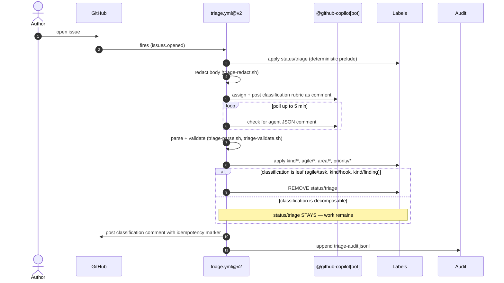
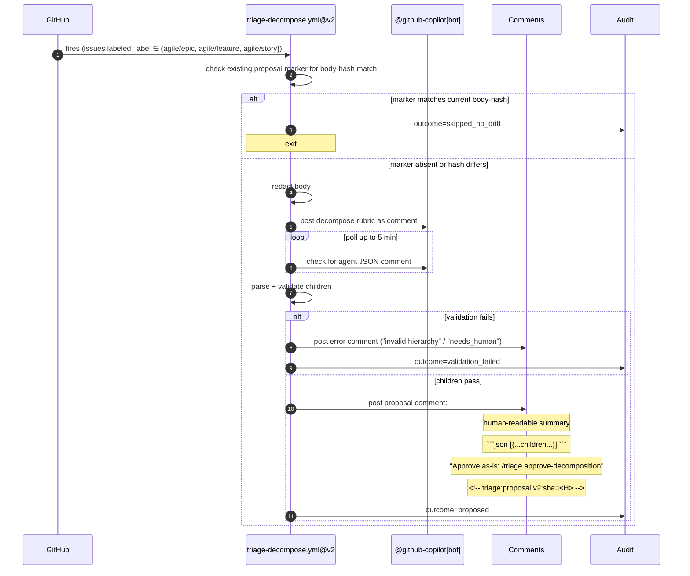
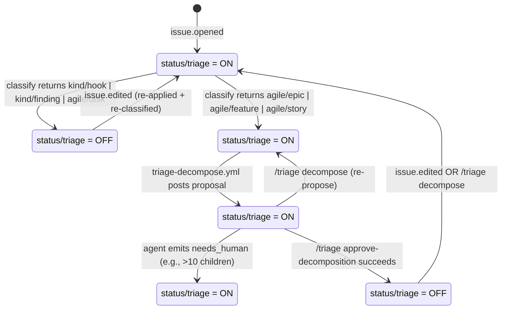

# Design — Triage & Decomposition Pipeline v2 (repo-standards@v2)

- **Date:** 2026-05-23
- **Status:** Draft — awaiting principal review before implementation planning
- **Scope:** Changes to `convergent-systems-co/repo-standards@v2`. Consumer rollout (aiConstitution caller bump, 21-atom-repo relabel) is downstream work with its own plan.
- **Source issue:** [convergent-systems-co/aiConstitution#19](https://github.com/convergent-systems-co/aiConstitution/issues/19)
- **Supersedes:** repo-standards `triage.yml@v1` (single-rubric classification only)

---

## 1. Context

`repo-standards@v1` ships a reusable GitHub Actions workflow (`triage.yml@v1`) that consumers wire in. On every new issue, it assigns `@github-copilot[bot]`, posts a classification rubric as a comment, polls for an agent JSON response, validates it against `labels.yml`, and applies `kind/*`, `area/*`, `priority/*` labels. It does **classification only**.

Two gaps in v1:

1. **Label vocabulary mismatch.** `repo-standards/labels.yml@v1` defines `kind/*` for *work-types* (bug, enhancement, refactor, chore, etc.). aiConstitution and its 21 sibling atom repos have evolved a different `kind/*` set for *plan-tree position* (epic, feature, story, task, hook, finding). Same prefix, different semantics — they don't currently coexist on any single repo.
2. **No decomposition.** Issue #19 specifies that triage should also propose and (with human approval) create sub-issue children for epic/feature/story-level items via GitHub's native sub-issues API. v1 does none of this.

v2 resolves both. It introduces a second label family (`agile/*`) for plan-tree position, keeps `kind/*` for work-type, and adds a second reusable workflow (`triage-decompose.yml@v2`) that owns the propose-then-approve loop for hierarchical issues.

---

## 2. Goals & non-goals

### Goals

- Classify every new issue automatically: `kind/*` (work-type) + `agile/*` (plan-tree position, when applicable) + `area/*` + `priority/*` + `status/triage`.
- Auto-emit a decomposition proposal as a comment when classification yields `agile/{epic, feature, story}`.
- File the proposed children as native GitHub sub-issues on human approval via `/triage approve-decomposition`.
- Cascade automatically: each created child carries `status/triage`, so v2 fires on it and (if itself decomposable) emits its own proposal.
- Be idempotent: re-runs do not duplicate work; partial sub-issue creation resumes safely.
- Be auditable: every classification, proposal, and approval emits a JSONL audit entry.

### Non-goals

- **Cross-repo sub-issue creation.** v2 files children in the same repo as the parent. Cross-repo decomposition is a v3 concern.
- **Auto-PR remediation.** Agent does not open PRs to fix issues. (#19 is classification + decomposition only.)
- **Replacing `kind/*` work-type labels.** The dev-flavored `kind/{bug, enhancement, refactor, chore, security, rfc, docs}` set is preserved and expanded with `hook` and `finding`. v2 adds `agile/*` *alongside*, not in place of.
- **Consumer rollout in this spec.** Bumping aiConstitution's caller and relabeling 22 repos is downstream work governed by separate plans.

---

## 3. Decisions locked

| # | Decision | Rationale |
|---|---|---|
| D1 | Two prefixes: `kind/*` (work-type) and `agile/*` (plan-tree). | They answer orthogonal questions about an issue. Overloading one prefix collides semantically. |
| D2 | `agile/*` members: `epic, feature, story, task`. | The four conventional agile levels. `agile/task` is the leaf of the chain. |
| D3 | `kind/*` adds `hook` and `finding` (leaf-observation work-types). | Match existing label set on aiConstitution + 21 atom repos. Hooks and findings sit outside the agile tree. |
| D4 | Decomposition chain: `agile/epic → agile/feature → agile/story → agile/task`. `agile/task` is terminal. | Nesting depth = sub-issue depth. Tasks don't decompose further. |
| D5 | Two reusable workflows in `repo-standards@v2`: `triage.yml@v2` (classify) and `triage-decompose.yml@v2` (propose + approve). | Classification and decomposition are different cognitive jobs; separate rubrics and separate iteration cadences. |
| D6 | Proposal flow: agent posts a comment with a fenced JSON block + idempotency marker. Human may edit the comment in-place. `/triage approve-decomposition` re-parses the latest comment state. | Round-trips human edits cleanly. JSON gives the workflow something machine-parseable. The HTML comment marker is the only state-storage. |
| D7 | Auto-propose at every decomposable level (epic, feature, story). | `agile/task`, `kind/hook`, `kind/finding` are classified but never trigger a proposal. |
| D8 | `status/triage` lifecycle: applied on open; removed when (a) classified as a leaf, or (b) `/triage approve-decomposition` succeeds. Re-applied on issue edit or on `/triage decompose`. | "status/triage on parent" = literally "more decomposition or classification work pending on this node." |
| D9 | Permission gate on `/triage approve-decomposition`: `author_association ∈ {OWNER, MEMBER, COLLABORATOR}`. | Mirrors how merge permissions typically work; refuses random users and merely-historical contributors. |
| D10 | Idempotency markers: hidden HTML comments with body-hash (12-char SHA-256 truncation). Three kinds: `classified`, `proposal`, `applied`. | GH issue is the source of truth; no external state. Body-hash detects meaningful change vs. cosmetic re-runs. |
| D11 | Confidence thresholds are separable: `classification-confidence-threshold: 0.6` (existing), `decomposition-confidence-threshold: 0.7` (new, higher). | Decomposition is judgement-heavier; a weak decomposition pollutes the sub-issue tree. |
| D12 | Decomposition cap: 1–10 children per proposal pass. If the agent thinks >10 children are needed, it emits `needs_human: true` and the parent's `status/triage` stays on. | Above 10 is a strong smell that the parent is too big for one decomposition pass. Stays on so a human takes over. |
| D13 | Rollout: RC tag (`v2.0.0-rc1`) + 1-week real-world soak on aiConstitution only, then promote to `v2.0.0` and roll out to 21 atom repos via existing label-install + caller-bump workflows. | Limits blast radius if a bug is found during soak. |

---

## 4. Architecture

### 4.1 Two workflows, two rubrics

```mermaid
flowchart LR
    subgraph triage["triage.yml@v2 — classification"]
        direction TB
        T_in["issues.opened/edited/reopened
              workflow_dispatch
              issue_comment /triage
              (excludes /triage decompose +
               /triage approve-decomposition)"]
        T_redact["redact body"]
        T_agent["agent + triage-rubric.md@v2"]
        T_labels["apply labels:
                  kind/*, agile/*, area/*, priority/*, status/triage"]
        T_audit["triage-audit.jsonl"]
        T_in --> T_redact --> T_agent --> T_labels --> T_audit
    end

    subgraph decompose["triage-decompose.yml@v2 — propose + approve"]
        direction TB
        D_in_A["issues.labeled
                (agile/{epic,feature,story})"]
        D_propose["agent + decompose-rubric.md@v2
                   → propose comment w/ JSON children + marker"]
        D_in_B["issue_comment /triage approve-decomposition"]
        D_perm["check author_association
                ∈ {OWNER, MEMBER, COLLABORATOR}"]
        D_parse["re-parse latest proposal comment
                 (post-edit if human edited)"]
        D_create["create sub-issues via GH API
                  POST /repos/.../issues
                  POST /repos/.../issues/{n}/sub_issues"]
        D_audit["decompose-audit.jsonl"]
        D_in_A --> D_propose
        D_in_B --> D_perm --> D_parse --> D_create --> D_audit
    end

    T_labels -. "if labels include agile/{epic,feature,story}
                 GH fires issues.labeled event" .-> D_in_A
    D_create -. "children carry status/triage
                 → triage.yml@v2 fires on each" .-> T_in
```



`triage.yml@v2` owns the answer to "what kind of issue is this and where in the plan tree does it sit?" `triage-decompose.yml@v2` owns the answer to "what's the next layer down, and when do we file it?"

### 4.2 Slash-command routing

The two workflows partition the `/triage *` command space. Each workflow's `if:` clauses enforce mutual exclusion so a single comment cannot fire both.

| Comment prefix | Workflow | Job action |
|---|---|---|
| `/triage` (bare, or `/triage refresh`, `/triage reclassify`, etc.) | `triage.yml@v2` | Re-run classification |
| `/triage decompose` | `triage-decompose.yml@v2` | Re-propose (with idempotency check on body hash) |
| `/triage approve-decomposition` | `triage-decompose.yml@v2` | File children as sub-issues (gated by author_association) |

`triage.yml@v2` job-level `if:` clause shape:
```yaml
if: |
  github.event_name == 'issues'
  || github.event_name == 'workflow_dispatch'
  || (github.event_name == 'issue_comment'
      && startsWith(github.event.comment.body, '/triage')
      && !startsWith(github.event.comment.body, '/triage decompose')
      && !startsWith(github.event.comment.body, '/triage approve-decomposition'))
```

`triage-decompose.yml@v2` has two jobs with disjoint triggers (`propose` and `approve`); see §9.2 for the approve job's permission clause.

### 4.3 Files (paths inside `convergent-systems-co/repo-standards`)

| Path | Status | Job |
|---|---|---|
| `.github/workflows/triage.yml` | modified | Classification workflow. Reusable. |
| `.github/workflows/triage-decompose.yml` | **NEW** | Propose + approve loop. Reusable. |
| `docs/triage-rubric.md` | modified | Classification rubric (v2 vocab). |
| `docs/decompose-rubric.md` | **NEW** | Decomposition rubric. |
| `labels.yml` | modified | Adds `agile/*`, adds `kind/hook` + `kind/finding`. |
| `.github/scripts/triage-redact.sh` | unchanged | Secret scrubbing per `Common.md §4`. |
| `.github/scripts/triage-parse.sh` | unchanged | Extract JSON from agent comment. |
| `.github/scripts/triage-validate.sh` | modified | Validate classification JSON against v2 `labels.yml`. |
| `.github/scripts/triage-apply.sh` | modified | Apply labels including `agile/*`. |
| `.github/scripts/triage-audit.sh` | unchanged | Audit log append. |
| `.github/scripts/decompose-parse.sh` | **NEW** | Find proposal comment by marker regex; extract JSON. |
| `.github/scripts/decompose-validate.sh` | **NEW** | Validate proposed children. |
| `.github/scripts/decompose-apply.sh` | **NEW** | Create sub-issues; register parent-child links. |
| `.github/scripts/decompose-audit.sh` | **NEW** | Audit log append for decomposition events. |
| `tests/fixtures/issues/*.md` | **NEW** | Fixture issues for rubric eval. |
| `tests/fixtures/expected/*.json` | **NEW** | Expected agent responses. |
| `tests/triage/*.bats` | **NEW** | bats tests for parse/validate/apply scripts. |
| `.github/workflows/rubric-eval.yml` | **NEW** | CI workflow that runs the rubric against the fixture corpus. |

**Net change:** 2 modified workflows + 1 new workflow + 1 modified rubric + 1 new rubric + 3 modified scripts + 4 new scripts + 1 modified labels.yml + test corpus.

---

## 5. Label model

### 5.1 `labels.yml@v2`

```yaml
labels:
  # KIND (work-type) — v1 set preserved, plus hook + finding
  - { name: kind/bug,          color: d73a4a, description: "Something is broken" }
  - { name: kind/feature,      color: 0e8a16, description: "Net-new capability" }
  - { name: kind/enhancement,  color: a2eeef, description: "Improvement to existing capability" }
  - { name: kind/docs,         color: 0075ca, description: "Documentation" }
  - { name: kind/refactor,     color: fbca04, description: "Behavior-preserving change" }
  - { name: kind/chore,        color: cccccc, description: "Build / CI / tooling / housekeeping" }
  - { name: kind/security,     color: b60205, description: "Vulnerability or hardening" }
  - { name: kind/rfc,          color: 5319e7, description: "Design proposal or discussion" }
  - { name: kind/hook,         color: 8a2be2, description: "Process hook / integration point — leaf" }   # NEW
  - { name: kind/finding,      color: ff6347, description: "Observation / report from a process — leaf" } # NEW
  # AGILE (plan-tree position) — NEW family
  - { name: agile/epic,        color: 7b3fa6, description: "Plan-tree: epic level, decomposes into features" }   # NEW
  - { name: agile/feature,     color: 9d5cb8, description: "Plan-tree: feature level, decomposes into stories" } # NEW
  - { name: agile/story,       color: bf79c9, description: "Plan-tree: story level, decomposes into tasks" }    # NEW
  - { name: agile/task,        color: dfa5dc, description: "Plan-tree: task level — leaf" }                       # NEW
  # AREA / PRIORITY / STATUS / RESOLUTION / COMMUNITY — unchanged from v1
```

### 5.2 Co-occurrence rules

A single issue may carry:

- Exactly one `kind/*`.
- Zero or one `agile/*` (zero = not in plan tree; e.g., `kind/hook` and `kind/finding` carry no `agile/*`).
- One or more `area/*`.
- Exactly one `priority/*`.
- One or more `status/*` (e.g., `status/triage`, `status/needs-info`).

`kind/feature` and `agile/feature` are independent — an issue can carry both. `kind/feature` says "this is net-new capability," `agile/feature` says "this is at the feature level of the plan tree."

### 5.3 Decomposition rule

```
agile/epic    → propose & file N agile/feature children
agile/feature → propose & file N agile/story  children
agile/story   → propose & file N agile/task   children
agile/task    → leaf of plan tree (classify; never propose)

kind/hook     → not in plan tree (no agile/* needed)
kind/finding  → not in plan tree (no agile/* needed)
```

---

## 6. Data flow

### 6.1 Classify



Idempotency marker on the classification comment:
`<!-- triage:classified:v2:sha=<body-hash> -->`

### 6.2 Propose (auto on `agile/*` labeled)



### 6.3 Approve (human comments `/triage approve-decomposition`)

```mermaid
sequenceDiagram
    autonumber
    actor Human
    participant GH as GitHub
    participant D as triage-decompose.yml@v2
    participant Issues as GH Issues API
    participant Labels
    participant Audit

    Human->>GH: comment "/triage approve-decomposition"
    GH->>D: fires (issue_comment)
    D->>D: check author_association ∈ {OWNER, MEMBER, COLLABORATOR}
    alt unauthorized
        D->>GH: post comment "approval refused: insufficient permissions"
        D->>Audit: outcome=permission_denied
    else authorized
        D->>D: find latest proposal comment by marker regex
        alt no proposal found
            D->>GH: post comment "no proposal found; comment /triage decompose to re-propose"
            D->>Audit: outcome=missing_proposal
        else proposal found
            D->>D: extract JSON (post-edit if human edited inline)
            D->>D: hash proposal JSON → proposal_sha
            D->>D: check applied marker for proposal_sha
            alt already applied
                D->>Audit: outcome=already_applied (idempotent skip)
            else not yet applied
                D->>D: validate children (decompose-validate.sh)
                loop each child
                    D->>Issues: POST /repos/.../issues  (title, body, labels including status/triage)
                    D->>Issues: POST /repos/.../issues/{parent}/sub_issues  (register parent-child link)
                    D->>Audit: append child outcome
                end
                D->>Labels: REMOVE status/triage from parent
                D->>GH: post applied comment with <!-- triage:applied:v2:sha=<proposal_sha> -->
                D->>Audit: outcome=applied
            end
        end
    end
```

---

## 7. State machines

### 7.1 `status/triage` lifecycle on a single issue



### 7.2 Idempotency marker scheme

Three kinds, all HTML comments hidden from rendered Markdown:

| Marker | Posted by | Hash content | Purpose |
|---|---|---|---|
| `<!-- triage:classified:v2:sha=<H> -->` | `triage.yml@v2` | SHA-256 (12 hex) of redacted issue body | Skip re-classification if issue body unchanged |
| `<!-- triage:proposal:v2:sha=<H> -->` | `triage-decompose.yml@v2` (propose) | SHA-256 (12 hex) of redacted issue body | Re-propose only if body drifted |
| `<!-- triage:applied:v2:sha=<H> -->` | `triage-decompose.yml@v2` (approve) | SHA-256 (12 hex) of proposal JSON | Refuse double-creation of children |

Regex: `/<!--\s*triage:(classified|proposal|applied):v2:sha=([a-f0-9]{12})\s*-->/`

GH issue is the source of truth. No external state. Re-running a workflow on the same issue with unchanged body and unchanged proposal is a no-op except for the audit log entry.

---

## 8. Schemas

### 8.1 Classification rubric JSON output

```json
{
  "labels": [
    "kind/<bug|enhancement|feature|refactor|chore|security|rfc|docs|hook|finding>",
    "area/<...>",
    "priority/<critical|high|medium|low>",
    "agile/<epic|feature|story|task>"
  ],
  "body_fill": {
    "severity": "low|medium|high|critical|null",
    "repro": "string|null",
    "acceptance": ["string", "..."],
    "out_of_scope": ["string", "..."]
  },
  "confidence": 0.0,
  "needs_human": false,
  "reasoning": "1-3 sentences"
}
```

**Constraints (enforced by `triage-validate.sh`):**

- `labels` MUST contain exactly one `kind/*`, at least one `area/*`, exactly one `priority/*`.
- `labels` MAY contain at most one `agile/*`. Required when the issue is plan-tree-positioned (decomposable or `agile/task` leaf). Forbidden when `kind/*` ∈ `{hook, finding}`.
- `kind/*` ∈ `{hook, finding}` ⇔ no `agile/*` (and vice-versa for plan-tree items).
- `confidence` ∈ [0.0, 1.0]. Below `classification-confidence-threshold` → strip non-`status/triage` labels; rely on `needs_human` for downstream handling.
- All label names MUST resolve in `labels.yml@v2`. Unknown labels are stripped and trigger `needs_human=true`.

### 8.2 Decomposition rubric JSON output

```json
{
  "parent_level": "epic|feature|story",
  "child_level": "feature|story|task",
  "confidence": 0.0,
  "needs_human": false,
  "reasoning": "1-3 sentences",
  "children": [
    {
      "title": "string (≤ 80 chars, no leading kind: prefix)",
      "body": "markdown string (may include acceptance criteria)",
      "labels": [
        "agile/<child_level>",
        "kind/<...>",
        "area/<...>",
        "priority/<...>"
      ]
    }
  ]
}
```

**Constraints (enforced by `decompose-validate.sh`):**

- `parent_level` + 1 = `child_level` exactly (`epic→feature`, `feature→story`, `story→task`). Any mismatch rejects the whole proposal.
- `children` length ∈ [1, 10]. Length 0 = decomposition not warranted; agent should have emitted `needs_human=true` instead. Length > 10 forces `needs_human=true` and the parent stays in triage.
- Every child's `labels` MUST contain `agile/<child_level>`. Other labels (`kind/*`, `area/*`, `priority/*`) MAY be specified; if missing, child inherits from parent.
- Every child's `title` is ≤ 80 chars and does not start with a `kind:` colon-prefix.
- `body` and `title` are scanned for prompt-injection signatures (per `Common.md §U8`). Hits reject the proposal and audit `outcome=prompt_injection_suspected`.
- `confidence` ∈ [0.0, 1.0]. Below `decomposition-confidence-threshold: 0.7` → proposal is NOT posted; agent rationale becomes a "needs_human" comment instead.

### 8.3 Audit log JSONL schemas

`triage-audit.jsonl` (per classification event):

```jsonl
{"ts":"<UTC>","event":"classify","issue":<N>,"agent":"copilot|rest","outcome":"applied|needs_human|timeout|parse_error|validation_failed","labels":[...],"confidence":0.0,"body_sha":"<H>","run_id":"<gh-run-id>"}
```

`decompose-audit.jsonl` (per propose/approve event):

```jsonl
{"ts":"<UTC>","event":"propose","issue":<N>,"agent":"copilot|rest","outcome":"proposed|skipped_no_drift|validation_failed|needs_human","child_count":<N>,"proposal_sha":"<H>","body_sha":"<H>","run_id":"<gh-run-id>"}
{"ts":"<UTC>","event":"approve","issue":<N>,"actor":"<login>","author_association":"<role>","outcome":"applied|permission_denied|missing_proposal|already_applied|body_drift|validation_failed","children_filed":[<N1>,<N2>,...],"proposal_sha":"<H>","run_id":"<gh-run-id>"}
```

Both files uploaded as workflow artifacts with 90-day retention.

---

## 9. Permissions

### 9.1 Reusable workflow permission contract

Callers MUST grant:

```yaml
permissions:
  issues: write
  contents: read
```

The reusable workflows themselves declare no `permissions:` block (per v1 convention).

### 9.2 Permission gate on `/triage approve-decomposition`

```yaml
jobs:
  approve:
    if: |
      github.event_name == 'issue_comment'
      && startsWith(github.event.comment.body, '/triage approve-decomposition')
      && contains(fromJSON('["OWNER","MEMBER","COLLABORATOR"]'), github.event.comment.author_association)
```

Unauthorized comments fall through to a fallback job that posts a refusal and audits `outcome=permission_denied`.

### 9.3 Bot identity

v2 retains `github.token` (the auto-provisioned `github-actions[bot]` identity) for v1-style intra-repo writes. Cross-repo decomposition (v3) will require a `triage-bot` PAT or fine-grained app token; out of scope here.

---

## 10. Error handling

| Failure | Behavior | Where handled |
|---|---|---|
| Agent never responds in 5 min (30 polls × 10s) | Continue-on-error → fall to Method B (REST stub) or write `needs_human` JSON; audit `outcome=timeout` | Both workflows |
| Agent JSON malformed | Parse script exits non-zero → synthesize `needs_human` JSON; audit `outcome=parse_error` | `*-parse.sh` |
| Agent emits unknown label | `*-validate.sh` strips it, lowers confidence; if below threshold → `needs_human` | `*-validate.sh` |
| Child's `agile/*` ≠ `child_level` | Reject whole proposal; comment "agent emitted invalid hierarchy"; audit `outcome=hierarchy_violation` | `decompose-validate.sh` |
| `/triage approve-decomposition` fires twice in quick succession | Applied-marker check skips silently | `decompose-apply.sh` |
| Proposal comment deleted, then `/triage approve-decomposition` | No proposal-marker found → reply "no proposal found; comment `/triage decompose` to re-propose"; audit `outcome=missing_proposal` | `decompose-parse.sh` |
| Issue body edited between propose and approve | Body-hash on parent ≠ proposal-marker hash → reply "body changed; re-run /triage decompose"; audit `outcome=body_drift` | `decompose-parse.sh` |
| Sub-issue creation partial-fails (3 of 5 created, then API 500) | Audit each child's outcome individually; applied-marker records succeeded children; re-running `/triage approve-decomposition` resumes (skips children that already exist by title+parent) | `decompose-apply.sh` |
| Prompt-injection signature in issue body or child title/body | `triage-redact.sh` strips on input; `decompose-validate.sh` rejects on output; audit `outcome=prompt_injection_suspected` | Both ends |
| Unauthorized commenter fires `/triage approve-decomposition` | Job-level `if:` skips; fallback job posts refusal; audit `outcome=permission_denied` | `triage-decompose.yml@v2` |

---

## 11. Testing strategy

| Layer | What | Mechanism |
|---|---|---|
| Script unit tests | `*-parse.sh`, `*-validate.sh`, `*-apply.sh` logic | `bats` tests in `tests/triage/`. Fixtures: known-good agent JSON + adversarial (malformed, prompt-injection, hierarchy violation, unknown labels). |
| Rubric eval | Both rubrics against a fixed corpus | `.github/workflows/rubric-eval.yml` runs each rubric against `tests/fixtures/issues/*.md`; asserts on `confidence`, `labels`, `children[].agile`; diffs against `tests/fixtures/expected/*.json`. |
| Workflow integration | End-to-end on a sandbox | Fire `workflow_dispatch` with synthetic issue numbers in a sandbox repo (`convergent-systems-co/triage-sandbox`, new or repurposed). Assert labels + sub-issues + audit log. |
| Dry-run mode | `inputs.dry_run: true` skips API mutations; emits proposal comment with `[DRY RUN]` header; skips sub-issue creation | New input on both reusable workflows. |
| Real-world soak | Run v2 on aiConstitution under `v2.0.0-rc1` tag for 1 week | Observe audit log + open issue triage. Promote to `v2.0.0` only if clean. |

---

## 12. Rollout plan

```
1. repo-standards branch:        triage/v2-design
2. Implementation:                workflows, rubrics, scripts, fixtures, tests
3. PR → repo-standards main:      CI green (rubric-eval + bats + lint)
4. Merge + tag:                   v2.0.0-rc1
5. aiConstitution caller:         bump from @v1 to @v2.0.0-rc1 (pinned, NOT moving tag)
6. Soak:                          1 week of real-world triage on aiConstitution
7. Review audit logs:             confirm zero unexpected outcomes, no permission_denied false positives
8. Promote:                       repo-standards re-tag v2.0.0 (same commit as rc1, mutable rc → fixed release)
9. aiConstitution caller:         bump to @v2 (moving major)
10. Atom-repo rollout:            label-install workflow (existing) + caller bump (PR + batch agents, precedent established 2026-05-23)
```

Each step in §12 becomes a checkpoint in the implementation plan (writing-plans phase). Steps 5, 6, 7, 8, 9, 10 are downstream and out of this spec's scope but listed here to make the path visible.

---

## 13. Open questions

None as of this draft. All design decisions in §3 are locked. Open items will be filed as issues against `repo-standards` during implementation if they arise.

---

## 14. References

- Source issue: [aiConstitution#19](https://github.com/convergent-systems-co/aiConstitution/issues/19)
- Existing v1 workflow: `convergent-systems-co/repo-standards/.github/workflows/triage.yml@v1`
- Existing v1 rubric: `convergent-systems-co/repo-standards/docs/triage-rubric.md@v1`
- Existing v1 labels: `convergent-systems-co/repo-standards/labels.yml@v1`
- Governance: `~/.ai/Code.md §11.1` (Alternatives Table requirement), `§11.7` (security findings), `~/.ai/Common.md §U8` (prompt-injection resistance), `§4` (secret redaction)
- Prior decision log: `~/.ai/checkpoints/7b22791780cf/2026-05-23T18:28:52Z.md` (session checkpoint covering v0.10 spec + atom-repo proliferation)
