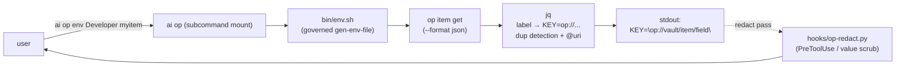

# plugin-op-spec.md — `op` Plugin (1Password Integration)

**Status:** Draft v0.1
**Scope:** Concrete specification for the first reference plugin under `plugin-spec.md`. Wraps the 1Password `op` CLI as `ai op <verb>` with Common.md §4 governance enforced at every surface.
**Parent specs:** `plugin-spec.md` (general plugin contract), `AI-CONSTITUTION-SPEC.md §11.6` (`ai plugins …` family).
**Authority:** Subordinate to `Constitution.md` + `Common.md` + `Code.md`. The non-overridable rules of `Constitution.md §3.5` apply absolutely.

---

## 0. TL;DR

The `op` plugin is the canonical example of a **tool-integration plugin** under `plugin-spec.md`. It wraps the 1Password CLI (`op`) and exposes:

- `ai op env <vault> <item> [...]` — generate env-file lines as `op://` secret references (the existing `gen-env-file.sh`, made governed and discoverable)
- `ai op signin` / `ai op signout` / `ai op whoami` — session management
- `ai op ref check <ref>` — validate an `op://` reference resolves, without reading the value
- `ai op items by-tag <tag>` — list items by tag, titles + IDs only
- `ai op field present <vault> <item> <field>` — presence test for a field
- `ai op clip <ref>` — copy a value to OS clipboard (the only allowed way to surface a value)
- `ai op doctor` — health check

It ships a `PreToolUse` redaction hook (`op-redact.py`) that scrubs raw secret values out of any tool output, a SKILL.md for `/op` invocation, a doctor check, and a settings fragment.



---

## 1. Why This Plugin Exists

`Common.md §1.P4` makes secret-handling non-overridable, and `§4` operationalizes it. The 1Password CLI is the canonical secret-vault interface for Polliard-owned work. Without a governed wrapper:

- AI agents that need an env var read `op item get` and risk emitting values to stdout (violation of `§4.3`).
- AI agents that need to verify a secret is set reach for `env | grep`, `cat .env`, or `echo "$VAR"` (violation of `§4.1`).
- Secret references in env files are hand-rolled, with no validation that `op://vault/item/field` actually resolves.
- The `gen-env-file.sh` helper (`/Users/itsfwcp/bin/gen-env-file.sh`) is invisible to AI agents — it has no skill, no manifest, no atom presence.

The `op` plugin closes those gaps. Every verb is built so that the only way to surface a secret *value* is through the OS clipboard (`ai op clip`); every other read returns presence, reference, or metadata — never the value.

---

## 2. Plugin Metadata

```toml
# plugin.toml — at the root of plugin-atoms.com/op/0.1.0/plugin.tar.gz

schemaVersion = "0.1"
name          = "op"
version       = "0.1.0"
description   = "1Password / op CLI integration: env-file gen, signin, item helpers — governed by Common.md §4."
license       = "Apache-2.0"
homepage      = "https://plugin-atoms.com/op"
repository    = "https://github.com/convergent-systems-co/plugin-op"

[provenance]
authors       = ["Thomas Polliard"]
ai_authored   = true

[compatibility]
ai_min        = "0.8.0"
ai_max        = ""
platforms     = ["darwin/arm64", "darwin/amd64", "linux/amd64"]

[[dependencies]]
name          = "op"
min_version   = "2.0.0"
detect        = "op --version"
install_hint  = "macOS: brew install --cask 1password-cli  |  Linux: see 1password.com/downloads/command-line/"

[[dependencies]]
name          = "jq"
min_version   = "1.6"
detect        = "jq --version"
install_hint  = "brew install jq  /  apt-get install jq"

# Optional clipboard backends — at least one MUST resolve at runtime.
[[dependencies]]
name          = "clipboard"
min_version   = "*"
detect        = "command -v pbcopy || command -v xclip || command -v wl-copy"
install_hint  = "macOS ships pbcopy; X11: apt install xclip; Wayland: apt install wl-clipboard"

[[artifacts]]
kind          = "subcommand"
namespace     = "op"
source        = "bin"

[[artifacts]]
kind          = "skill"
source        = "skills/op"
name          = "op"

[[artifacts]]
kind          = "hook"
source        = "hooks/op-redact.py"
event         = "PreToolUse"
description   = "Redact resolved op:// secret values from tool output per Common.md §4.5"

[[artifacts]]
kind          = "doctor"
source        = "doctor/check.sh"

[[artifacts]]
kind          = "settings-fragment"
source        = "settings/schema.toml"

[capabilities]
reads         = [
  "1Password vault metadata (titles, tags, field labels) via `op` CLI",
  "1Password field presence (via `op item get --fields … --reveal=false`)",
  "$OP_SERVICE_ACCOUNT_TOKEN (presence only, never echoed)",
]
writes        = [
  "stdout: op:// secret references, never values",
  "OS clipboard: secret values, only via `ai op clip` (Common.md §4.2)",
  "~/.ai/plugins/op/cache/ (item-list cache; never values)",
  "~/.ai/audit/interactions/<YYYY-MM>.jsonl (lifecycle entries)",
]
network       = ["1password.com (via op CLI; no direct calls)"]
filesystem    = [
  "~/.claude/skills/op (symlink)",
  "~/.claude/settings.json (PreToolUse hook entry)",
  "~/.config/aiConstitution/plugins/op.toml (generated config)",
]
binaries      = ["op", "jq", "pbcopy/xclip/wl-copy"]

[extends]
skills        = ["op"]
hooks         = ["PreToolUse"]
subcommand    = "op"
doctor        = true

[[install_hook]]
op            = "register-subcommand"
namespace     = "op"
from          = "bin"

[[install_hook]]
op            = "symlink"
from          = "skills/op"
to            = "~/.claude/skills/op"
on_conflict   = "fail"

[[install_hook]]
op            = "register-hook"
event         = "PreToolUse"
script        = "hooks/op-redact.py"
match         = "op://"

[[install_hook]]
op            = "generate-config"
template      = "settings/op.toml.tmpl"
to            = "~/.config/aiConstitution/plugins/op.toml"
on_conflict   = "skip"
```

---

## 3. CLI Surface

Every verb is dispatched by `ai op <verb>`. The plugin's `bin/` directory contains one executable per verb. Per `plugin-spec.md §8.3`, the subcommand-mount machinery dispatches automatically.

### 3.1 Verb table

| Verb | Purpose | Reads value? | Writes value? | Exit modes |
|---|---|---|---|---|
| `env <vault> <item> [item ...]` | Emit `KEY="op://…"` env-file lines for each item's fields | no | no | 0; 64 usage; 65 manifest; 69 op unreachable |
| `signin [<account>]` | Interactive 1Password sign-in (biometric / device PIN) | no | no | 0; 1 user cancel |
| `signout` | End the current session | no | no | 0 |
| `whoami` | Print account email + signed-in status | no | no | 0; 1 not signed in |
| `ref check <ref>` | Resolve `op://vault/item/field`; print "ok" or error; never the value | no | no | 0 resolves; 1 unresolved; 64 malformed |
| `items by-tag <tag> [--vault <v>]` | List `{id,title,vault,tags}` JSON for items with that tag | no | no | 0; 1 no matches; 69 op unreachable |
| `items by-vault <vault>` | List `{id,title,tags}` JSON for all items in a vault | no | no | 0; 69 op unreachable |
| `field present <vault> <item> <field>` | Presence test: 0 if set, 1 if absent | no | no | 0 set; 1 absent; 64 usage |
| `field labels <vault> <item>` | Print the field labels of an item (labels only, no values) | no | no | 0; 1 no item |
| `clip <ref> [--timeout <s>]` | Copy value of `op://…` to OS clipboard; clear after timeout (default 45s) | **yes (to clipboard only)** | **clipboard** | 0; 64 usage; 1 no clipboard backend |
| `doctor` | Run the plugin's health check | no | no | 0 healthy; 1 unhealthy |

### 3.2 Verbs with NO underlying-CLI equivalent

The following verbs exist in `ai op` but not in `op` — they are deliberate governance additions:

- **`ref check`** — composes `op item get --fields <label> --reveal=false` to validate a reference without reading its value. The underlying `op item get` will emit the value by default; the plugin's wrapper forces `--reveal=false` semantics (or the equivalent in the installed `op` version).
- **`field present`** — composes `op item get --format json | jq` to check whether a field is non-null without ever materializing the value in stdout.
- **`clip`** — composes `op read "op://…" | <pbcopy|xclip|wl-copy>` per `Common.md §4.2`. Refuses to print to stdout under any flag.

### 3.3 Forbidden verbs

The following verbs are **never** exposed by `ai op`, even though `op` provides them:

| `op` verb | Why excluded |
|---|---|
| `op read` (to stdout) | Would echo a secret value. Use `ai op clip` instead. |
| `op item get` (default output) | Echoes field values. Use `ai op ref check` or `ai op field present`. |
| `op inject` | Materializes secrets into a template stream — same risk; expose only as a clipboard-bound variant in a future verb if needed. |

Calling `op` directly is still possible — the plugin doesn't (and can't) interpose on raw `op` invocations. The plugin's value is the governed surface; raw `op` remains the user's responsibility.

---

## 4. Detailed Verb Specifications

### 4.1 `ai op env <vault> <item> [item ...]`

The fixed `gen-env-file.sh` (per the conversation that produced this spec) is the body of `bin/env.sh`. Restated for the record:

```bash
#!/usr/bin/env bash
set -euo pipefail

VAULT="${1:?Usage: ai op env <vault> <item> [item2 ...]}"
shift

if [[ $# -eq 0 ]]; then
  echo "Usage: ai op env <vault> <item> [item2 ...]" >&2
  exit 64
fi

for ITEM in "$@"; do
  echo "# --- ${ITEM} ---"
  op item get "$ITEM" --vault "$VAULT" --format json \
    | jq -r --arg v "$VAULT" --arg i "$ITEM" '
        [ .fields[]
          | select(.value != null and .label != null)
          | . + { key: (.label | ascii_upcase | gsub("[^A-Z0-9]"; "_")) }
        ]
        | (group_by(.key) | map(select(length > 1) | .[0].key)) as $dupes
        | if ($dupes | length) > 0
          then error("duplicate env-var keys after sanitization: \($dupes | join(", "))")
          else .[] | "\(.key)=\"op://\($v)/\($i)/\(.label | @uri)\""
          end
      '
  echo ""
done
```

**Governance properties:**

- Reads field labels and presence, never values (passes `.label` and `.value != null` checks; never emits `.value`).
- Output is exclusively `op://` references; redaction hook is a defense-in-depth backstop.
- Duplicate sanitized keys produce a loud `jq` error and `set -e` aborts — silent overwrites are impossible.
- Special characters in labels are URL-encoded via jq's `@uri` so the reference resolves at runtime.

**Output shape:**

```
# --- myitem ---
API_KEY="op://Developer/myitem/api_key"
DATABASE_URL="op://Developer/myitem/database_url"
```

The user redirects to a file: `ai op env Developer myitem > .env`.

### 4.2 `ai op ref check <ref>`

```bash
#!/usr/bin/env bash
# bin/ref-check.sh — invoked as `ai op ref check`
set -euo pipefail

REF="${1:?Usage: ai op ref check op://<vault>/<item>/<field>}"

# Validate shape before talking to op.
if ! [[ "$REF" =~ ^op://[^/]+/[^/]+/[^/]+$ ]]; then
  echo "ref-check: malformed reference: $REF" >&2
  exit 64
fi

# Resolve presence without echoing the value.
# `op read` does not have a --reveal=false in older versions; we capture stdout
# and immediately drop it to /dev/null, exit code carries presence.
if op read "$REF" >/dev/null 2>&1; then
  echo "ok: $REF resolves"
  exit 0
else
  echo "unresolved: $REF" >&2
  exit 1
fi
```

The trick is `>/dev/null 2>&1` — the value is read by `op`, immediately discarded, and the shell never holds it in a variable. The audit hook records the `plugin-invoke` event but the value never crosses a process boundary the assistant can read.

### 4.3 `ai op field present <vault> <item> <field>`

```bash
#!/usr/bin/env bash
# bin/field-present.sh
set -euo pipefail

VAULT="${1:?Usage: ai op field present <vault> <item> <field>}"
ITEM="${2:?Usage: ai op field present <vault> <item> <field>}"
FIELD="${3:?Usage: ai op field present <vault> <item> <field>}"

# Use --format json + jq presence check; never emit the value.
PRESENT=$(op item get "$ITEM" --vault "$VAULT" --format json \
  | jq -r --arg f "$FIELD" '
      [.fields[] | select(.label == $f) | (.value != null)]
      | if length == 0 then "missing"
        elif .[0] then "set"
        else "empty"
        end
    ')

case "$PRESENT" in
  set)     echo "set";     exit 0 ;;
  empty)   echo "empty";   exit 1 ;;
  missing) echo "missing"; exit 1 ;;
esac
```

### 4.4 `ai op clip <ref>`

```bash
#!/usr/bin/env bash
# bin/clip.sh — the ONLY verb that materializes a value, and only to the clipboard.
set -euo pipefail

REF="${1:?Usage: ai op clip op://<vault>/<item>/<field> [--timeout <seconds>]}"
shift
TIMEOUT=45
while [[ $# -gt 0 ]]; do
  case "$1" in
    --timeout) TIMEOUT="$2"; shift 2 ;;
    *) echo "ai op clip: unknown flag $1" >&2; exit 64 ;;
  esac
done

if   command -v pbcopy   >/dev/null 2>&1; then CLIP=(pbcopy)
elif command -v wl-copy  >/dev/null 2>&1; then CLIP=(wl-copy)
elif command -v xclip    >/dev/null 2>&1; then CLIP=(xclip -selection clipboard)
else
  echo "ai op clip: no clipboard backend (need pbcopy / wl-copy / xclip)" >&2
  exit 1
fi

# Pipe the value through `op read` into the clipboard backend.
# `set -o pipefail` (inherited via `set -e` style) propagates an op failure.
op read "$REF" | "${CLIP[@]}"
echo "Value copied to clipboard. Auto-clear in ${TIMEOUT}s."

# Schedule clear.
( sleep "$TIMEOUT" && printf '' | "${CLIP[@]}" ) &
disown
```

This is the canonical implementation of `Common.md §4.2` — the value is materialized inside a pipe-and-clipboard fast path; no shell variable holds it; the clipboard is cleared after a bounded interval.

### 4.5 `ai op whoami` / `ai op signin` / `ai op signout`

Straight passthroughs to `op whoami` / `op signin` / `op signout`. These do not echo values; they manage session state. Per `Common.md §2.7`, `signin` is one of the **named-exception** verbs where the assistant cannot perform the action itself (biometric / device PIN); the wrapper makes that explicit:

```bash
#!/usr/bin/env bash
# bin/signin.sh
set -euo pipefail
echo "ai op signin: this verb requires biometric / device-PIN approval."
echo "Running: op signin $*"
exec op signin "$@"
```

---

## 5. Governance Hook — `op-redact.py`

The plugin ships a `PreToolUse` hook that scrubs resolved secret values from tool output. Wired by manifest:

```toml
[[install_hook]]
op            = "register-hook"
event         = "PreToolUse"
script        = "hooks/op-redact.py"
match         = "op://"
```

### 5.1 What it does

The hook runs **before** every tool invocation. If the tool input contains a literal string that matches the high-entropy / canonical-secret patterns relayed alongside an `op://` reference — e.g., a leaked value re-emitted by mistake — it rewrites the input with `[REDACTED:op-secret]` and writes a violation audit entry per `Common.md §5.2`.

### 5.2 Sketch

```python
#!/usr/bin/env python3
"""op-redact.py — PreToolUse hook for the `op` plugin.

Reads the tool invocation payload on stdin (JSON), redacts likely secret values
in fields/args that mention op:// references, writes the (possibly redacted)
payload to stdout.

Common.md §4.5: "When a secret appears in tool output… replace it with
[REDACTED:<kind>] before you quote, summarize, or echo it back."
"""

import json
import re
import sys
from pathlib import Path
from datetime import datetime, timezone

# High-entropy patterns commonly found alongside an op:// emission that
# indicate a value leaked back into the prompt context.
HIGH_ENTROPY = re.compile(r'\b[A-Za-z0-9+/_-]{32,}\b')

# Known-shape patterns (AWS access key, GitHub PAT, etc.).
KNOWN_SHAPES = [
    (re.compile(r'\bAKIA[0-9A-Z]{16}\b'),                    'aws-access-key'),
    (re.compile(r'\bghp_[A-Za-z0-9]{36,}\b'),                'github-pat'),
    (re.compile(r'\bxoxb-[A-Za-z0-9-]{40,}\b'),              'slack-bot-token'),
    (re.compile(r'\bsk-[A-Za-z0-9]{40,}\b'),                 'openai-key'),
    (re.compile(r'\bey[A-Za-z0-9_-]{20,}\.[A-Za-z0-9_-]{20,}\.[A-Za-z0-9_-]{20,}\b'), 'jwt'),
]

OP_REF = re.compile(r'op://[^\s"\']+')


def redact(text: str) -> tuple[str, list[str]]:
    """Return (redacted_text, list of kinds that triggered)."""
    triggered = []
    for pat, kind in KNOWN_SHAPES:
        if pat.search(text):
            text = pat.sub(f'[REDACTED:{kind}]', text)
            triggered.append(kind)
    # High-entropy strings near an op:// reference are suspect.
    if OP_REF.search(text):
        new = HIGH_ENTROPY.sub(
            lambda m: f'[REDACTED:high-entropy]' if len(m.group(0)) >= 32 else m.group(0),
            text,
        )
        if new != text:
            triggered.append('high-entropy-near-op-ref')
            text = new
    return text, triggered


def log_violation(kinds: list[str], payload_excerpt: str) -> None:
    ts = datetime.now(timezone.utc).strftime('%Y-%m-%dT%H%M%SZ')
    p = Path.home() / '.ai' / 'audit' / 'violations' / f'{ts}-op-redact.md'
    p.parent.mkdir(parents=True, exist_ok=True)
    p.write_text(
        f'# Violation — {ts}\n\n'
        f'- **File / Rule violated:** Common.md §1.P4 (no secrets in artifacts)\n'
        f'- **What happened:** op-redact hook scrubbed secret-shaped tokens '
        f'from tool input. Triggered: {", ".join(kinds)}.\n'
        f'- **How noticed:** tool-flagged (op-redact PreToolUse hook)\n'
        f'- **Remediation:** value replaced with [REDACTED:…] before tool ran.\n'
        f'- **Excerpt (post-redaction):** {payload_excerpt[:400]}\n',
        encoding='utf-8',
    )


def main() -> int:
    raw = sys.stdin.read()
    try:
        payload = json.loads(raw)
    except json.JSONDecodeError:
        sys.stdout.write(raw)
        return 0

    redacted_text = json.dumps(payload)
    redacted_text, kinds = redact(redacted_text)
    if kinds:
        log_violation(kinds, redacted_text)

    sys.stdout.write(redacted_text)
    return 0


if __name__ == '__main__':
    sys.exit(main())
```

### 5.3 Hook is defense-in-depth, not the only line

The plugin's own verbs (§3) are already designed not to emit values. The redaction hook catches:

- Values that leak in via tool *inputs* (e.g., an assistant pastes a known token alongside an `op://` reference).
- Values that leak via tools the plugin doesn't control (e.g., `Bash` running an arbitrary `echo $SECRET`).
- Future regressions in the plugin itself.

---

## 6. Skill — `skills/op/SKILL.md`

The plugin ships a single skill, mounted at `~/.claude/skills/op`. Frontmatter shape matches existing skills (see `~/.ai/skills/commit/SKILL.md`).

```markdown
---
name: op
description: 1Password / op CLI helper. Generate env-files as op:// references, validate references, list items by tag, present-test fields, clip-copy values. Common.md §4 enforced. Use when the user types /op, asks to generate an env file from 1Password, asks "is the X secret set?", or wants to copy a 1Password value to the clipboard.
user-invocable: true
allowed-tools:
  - Bash
  - Read
---

# /op Skill — 1Password helper

Governed wrapper for the 1Password `op` CLI. Every verb honors Common.md §4
(secret handling): presence tests instead of value reads, OS clipboard for
transfer, refusal of silent value display.

## Invocation grammar

```text
/op env <vault> <item> [item...]      # emit env-file lines with op:// refs
/op env <vault> <item> > .env         # canonical pipe-to-file usage
/op ref check <ref>                   # validate op://… without reading value
/op field present <vault> <item> <field>  # presence test
/op items by-tag <tag>                # list items by tag (titles+IDs only)
/op clip <ref>                        # copy value to clipboard (45s auto-clear)
/op whoami                            # current session
/op signin                            # interactive (biometric)
/op doctor                            # health check
```

## Pre-flight

```bash
command -v op                                # op installed?
command -v jq                                # jq installed?
op whoami 2>/dev/null                        # signed in?
```

| Pre-flight result | Behavior |
|---|---|
| `op` missing | Refuse with install hint: `brew install --cask 1password-cli` |
| `jq` missing | Refuse with install hint: `brew install jq` |
| Not signed in | Suggest `/op signin` (interactive; biometric) |
| All present | Proceed |

## Decision matrix — which verb to use

| User intent | Verb |
|---|---|
| "Generate a .env from 1Password" | `/op env <vault> <item> > .env` |
| "Is FOO_TOKEN set?" | `/op field present <vault> <item> FOO_TOKEN` |
| "Does this op:// reference work?" | `/op ref check <ref>` |
| "Give me the value of X" | `/op clip <ref>` — NEVER paste the value into chat |
| "List all my cloudflare items" | `/op items by-tag cloudflare` |
| "Who am I in 1Password?" | `/op whoami` |

## Forbidden

- Do NOT use `/op clip` and then paste the value back into the conversation.
- Do NOT use raw `op read` to print a value to stdout.
- Do NOT use `op item get <item>` and read `.value` fields.
- See Common.md §4.3 — refuse silent display.
```

---

## 7. Doctor Check — `doctor/check.sh`

```bash
#!/usr/bin/env bash
# doctor/check.sh — invoked by `ai doctor` and `ai op doctor`
# Exit 0 = healthy; non-zero = unhealthy; stdout describes findings.

set -uo pipefail

PASS=()
FAIL=()

check() {
  local name="$1"; shift
  if "$@" >/dev/null 2>&1; then
    PASS+=("$name")
  else
    FAIL+=("$name")
  fi
}

check "op binary present"        command -v op
check "jq binary present"        command -v jq
check "clipboard backend present" bash -c 'command -v pbcopy || command -v wl-copy || command -v xclip'
check "op session active"        op whoami
check "PreToolUse hook installed" grep -q 'op-redact.py' "$HOME/.claude/settings.json"
check "skills symlink resolves"  test -L "$HOME/.claude/skills/op"

printf 'op plugin doctor:\n'
for p in "${PASS[@]}"; do printf '  PASS  %s\n' "$p"; done
for f in "${FAIL[@]}"; do printf '  FAIL  %s\n' "$f"; done

if [[ ${#FAIL[@]} -gt 0 ]]; then
  printf '\nfindings: %d / %d failing\n' "${#FAIL[@]}" "$((${#PASS[@]} + ${#FAIL[@]}))"
  exit 1
fi
exit 0
```

Findings are surfaced by `ai doctor`'s standard output format and contribute to the global doctor exit code.

---

## 8. Settings Fragment — `settings/schema.toml`

The plugin contributes one settings section, validated by `ai settings`:

```toml
# settings/schema.toml — merged into ~/.config/aiConstitution/settings.toml schema

[plugins.op]
# Default vault to operate on when --vault is omitted (env, items by-vault).
# Empty string = no default; require explicit vault on every invocation.
default_vault    = ""

# Default clipboard auto-clear (seconds) for `ai op clip`.
# Range: 5..600. Override per-invocation with --timeout.
clip_timeout_s   = 45

# Cache TTL for `items by-tag` and `items by-vault` results.
# Cache stores titles + IDs only (no values).
items_cache_ttl_s = 300

# Refuse `ai op env` if any field's sanitized key would collide.
# Default true — set false at your own risk.
fail_on_dup_keys  = true

# Hook strictness. "strict" exits non-zero (blocking the tool call) on
# any secret-shaped token in input. "warn" logs and lets the tool run.
redact_mode      = "strict"
```

---

## 9. Installation Walkthrough

What `ai plugins install op` actually does, step by step:

```mermaid
sequenceDiagram
    participant U as user
    participant A as ai (binary)
    participant R as plugin-atoms.com
    participant FS as ~/.ai/
    participant CC as ~/.claude/

    U->>A: ai plugins install op
    A->>R: GET plugin-atoms.com/op/latest → 0.1.0
    A->>R: GET plugin-atoms.com/op/0.1.0/plugin.tar.gz
    A->>R: GET plugin-atoms.com/op/0.1.0/SHA256SUMS
    A->>A: verify SHA256 match
    A->>A: parse plugin.toml; validate against schema
    A->>U: confirmation: "Plugin op declares capabilities:<br/>reads vault metadata + presence<br/>writes stdout + clipboard + cache<br/>network 1password.com<br/>Proceed? (y/N)"
    U->>A: y
    A->>FS: unpack to ~/.ai/plugins/op/
    A->>A: run install_hook entries:
    A->>CC: register-subcommand: mount ai op <verb>
    A->>CC: symlink skills/op → ~/.claude/skills/op
    A->>CC: register-hook PreToolUse hooks/op-redact.py
    A->>FS: generate-config → ~/.config/aiConstitution/plugins/op.toml
    A->>FS: write plugin-state.json entry
    A->>FS: append plugin-install audit entry
    A->>U: installed; enabled; try `ai op doctor`
```

### 9.1 Idempotency

Re-running `ai plugins install op` on an already-installed plugin:

1. Resolves the same version.
2. Verifies the on-disk content hash matches the registry's `SHA256SUMS`.
3. If match: prints "already installed at 0.1.0"; exits 0.
4. If mismatch (e.g., a file was hand-edited): prompts "Repair? (y/N)".

### 9.2 Per-machine state

`plugin-state.json` (per `plugin-spec.md §6.1`) records that `op` is installed. `ai status` surfaces it; `ai sync push` includes it if and only if the user has opted into syncing plugin state.

---

## 10. Migration from `gen-env-file.sh`

The standalone script at `/Users/itsfwcp/bin/gen-env-file.sh` becomes the body of `bin/env.sh` inside the plugin. Migration path:

1. **Publish `op@0.1.0`** to `plugin-atoms.com`.
2. **Install:** `ai plugins install op`.
3. **Verify:** `ai op doctor` — all checks green.
4. **Smoke test:** `ai op env Developer <test-item>` should produce identical output to `gen-env-file.sh Developer <test-item>`.
5. **Replace the standalone script** with a one-line forwarder (kept for backward compatibility with shell scripts that reference the old path):

   ```bash
   #!/usr/bin/env bash
   # gen-env-file.sh — legacy forwarder; the plugin is the source of truth.
   exec ai op env "$@"
   ```

6. **Or remove** the standalone script if no out-of-band consumers reference it. Verify via `grep -r gen-env-file.sh ~/` first.

### 10.1 The bug-report-separately rule (Code.md §11.3)

The bugs already fixed in `gen-env-file.sh` (dead-code `exit`, no `@uri` encoding, no dup-key detection, wrong usage path) ride along into the plugin's first published version (`0.1.0`). Any *new* bugs surfaced during plugin authoring are filed as separate issues and fixed in a follow-up release per §11.3 — not folded silently into the initial publish.

---

## 11. Worked Example — End-to-End

```text
$ ai plugins install op
[resolve] plugin-atoms.com/op → 0.1.0
[fetch]   plugin.tar.gz (12.4 KB)
[verify]  sha256:8af3… matches SHA256SUMS
[parse]   plugin.toml validates against schemaVersion 0.1
[confirm] op declares: reads vault metadata + presence; writes stdout +
          clipboard + ~/.ai/plugins/op/cache; network 1password.com;
          touches ~/.claude/skills/op, ~/.claude/settings.json
          Proceed? (y/N) y
[install] unpacked to ~/.ai/plugins/op/
[hook]    register-subcommand: ai op {env,signin,signout,whoami,ref,items,field,clip,doctor}
[hook]    symlink ~/.claude/skills/op → ~/.ai/plugins/op/skills/op
[hook]    register-hook PreToolUse hooks/op-redact.py
[hook]    generate-config ~/.config/aiConstitution/plugins/op.toml (created)
[state]   plugin-state.json updated
[audit]   plugin-install logged
op 0.1.0 installed and enabled. Try: ai op doctor

$ ai op doctor
op plugin doctor:
  PASS  op binary present
  PASS  jq binary present
  PASS  clipboard backend present
  PASS  op session active
  PASS  PreToolUse hook installed
  PASS  skills symlink resolves
(6/6 passing)

$ ai op env Developer myitem > .env
$ cat .env
# --- myitem ---
API_KEY="op://Developer/myitem/api_key"
DATABASE_URL="op://Developer/myitem/database_url"

$ ai op ref check op://Developer/myitem/api_key
ok: op://Developer/myitem/api_key resolves

$ ai op field present Developer myitem missing_field
missing
$ echo $?
1
```

---

## 12. Open Questions

1. **`op` version drift.** The plugin pins `op >= 2.0.0`. Newer `op` versions may change `--format json` output schema. The `gen-env-file.sh` body assumes `.fields[].label` and `.fields[].value`. Need a smoke test in CI on every `op` minor-version release. File as follow-up.
2. **Service account vs. user account.** `OP_SERVICE_ACCOUNT_TOKEN` mode changes the available verbs (no biometric signin, narrower vault scope). The plugin's behavior under service-account mode is identical for `env`/`ref check`/`field present`/`items by-*`, but `signin`/`clip`/`whoami` behave differently. Document in v0.2.
3. **Multiple 1Password accounts.** `op` supports multiple accounts. `ai op signin --account` and `ai op whoami` need to surface this. Defer to v0.2.
4. **Clipboard auto-clear race.** The 45-second clear is best-effort: a user can copy something else in the interval and the auto-clear overwrites it. Acceptable tradeoff; mention in README.
5. **Redaction hook false positives.** `redact_mode = "strict"` blocks tool calls containing high-entropy tokens near `op://` references. A legitimate high-entropy token (a UUID, a content hash) will trip the heuristic. Settings.toml's `redact_mode = "warn"` is the escape hatch but trades safety for UX. Tune the heuristic in v0.2 with a more selective regex set.

---

## 13. Changelog

- **0.1** — Initial draft. Concrete instantiation of `plugin-spec.md` for the 1Password / `op` CLI. Surface: `ai op {env,signin,signout,whoami,ref,items,field,clip,doctor}`. Ships subcommand mount, a SKILL.md, a `PreToolUse` redaction hook, a doctor check, and a settings fragment. The `gen-env-file.sh` body becomes `bin/env.sh` and remains the canonical env-file generator. Governance hooks: Common.md §4.1 (presence not value), §4.2 (clipboard transfer), §4.3 (refuse silent display), §4.5 (redact on encounter), §2.7 (signin as named-exception biometric verb).

---

*End of op plugin spec. See `plugin-spec.md` for the general plugin contract.*
