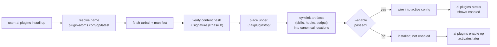

# plugin-spec.md — Plugin System for `ai`

**Status:** Draft v0.1
**Scope:** Defines the plugin shape, distribution model, install lifecycle, CLI surface, and governance contract for plugins consumed by the `ai` binary.
**Parent:** Extends `AI-CONSTITUTION-SPEC.md §11` ("Plugins — the workflow-orchestration layer") with a unified install verb and atoms-based distribution.
**Sibling specs:** `plugin-op-spec.md` (1Password / `op` plugin — first reference implementation).
**Authority:** Subordinate to `Constitution.md` + `Common.md` + `Code.md` per the inheritance order in `Constitution.md §2`.

---

## 0. TL;DR

Plugins are **installable, versioned, atom-distributed extensions** that wrap CLI verbs, conversational workflows, tool integrations, or all three. They follow the same atoms-publishing pattern as `skill-atoms.com` / `persona-atoms.com` / `action-atoms.com`. The CLI surface extends the existing `ai plugins {list,enable,disable,status,update}` (§11.6) with a new `install` verb that resolves a name to a published atom, fetches it, verifies it, and places it under `~/.ai/plugins/<name>/`.

A plugin is a tarball with a `plugin.toml` manifest, a directory of artifacts (skills, hooks, scripts, prompts, configs), and an optional install hook. `ai plugins install 1password` is the first canonical use case — the plugin ships a Bash entrypoint (`gen-env-file.sh`), a SKILL.md, a doctor check, and a Common.md §4 redaction hook.



---

## 1. Goals and Non-Goals

### 1.1 Goals

- **G-P1. One install verb.** A single `ai plugins install <name>` resolves any plugin — workflow plugin (`amendment-author`), tool integration (`op`), or hybrid — from the atoms registry, without per-plugin install paths.
- **G-P2. Atoms-shaped distribution.** Plugins are versioned, content-hashed, immutable atoms at `plugin-atoms.com/<name>/<version>/`. No "latest" mutability surprises.
- **G-P3. Install ≠ enable.** A plugin can be on disk but inert. Enable is a separate, reversible decision (mirrors `superpowers` today: installed via `claude`, enabled separately).
- **G-P4. Governed by default.** Every plugin inherits `Common.md §4` (secrets), `§2.2` (destructive-action gates), `§4` redaction, and `§5.5` hook-driven enforcement. Plugins MAY declare additional capabilities; they MAY NOT bypass the four governance files.
- **G-P5. Composable with existing surfaces.** A plugin MAY ship one-or-more of: SKILL.md (consumed by `ai skills`), hook (consumed by `ai hooks`), persona atom reference, `ai`-binary subcommand mounted under a plugin namespace (e.g., `ai op env`), prompt template, settings.toml schema fragment.
- **G-P6. Deterministic.** Same plugin atom + same `ai` version → same on-disk layout. Re-installing a plugin is idempotent.

### 1.2 Non-Goals

- **NG-P1. No arbitrary code execution at install.** Plugins MAY ship a declarative install hook (a list of operations from a fixed vocabulary — symlink, copy, generate-config); they MAY NOT ship arbitrary scripts that run as root or with elevated privileges at install time. Out-of-vocabulary install hooks require explicit user approval per `Common.md §2.2`.
- **NG-P2. No native binaries in v0.1.** Plugins ship text artifacts (Markdown, TOML, YAML, JSON, Bash, Python, Lua, Mermaid). Native binaries (Go, Rust) are deferred to a future phase with a separate signing/notarization story.
- **NG-P3. No registry of trust beyond `convergent-systems-co`.** Initial plugin sources are limited to the org's own atoms registry. Third-party plugin atoms come later with capability-declaration and review-gate.
- **NG-P4. Not a package manager.** Plugins MAY declare external dependencies (e.g., `op` ≥ 2.0); `ai` checks them via `ai doctor` and refuses to enable if missing. `ai` does NOT install OS-level dependencies — that is `brew`/`apt`/`scoop`'s job.

---

## 2. Relationship to `AI-CONSTITUTION-SPEC.md §11`

This spec **extends** `§11`. It does not redefine it.

| §11 concept | This spec | Relationship |
|---|---|---|
| Workflow plugins (`amendment-author`, `superpowers`) | First-class plugins | Already covered by §11.6 `enable/disable/status/update`. This spec adds `install`. |
| Tool-integration plugins (`op`, future `gcloud`, `vault`, `aws`) | First-class plugins | New category — same surface, same atom shape. The shape difference is what's *inside* the tarball, not the install path. |
| Composite plugins (workflow + integration + persona reference) | First-class plugins | A plugin's manifest declares which artifact kinds it ships. No additional surface needed. |
| `ai plugins enable <name>` | Unchanged | Now operates on whatever `ai plugins install` placed on disk. Pre-install plugins still work for already-present cases. |

§11.6's existing language —

> Plugins are discovered via Claude's plugin registry (the user's existing `superpowers` is detected here). `ai` knows which conventional plugins integrate with the spec's surfaces — the five candidates above plus `superpowers` — and `ai plugins enable amendment-author` (when published) does the right thing.

— is preserved. Discovery via Claude's plugin registry remains a valid path for Claude-native plugins. The `ai plugins install` path adds a second discovery channel (`plugin-atoms.com`) and is the canonical path for non-Claude plugins (tool integrations, hooks, persona bundles).

Both channels resolve to the same on-disk layout (§3) and the same enable behavior.

---

## 3. Plugin Atom Shape

A plugin atom is a tarball. Unpacked under `~/.ai/plugins/<name>/`, it has this layout:

```
~/.ai/plugins/<name>/
├── plugin.toml                  # manifest — required
├── README.md                    # human description — required
├── CHANGELOG.md                 # version history — required
├── LICENSE                      # required (SPDX identifier)
├── skills/                      # optional — consumed by `ai skills`
│   └── <skill-name>/
│       └── SKILL.md
├── hooks/                       # optional — consumed by `ai hooks`
│   └── <hook-name>.{py,sh}
├── bin/                         # optional — entrypoints exposed as `ai <namespace> <verb>`
│   └── <verb>.sh                # e.g. bin/env.sh → `ai op env`
├── cmd/                         # optional — alias for bin/, conventional for Go-style layout
├── doctor/                      # optional — health checks for `ai doctor`
│   └── check.sh                 # exit 0 = healthy; non-zero with message = unhealthy
├── settings/                    # optional — settings.toml schema fragments
│   └── schema.toml
├── prompts/                     # optional — prompt templates for skills / personas
└── assets/                      # optional — non-executable static content
```

### 3.1 Required files

- **`plugin.toml`** — the manifest. See §4.
- **`README.md`** — purpose, prereqs, surface, governance ties. Stranger-test pass per `Common.md §1.P1`.
- **`CHANGELOG.md`** — semver entries with `BREAKING` tags per `Common.md §0.x` (governance-file amendment protocol applied to plugins).
- **`LICENSE`** — SPDX-identified license file. Defaults to `Apache-2.0` for org-published plugins; other licenses require review.

### 3.2 Optional directories

Every other directory is optional. A pure tool integration plugin (`op`) MAY ship only `bin/`, `doctor/`, `hooks/`, and `skills/`. A pure workflow plugin (`amendment-author`) MAY ship only `skills/` and `prompts/`. A plugin MUST ship at least one of the optional directories; an empty plugin (manifest + README only) is rejected at install.

### 3.3 Forbidden contents

- **No `node_modules/`, `vendor/`, `target/`, `dist/`** — plugins are source-shaped, not built artifacts. Native code is NG-P2.
- **No `.env*`, `secrets/`, `*.pem`, `id_rsa*`** — `Common.md §4` applies inside plugin tarballs too. Install MUST refuse if these appear.
- **No nested plugins** — `plugins/` inside a plugin is forbidden. Composition happens at the manifest level (`depends_on`), not by nesting.

---

## 4. `plugin.toml` Manifest Schema

```toml
# Required top-level metadata.
schemaVersion = "0.1"
name          = "op"                          # kebab-case; matches plugin-atoms.com/<name>/
version       = "0.3.1"                       # SemVer; immutable once published
description   = "1Password / op CLI integration: env-file gen, signin, item helpers."
license       = "Apache-2.0"                  # SPDX identifier
homepage      = "https://plugin-atoms.com/op"
repository    = "https://github.com/convergent-systems-co/plugin-op"

# Authorship and provenance.
[provenance]
authors       = ["Thomas Polliard <thomas@…>"]
ai_authored   = true                          # honest provenance per Common.md §U4
published_at  = "2026-05-23T18:00:00Z"        # set by plugin-atoms.com at publish, not by hand
content_hash  = "sha256:…"                    # computed; appears in published atom metadata only

# Compatibility.
[compatibility]
ai_min        = "0.8.0"                       # minimum `ai` binary version
ai_max        = ""                            # empty = no upper bound
platforms     = ["darwin/arm64", "darwin/amd64", "linux/amd64"]

# External dependencies. `ai doctor` checks each at install AND on every `ai doctor` run.
[[dependencies]]
name          = "op"                          # the underlying CLI
min_version   = "2.0.0"
detect        = "op --version"                # command to probe presence
install_hint  = "brew install --cask 1password-cli"

[[dependencies]]
name          = "jq"
min_version   = "1.6"
detect        = "jq --version"
install_hint  = "brew install jq"

# Artifact declarations. Each entry tells `ai plugins install` where to symlink.
# Source paths are relative to the plugin root; destinations are governed paths.
[[artifacts]]
kind          = "skill"                       # → ~/.claude/skills/<name>
source        = "skills/op-env"
name          = "op-env"

[[artifacts]]
kind          = "hook"                        # → wired into ~/.claude/settings.json hook events
source        = "hooks/op-redact.py"
event         = "PreToolUse"
description   = "Redact op:// secret references printed to stdout per Common.md §4.5"

[[artifacts]]
kind          = "subcommand"                  # → mounted as `ai op <verb>`
namespace     = "op"
source        = "bin"                         # every executable in bin/ becomes a verb

[[artifacts]]
kind          = "doctor"                      # → run during `ai doctor`
source        = "doctor/check.sh"

[[artifacts]]
kind          = "settings-fragment"           # → merged into settings.toml schema validation
source        = "settings/schema.toml"

# Capability declarations. Plugins MUST declare what they touch.
# `ai plugins install` summarizes these to the user before placing files.
[capabilities]
reads         = ["env vars", "1Password vault (via op CLI, presence-only)"]
writes        = ["stdout (op:// references only, never values)", "~/.ai/plugins/op/cache/"]
network       = ["1password.com (via op CLI; no direct calls)"]
filesystem    = ["~/.claude/skills/op-env (symlink)", "~/.claude/settings.json (hook entry)"]
binaries      = ["op", "jq"]                  # depended upon, not shipped

# Optional install hook — declarative, fixed vocabulary only.
# Out-of-vocabulary entries cause install to refuse (per NG-P1).
[[install_hook]]
op            = "symlink"
from          = "skills/op-env"
to            = "~/.claude/skills/op-env"

[[install_hook]]
op            = "generate-config"
template      = "settings/op.toml.tmpl"
to            = "~/.config/aiConstitution/plugins/op.toml"
on_conflict   = "skip"                        # skip | merge | fail

# Optional: tell `ai` which existing surfaces this plugin extends.
[extends]
skills        = ["op-env"]                    # adds to skills catalog
hooks         = ["PreToolUse"]                # wires into hook event
subcommand    = "op"                          # claims `ai op` namespace
doctor        = true                          # contributes a check
```

### 4.1 Manifest validation

`ai plugins install` rejects a manifest that fails any of:

- `schemaVersion` not recognized.
- `name` not kebab-case, or doesn't match the atoms-registry path.
- `version` not valid SemVer.
- `license` not a recognized SPDX identifier.
- Any `[[artifacts]]` entry references a `source` that does not exist in the tarball.
- Any `[[install_hook]]` entry uses an `op` not in the fixed vocabulary (§4.2).
- Any declared capability touches a path matched by `Common.md §2.2` without an `[install_hook]` entry pre-approving the touch.

### 4.2 Install-hook vocabulary (fixed)

| `op` | Effect | Required keys | Optional keys |
|---|---|---|---|
| `symlink` | Create symlink from plugin path → destination | `from`, `to` | `on_conflict` (default `fail`) |
| `copy` | Copy file into destination (no executable bit) | `from`, `to` | `on_conflict`, `mode` |
| `generate-config` | Render a Go-template file from `template` into `to` | `template`, `to` | `on_conflict`, `vars` |
| `merge-settings` | Deep-merge a settings.toml fragment | `from`, `to`, `section` | `on_conflict` |
| `register-hook` | Wire a hook into `~/.claude/settings.json` for an event | `event`, `script` | `before`, `after`, `match` |
| `register-subcommand` | Mount a `bin/` directory under `ai <namespace>` | `namespace`, `from` | — |

No other operations are valid in v0.1. `chmod`, `chown`, `curl`, `rm`, arbitrary shell — all forbidden.

---

## 5. Distribution — `plugin-atoms.com`

Plugins are versioned, immutable atoms following the established pattern from `AI-CONSTITUTION-SPEC.md §7.9`.

```
plugin-atoms.com/
├── <name>/
│   ├── <version>/
│   │   ├── plugin.tar.gz                    # the atom payload
│   │   ├── plugin.toml                      # manifest, extracted for fast resolution
│   │   ├── manifest.json                    # registry index entry
│   │   └── SHA256SUMS                       # content hash; signed by publisher
│   ├── latest -> <version>                  # symlink to most recent stable
│   └── meta.json                            # versions list, deprecations
└── _index.json                              # all plugins, all versions
```

### 5.1 Resolution order

`ai plugins install <name>` resolves the version in this order, first match wins:

1. **Explicit pin.** `ai plugins install op@0.3.1` — use exactly that version.
2. **Manifest pin.** If `~/.config/aiConstitution/settings.toml` has `[plugins.pins] op = "0.3.1"`, use that.
3. **`latest` symlink** in `plugin-atoms.com/op/`.
4. **No match** → error with a list of available versions.

Range syntax (`^0.3.0`, `0.3.x`) is deferred to a later phase, matching the `skill-atoms.com` rollout (see `AI-CONSTITUTION-SPEC.md` line 654).

### 5.2 Integrity

- **Content hash.** Every published atom includes a `SHA256SUMS` file. `ai plugins install` recomputes the hash on the downloaded tarball and refuses to proceed on mismatch.
- **Signing (Phase B).** Atoms will be signed by `convergent-systems-co`'s release key. v0.1 ships hash-verify only; signature-verify lands when the signing pipeline lands.
- **Pinning.** Once a `<name>/<version>/` exists at `plugin-atoms.com`, it is immutable. Republishing the same version is forbidden. A defect in `op@0.3.1` requires `op@0.3.2`.

### 5.3 Cache

Atoms are cached at `~/.cache/aiConstitution/plugin-atoms/<name>/<version>/`. A re-install from cache skips the network round-trip. `ai plugins install --no-cache` forces a re-fetch.

### 5.4 Publishing

A plugin is published with `ai plugins share <name>` (mirrors `ai skills share` and `ai persona share`):

```
ai plugins share op                          # files a PR against the plugin-atoms repo
ai plugins share op --version 0.3.1          # explicit version
ai plugins share op --dry-run                # validate manifest + run install simulation
```

The PR submission includes the manifest, the tarball, the SHA256SUMS, and a provenance block. Acceptance is gated by the org's review process (out of scope for this spec).

---

## 6. Lifecycle

```mermaid
stateDiagram-v2
    [*] --> Resolved : ai plugins install <name>
    Resolved --> Fetched : tarball + manifest downloaded
    Fetched --> Verified : SHA256 match; signature (Phase B)
    Verified --> Placed : unpacked under ~/.ai/plugins/<name>/
    Placed --> Linked : install_hook executed
    Linked --> Installed : registered in plugin-state.json
    Installed --> Enabled : ai plugins enable <name>
    Enabled --> Disabled : ai plugins disable <name>
    Disabled --> Enabled : ai plugins enable <name>
    Enabled --> Upgrading : ai plugins update <name>
    Disabled --> Upgrading : ai plugins update <name>
    Upgrading --> Installed : new version placed; old archived
    Installed --> Uninstalled : ai plugins uninstall <name>
    Uninstalled --> [*]
```



### 6.1 State tracking

Plugin state lives at `~/.config/aiConstitution/plugin-state.json`:

```json
{
  "schemaVersion": "0.1",
  "plugins": {
    "op": {
      "installedVersion": "0.3.1",
      "installedAt": "2026-05-23T18:30:00Z",
      "enabled": true,
      "enabledAt": "2026-05-23T18:30:05Z",
      "source": "plugin-atoms.com/op/0.3.1",
      "contentHash": "sha256:…",
      "artifacts": [
        { "kind": "skill", "name": "op-env", "linkedTo": "~/.claude/skills/op-env" },
        { "kind": "hook", "event": "PreToolUse", "script": "~/.ai/plugins/op/hooks/op-redact.py" },
        { "kind": "subcommand", "namespace": "op", "from": "~/.ai/plugins/op/bin/" }
      ]
    }
  }
}
```

`plugin-state.json` is machine state — synced per `Common.md §5.5` symlink discipline if and only if the user opts in.

### 6.2 Install ≠ enable

Per **G-P3**, install places files; enable wires them into the active config. The split exists because:

- A user MAY want to inspect a plugin before activating it.
- A user MAY want a plugin installed for tooling purposes (e.g., available to a CI job) without it firing hooks in their interactive session.
- A user MAY want to A/B between plugin versions: install both, enable one, swap.

The default is `install --enable`. `ai plugins install <name>` is equivalent to `ai plugins install <name> --enable`.

### 6.3 Uninstall is reversible

Uninstall:
1. Disables the plugin if enabled.
2. Removes symlinks created at install.
3. Archives `~/.ai/plugins/<name>/` to `~/.ai/plugins/.archive/<name>-<version>-<UTC>/`.
4. Removes the entry from `plugin-state.json`.

Re-installing the same version restores the archive without re-fetching.

---

## 7. CLI Surface

Full matrix. New verbs marked **NEW**; existing §11.6 verbs marked *existing*.

```bash
# Discovery
ai plugins list                              # existing — show available + installed
ai plugins list --installed                  # NEW — filter to installed only
ai plugins list --available                  # NEW — filter to atoms-registry only
ai plugins search <query>                    # NEW — fuzzy search plugin-atoms.com

# Inspection
ai plugins show <name>                       # NEW — manifest + capabilities + state
ai plugins status                            # existing — per-plugin: installed? enabled? version?
ai plugins status <name>                     # NEW — narrow to one plugin

# Lifecycle
ai plugins install <name>[@<version>]        # NEW — resolve, fetch, verify, place, enable
ai plugins install <name> --no-enable        # NEW — place but don't enable
ai plugins install <name> --no-cache         # NEW — force re-fetch from registry
ai plugins install <name> --dry-run          # NEW — show what would happen
ai plugins enable <name>                     # existing
ai plugins disable <name>                    # existing
ai plugins update <name> [<version>]         # existing — upgrade to <version> or latest
ai plugins update --all                      # NEW — upgrade every installed plugin
ai plugins uninstall <name>                  # NEW — remove + archive
ai plugins uninstall <name> --purge          # NEW — remove + delete archive

# Publishing
ai plugins share <name>                      # NEW — file upstream against plugin-atoms.com
ai plugins share <name> --dry-run            # NEW — validate without filing
ai plugins share <name> --version <semver>   # NEW — explicit version override
```

### 7.1 Output discipline

Every command emits structured output. `--format json` is supported on `list`, `show`, `status`. Default human format follows `Common.md §U16.1` (ASCII tables in TUI).

### 7.2 Exit codes

| Code | Meaning |
|---|---|
| 0 | Success |
| 1 | Generic failure (network, disk, parse) |
| 64 | Usage error (`EX_USAGE`) |
| 65 | Manifest validation failed (`EX_DATAERR`) |
| 69 | Service unavailable (`EX_UNAVAILABLE`) — registry unreachable |
| 73 | Cannot create output (`EX_CANTCREAT`) — symlink target conflict |
| 75 | Tempfail (`EX_TEMPFAIL`) — transient; retry safe |
| 78 | Configuration error (`EX_CONFIG`) — settings.toml invalid |

### 7.3 Confirmation gates

Per `Common.md §2.2`, the following operations MUST confirm before executing:

- `ai plugins install` — if capabilities touch any §2.2 path (e.g., `~/.claude/settings.json`). Summarize capabilities, ask yes/no.
- `ai plugins uninstall --purge` — destructive; ask.
- `ai plugins update` — if the new version's manifest declares capabilities the old version did not.

Non-destructive operations (`list`, `show`, `status`, `search`) run without confirmation.

---

## 8. Plugin Interfaces

The two-sided contract between a plugin and the `ai` binary.

### 8.1 What a plugin provides

A plugin MUST provide:

| Interface | Form | Required when |
|---|---|---|
| **Manifest** | `plugin.toml` | always |
| **Description** | `README.md` | always |
| **History** | `CHANGELOG.md` | always |
| **License** | `LICENSE` | always |

A plugin MAY provide any combination of:

| Interface | Form | Mounted as |
|---|---|---|
| **Skills** | `skills/<name>/SKILL.md` | `~/.claude/skills/<name>` (symlink) |
| **Hooks** | `hooks/<name>.{py,sh}` + manifest entry | `~/.claude/settings.json` hooks block |
| **Subcommands** | `bin/<verb>.{sh,py}` | `ai <namespace> <verb>` |
| **Doctor checks** | `doctor/check.sh` | runs in `ai doctor` |
| **Settings fragments** | `settings/schema.toml` | merged into settings.toml validator |
| **Prompt templates** | `prompts/*.md` | referenced by skills or personas |
| **Doctor health endpoint** | exit code + stdout | `ai doctor` parses |

### 8.2 What `ai` provides to a plugin

A plugin's scripts and hooks receive a stable runtime context:

| Variable | Source | Lifetime |
|---|---|---|
| `AI_PLUGIN_ROOT` | `~/.ai/plugins/<name>/` | every plugin invocation |
| `AI_PLUGIN_NAME` | manifest `name` | every plugin invocation |
| `AI_PLUGIN_VERSION` | manifest `version` | every plugin invocation |
| `AI_ROOT` | `~/.ai/` | every plugin invocation |
| `AI_AUDIT_DIR` | `~/.ai/audit/` | every plugin invocation |
| `AI_MEMORY_DIR` | `~/.ai/memory/` | every plugin invocation |
| `AI_CACHE_DIR` | `~/.ai/plugins/<name>/cache/` | every plugin invocation |
| `AI_DRY_RUN` | `1` if `--dry-run` else unset | install/update only |
| `AI_LOG_LEVEL` | `debug|info|warn|error` | every plugin invocation |

Plugins MUST NOT read or write outside `AI_PLUGIN_ROOT`, `AI_CACHE_DIR`, or paths declared in their manifest's `[capabilities]` block. Violations are caught by the existing `~/.ai/hooks/audit.py` and surface as `Common.md §5.2` violation log entries.

### 8.3 Subcommand mounting

When a plugin's manifest declares:

```toml
[[artifacts]]
kind          = "subcommand"
namespace     = "op"
source        = "bin"
```

…every executable in `bin/` is mounted under `ai op`. The mounting:

1. Each `bin/<verb>` becomes `ai op <verb>`.
2. The `ai` binary dispatches `ai op <verb> <args>` by exec'ing `<plugin_root>/bin/<verb> <args>` with `AI_*` env vars set.
3. `ai op` (no verb) lists the plugin's available verbs from `bin/`.
4. `ai op --help` reads `bin/HELP.md` if present; otherwise generates a minimal usage from the verb names.

Namespace collisions are forbidden. If two installed plugins both claim `namespace = "op"`, `ai plugins install` refuses unless the second is installed with `--accept-namespace-conflict` (which makes the *new* plugin's verbs override the old).

---

## 9. Capability and Permission Model

### 9.1 Declared capabilities

Every plugin's `[capabilities]` block enumerates what it touches:

```toml
[capabilities]
reads         = [...]   # what it reads
writes        = [...]   # what it writes
network       = [...]   # hosts it contacts (or "none")
filesystem    = [...]   # paths it touches outside AI_PLUGIN_ROOT
binaries      = [...]   # external binaries it invokes
```

### 9.2 Capability enforcement

v0.1 enforcement is **declarative + audit-only**:

- Capabilities are summarized to the user at install (`ai plugins install` confirmation prompt).
- The audit hook (`~/.ai/hooks/audit.py`) records every plugin invocation with the plugin name.
- A plugin that exceeds its declared capabilities will leave audit trail entries that don't match its manifest; this is a defect, surfaced by `ai doctor`.

v0.2+ enforcement (deferred): sandbox plugin invocations via `bubblewrap` (Linux) or `sandbox-exec` (macOS) with capability-derived policies. Out of scope for this spec.

### 9.3 The four non-overridable rules

Per `Constitution.md §3.5`, no plugin can opt out of:

- **No fabrication** (`Common.md §1.P2`).
- **No secrets in artifacts** (`Common.md §1.P4` + `§4`).
- **Destructive-action gates** (`Common.md §2.2`).
- **Prompt-injection resistance** (`Common.md §U8`).

A plugin whose declared capabilities or shipped code would conflict with any of these is rejected at install. This is checked statically against the manifest and structurally against shipped scripts (grep for known anti-patterns: `cat .env*`, `echo "$AWS_SECRET_ACCESS_KEY"`, etc.).

---

## 10. Governance Ties

### 10.1 Common.md §4 (Secret Handling)

Plugins that touch credentials (the 1Password plugin is the canonical case) MUST:

- Use **presence tests**, never value reads (per `Common.md §4.1`).
- Use the **OS clipboard** for transfer, never stdout (per `§4.2`).
- **Redact** secrets in any tool output they relay (per `§4.5`).

The `op` plugin's `hooks/op-redact.py` is a reference implementation — it intercepts tool output containing op:// references resolved to literal values and rewrites them as `[REDACTED:op-secret]`.

### 10.2 Common.md §2.2 (Destructive-action gates)

A plugin's install hook MUST NOT touch §2.2 paths without:

1. Declaring the touch in `[capabilities].filesystem`.
2. Triggering the §2.4 confirmation protocol at install time.

A plugin's installed scripts inherit §2.2: e.g., `ai op uninstall-vault` (hypothetical) would gate on the standard destructive-action confirmation regardless of plugin context.

### 10.3 Common.md §U17 (Worktree placement)

Plugins that create worktrees MUST follow §U17 — single-repo worktrees live at `<repo>/.worktrees/<name>/`, cross-repo at `~/.ai/worktrees/<name>/`. Plugins MAY shell out to `ai worktree add` (§U17.5) rather than calling `git worktree add` directly.

### 10.4 Audit trail

Every plugin lifecycle event appends to `~/.ai/audit/interactions/<YYYY-MM>.jsonl` per `Common.md §5.2`. The event vocabulary is extended with plugin-specific kinds:

| `kind` | Fires on |
|---|---|
| `plugin-resolve` | name → atom URL resolution |
| `plugin-fetch` | tarball download |
| `plugin-verify` | hash / signature check |
| `plugin-install` | files placed; symlinks created |
| `plugin-enable` | wired into active config |
| `plugin-disable` | unwired |
| `plugin-update` | upgrade to new version |
| `plugin-uninstall` | files archived; state removed |
| `plugin-invoke` | a plugin script ran |
| `plugin-violation` | declared capability exceeded |

---

## 11. Alternatives Considered

Per `Code.md §11.1`, the choice was made among the following options. Two alternatives MUST appear before a choice is locked in.

| Alternative | Pros | Cons | Verdict |
|---|---|---|---|
| **A. Atoms-shaped distribution** (chosen) — plugin-atoms.com/<name>/<version>/, mirrors skill-atoms / persona-atoms / action-atoms | Consistent with §7.9; one registry pattern across all atom kinds; content-hashed, immutable, signable | Requires a registry; another atoms-DNS entry to operate | **Chosen** — pattern already proven; consistency is load-bearing |
| **B. Each plugin is a GitHub repo** (Homebrew-tap pattern) — `convergent-systems-co/plugin-<name>` | Familiar; uses existing GitHub auth; no registry to operate | Diverges from existing atoms pattern; version pinning via tags is less hash-stable; no `latest` semantics native to git | Rejected — inconsistency with the atoms ecosystem outweighs familiarity |
| **C. Plugins ship inside the main `ai` repo** | Simplest distribution; one repo to maintain | Forces plugin updates to ride `ai` releases; no third-party plugins possible; tarball bloat | Rejected — violates G-P3 (separate lifecycle) and blocks G-P5 |
| **D. npm / PyPI as the registry** | Existing infra; existing tooling | Wrong shape (code packages, not declarative atoms); language-specific; trust model is wrong for this | Rejected — wrong tool |

The same kind of table is implicitly available for the install verb choice (`install` vs `add` vs `enable --fetch`) — chosen `install` to match `skills install` (line 228 of AI-CONSTITUTION-SPEC.md) and broader Unix conventions.

---

## 12. Worked Example

See **`plugin-op-spec.md`** for the 1Password plugin as a concrete instantiation of this spec. It exercises:

- All four artifact kinds (`skill`, `hook`, `subcommand`, `doctor`).
- The Common.md §4 governance hook (redaction).
- External dependency declaration (`op`, `jq`).
- The `gen-env-file.sh` body wired as `ai op env`.

---

## 13. Open Questions

1. **Signing key authority.** Phase B's signature-verify needs a public key bundle. Where is it published? (Candidate: `~/.ai/keys/plugin-atoms.pub`, distributed with the `ai` binary.)
2. **Mirroring.** Should `plugin-atoms.com` mirror to a github-pages backup the same way the other atoms registries do? Probably yes — file as a follow-up.
3. **Plugin-namespaced settings.** `~/.config/aiConstitution/plugins/<name>.toml` is proposed in §4 for plugin-private config. The settings.toml main schema needs a `[plugins.<name>]` section convention — defer to a settings.toml amendment.
4. **Per-project plugins.** Today's spec is user-global (`~/.ai/plugins/`). A per-project plugin (e.g., a repo ships `.ai/plugins/<name>/` with its own manifest, picked up only inside that repo) is plausibly useful — defer.
5. **Plugin uninstall partial rollback.** If `ai plugins uninstall` fails mid-way (e.g., symlink removed, archive failed), the state is inconsistent. Need transactional install/uninstall — likely via a two-phase commit pattern. File as follow-up.

---

## 14. Changelog

- **0.1** — Initial draft. Extends `AI-CONSTITUTION-SPEC.md §11.6` with `install/uninstall/share/search/show` verbs, an atoms-shaped distribution model at `plugin-atoms.com`, a `plugin.toml` manifest schema, a fixed-vocabulary install-hook system (no arbitrary code at install per NG-P1), a declared-capability model with v0.1 audit-only enforcement, and governance ties to `Common.md §2.2`, `§4`, `§U17`, and `§5.2`. Sibling spec `plugin-op-spec.md` exercises the contract end-to-end.

---

*End of plugin spec. See `plugin-op-spec.md` for the 1Password reference implementation.*
